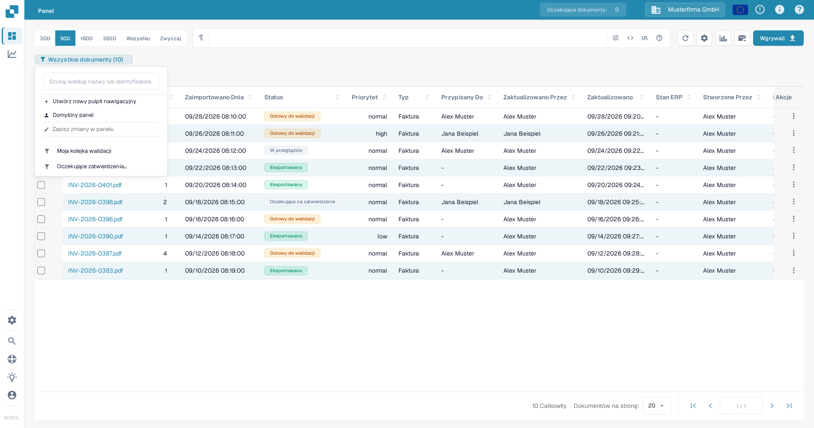
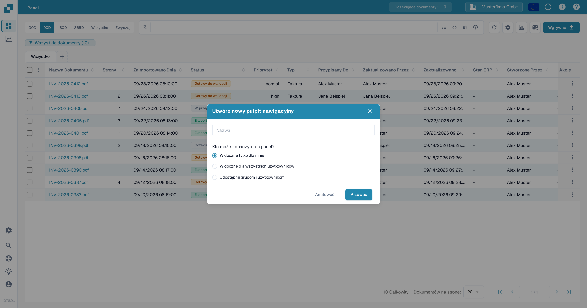
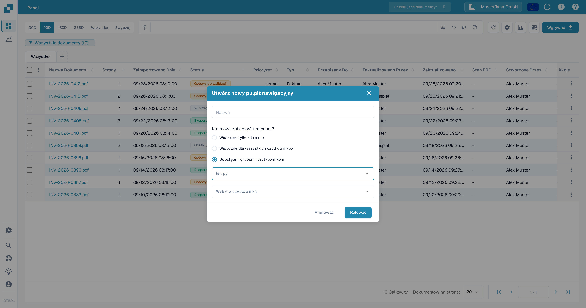
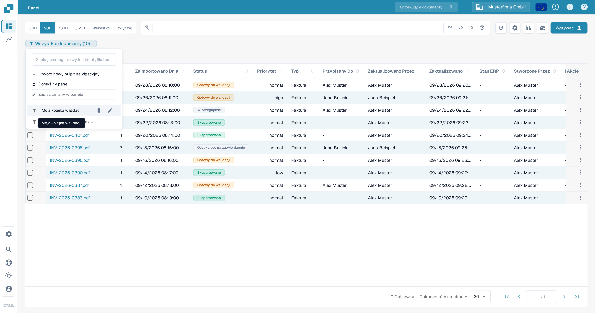
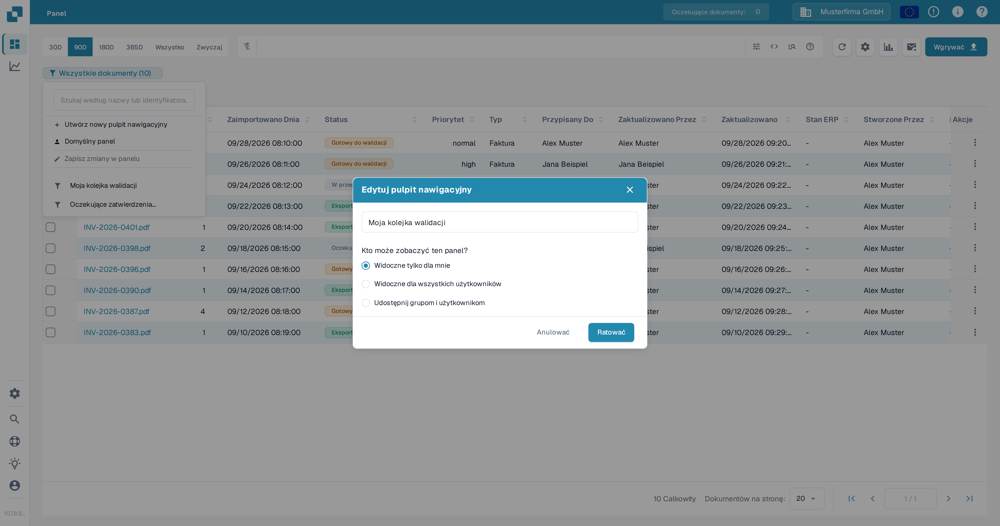

# Osobiste Panele

Osobisty panel zapisuje widok listy dokumentów, dzięki czemu możesz wrócić do filtrów i kolumn, których często używasz. Możesz zachować go jako prywatny, udostępnić go wszystkim w swojej organizacji lub udostępnić wybranym grupom i użytkownikom. Jak filtrować listę dokumentów przed zapisaniem widoku, opisuje [Szybkie wyszukiwanie](quick-search.md).

## Utwórz panel

1. W **Panelu** ustaw filtry i kolumny, które chcesz zapisać.
2. Wybierz przycisk panelu poniżej paska wyszukiwania. Pokazuje on bieżący widok i liczbę dokumentów, na przykład **Wszystkie dokumenty (10)**.
3. Wybierz **Utwórz nowy pulpit nawigacyjny**.

<figure><figcaption>
Otwórz przycisk bieżącego panelu, aby utworzyć zapisany widok.
</figcaption></figure>

4. Wprowadź nazwę i wybierz, kto może widzieć panel:
   * **Widoczne tylko dla mnie** zachowuje widok jako prywatny.
   * **Widoczne dla wszystkich użytkowników** udostępnia go Twojej organizacji.
   * **Udostępnij grupom i użytkownikom** pozwala wybrać konkretne grupy lub osoby.
5. Wybierz **Ratować**.

<figure><figcaption>
Nadaj panelowi nazwę i wybierz jego widoczność przed zapisaniem.
</figcaption></figure>

<figure><figcaption>
Wybierz grupy lub użytkowników, gdy chcesz udostępnić panel konkretnym osobom.
</figcaption></figure>

## Otwórz lub zmień panel

Wybierz przycisk panelu, a następnie wybierz zapisany panel z listy. Wybierz **Domyślny panel**, aby wrócić do widoku domyślnego. Przycisk pokazuje nazwę aktywnego panelu.

Aby zmienić panel, który należy do Ciebie, najedź kursorem na jego nazwę na liście i wybierz ikonę **ołówek**. W oknie **Edytuj pulpit nawigacyjny** zmień jego nazwę lub widoczność i wybierz **Ratować**. Panelu udostępnionego Ci przez inną osobę nie możesz edytować ze swojego konta.

<figure><figcaption>
Najedź kursorem na panel, który należy do Ciebie, aby wyświetlić ikony edycji i usuwania.
</figcaption></figure>

<figure><figcaption>
W oknie Edytuj pulpit nawigacyjny zmień nazwę panelu lub to, kto może go widzieć.
</figcaption></figure>

## Zapisz zmiany w bieżącym widoku

Po zmianie filtrów lub kolumn w panelu, który należy do Ciebie, wybierz **Zapisz zmiany w panelu** w menu panelu. Działanie jest niedostępne, gdy żaden panel nie jest wybrany, widok się nie zmienił lub wybrany panel należy do innej osoby.

## Usuń panel

Otwórz listę paneli, najedź kursorem na panel, który należy do Ciebie, i wybierz ikonę **kosza**. Potwierdź usunięcie w oknie dialogowym. Usuwanie nie jest dostępne dla panelu, który udostępniła Ci inna osoba.
