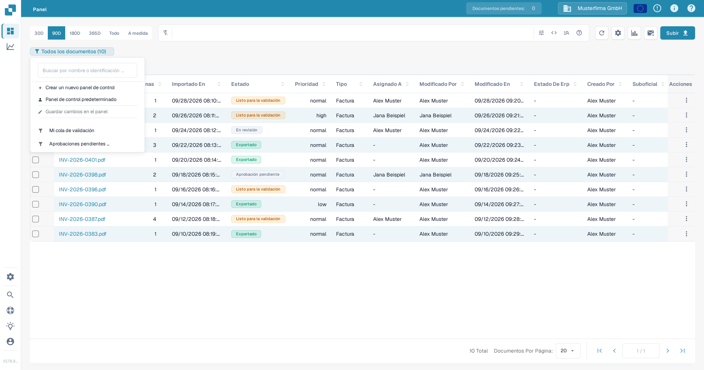
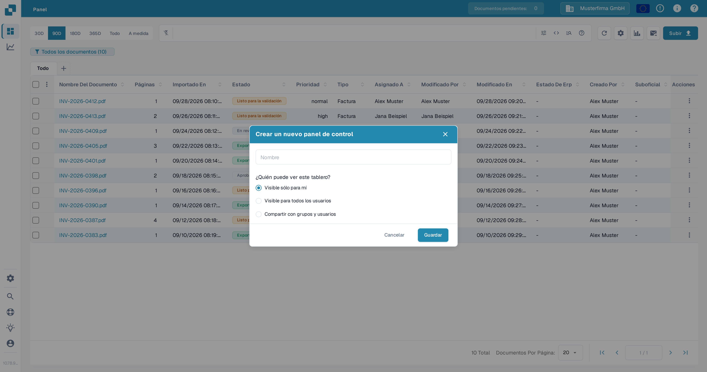
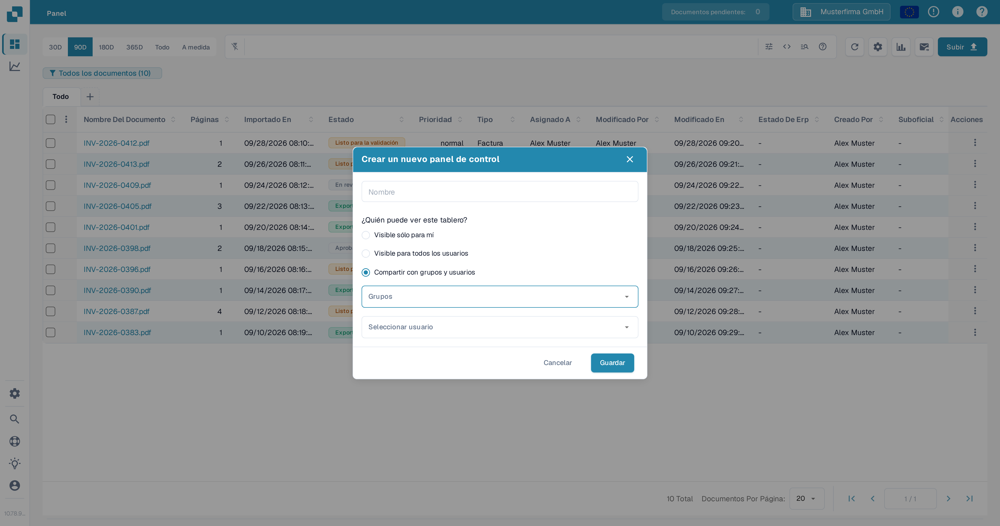
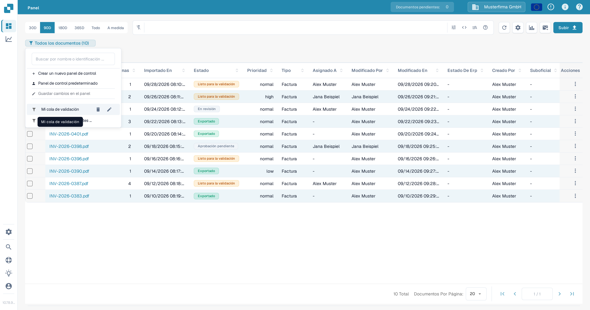
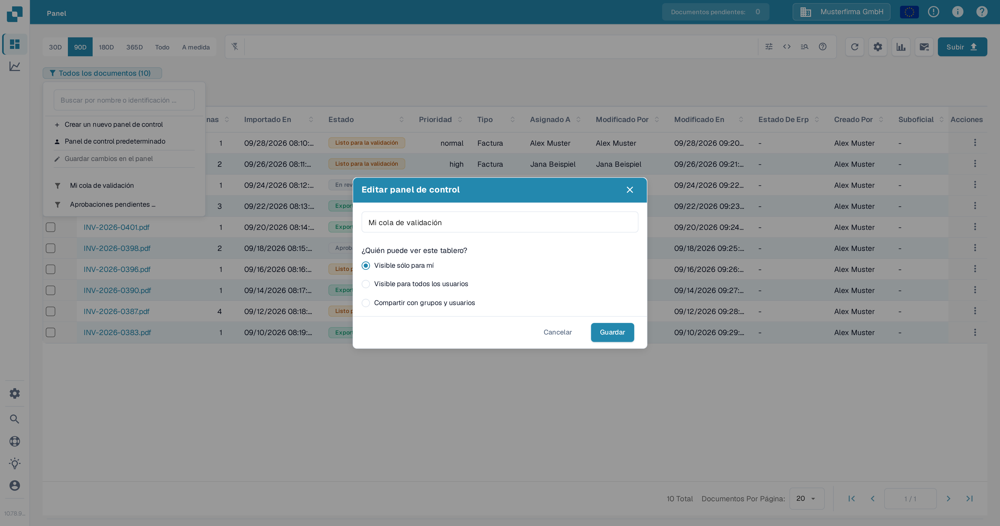

# Paneles personales

Un panel personal guarda una vista de la lista de documentos para que puedas volver a los filtros y columnas que usas con frecuencia. Puedes mantenerlo privado, hacerlo visible para todos los miembros de tu organización o compartirlo con grupos y usuarios seleccionados. Para saber cómo filtrar la lista de documentos antes de guardar una vista, consulta [Búsqueda rápida](quick-search.md).

## Crear un panel

1. En el **Panel**, define los filtros y las columnas que quieres guardar.
2. Selecciona la insignia del panel debajo de la barra de búsqueda. Muestra la vista actual y el número de documentos, por ejemplo **Todos los documentos (10)**.
3. Selecciona **Crear un nuevo panel de control**.

<figure><figcaption>
Abre la insignia del panel actual para crear una vista guardada.
</figcaption></figure>

4. Introduce un nombre y elige quién puede ver el panel:
   * **Visible sólo para mí** mantiene la vista privada.
   * **Visible para todos los usuarios** la pone a disposición de tu organización.
   * **Compartir con grupos y usuarios** te permite seleccionar grupos o personas específicas.
5. Selecciona **Guardar**.

<figure><figcaption>
Ponle nombre al panel y elige su visibilidad antes de guardarlo.
</figcaption></figure>

<figure><figcaption>
Selecciona grupos o usuarios cuando quieras compartir un panel con personas específicas.
</figcaption></figure>

## Abrir o cambiar un panel

Selecciona la insignia del panel y después elige un panel guardado de la lista. Selecciona **Panel de control predeterminado** para volver a la vista predeterminada. La insignia muestra el nombre del panel activo.

Para cambiar un panel del que eres propietario, pasa el cursor sobre su nombre en la lista y selecciona el icono del **lápiz**. En **Editar panel de control**, cambia su nombre o visibilidad y selecciona **Guardar**. Un panel compartido contigo por otra persona no se puede editar desde tu cuenta.

<figure><figcaption>
Pasa el cursor sobre un panel del que eres propietario para ver sus controles de edición y eliminación.
</figcaption></figure>

<figure><figcaption>
Usa el diálogo Editar panel de control para cambiar el nombre del panel o quién puede verlo.
</figcaption></figure>

## Guardar cambios en la vista actual

Después de cambiar filtros o columnas en un panel del que eres propietario, selecciona **Guardar cambios en el panel** en el menú del panel. La acción no está disponible si no hay ningún panel seleccionado, si la vista no ha cambiado o si el panel seleccionado pertenece a otra persona.

## Eliminar un panel

Abre la lista de paneles, pasa el cursor sobre un panel del que eres propietario y selecciona el icono de la **papelera**. Confirma con **Borrar**. El control de eliminación no está disponible para un panel que otra persona ha compartido contigo.
