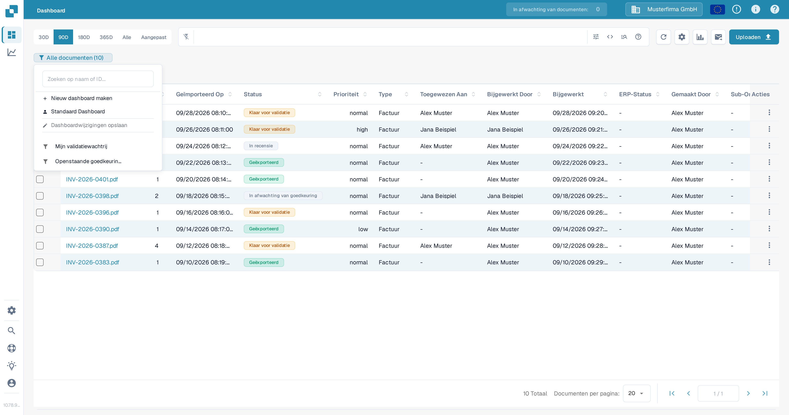
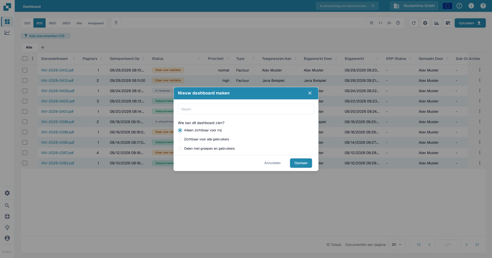
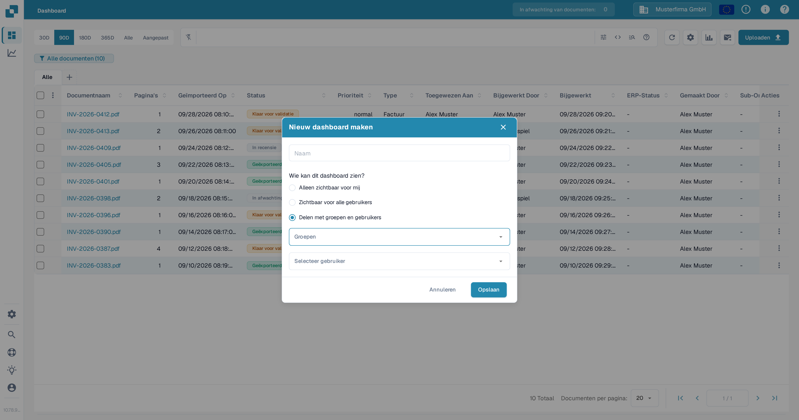
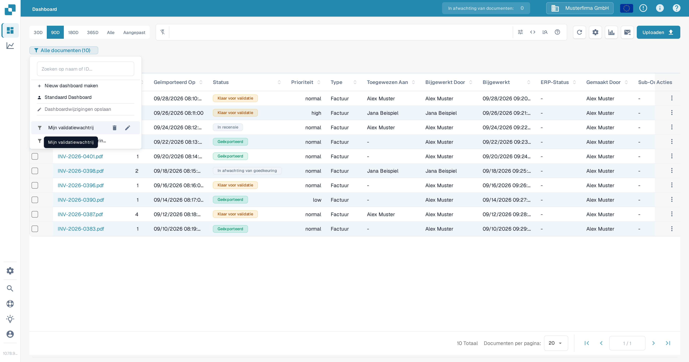
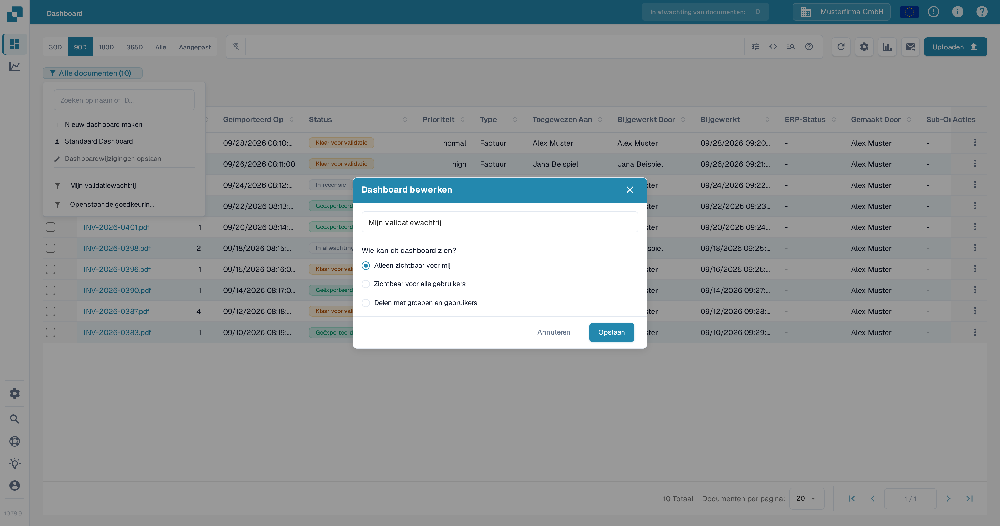

# Persoonlijke Dashboards

Een persoonlijk dashboard slaat een weergave van de documentenlijst op, zodat u altijd kunt terugkeren naar de filters en kolommen die u vaak gebruikt. U kunt het privé houden, zichtbaar maken voor iedereen in uw organisatie of delen met geselecteerde groepen en gebruikers. Hoe u de documentenlijst filtert voordat u een weergave opslaat, wordt beschreven in [Snelle zoekopdracht](quick-search.md).

## Een dashboard maken

1. Stel in het **Dashboard** de filters en kolommen in die u wilt opslaan.
2. Selecteer de dashboardbadge onder de zoekbalk. Deze toont de huidige weergave en het aantal documenten, bijvoorbeeld **Alle documenten (10)**.
3. Selecteer **Nieuw dashboard maken**.

<figure><figcaption>
Open de dashboardbadge om een opgeslagen weergave te maken.
</figcaption></figure>

4. Voer een naam in en kies wie het dashboard kan zien:
   * **Alleen zichtbaar voor mij** houdt de weergave privé.
   * **Zichtbaar voor alle gebruikers** maakt deze beschikbaar voor uw organisatie.
   * **Delen met groepen en gebruikers** laat u specifieke groepen of personen selecteren.
5. Selecteer **Opslaan**.

<figure><figcaption>
Geef het dashboard een naam en stel de zichtbaarheid in voordat u het opslaat.
</figcaption></figure>

<figure><figcaption>
Selecteer groepen of gebruikers als u een dashboard met specifieke personen wilt delen.
</figcaption></figure>

## Een dashboard openen of wisselen

Selecteer de dashboardbadge en kies vervolgens een opgeslagen dashboard uit de lijst. Selecteer **Standaard Dashboard** om terug te keren naar de standaardweergave. De badge toont de naam van het actieve dashboard.

Om een dashboard te wijzigen dat van u is, beweegt u de muis over de naam in de lijst en selecteert u het **potlood**-pictogram. Wijzig in het dialoogvenster **Dashboard bewerken** de naam of de zichtbaarheid en selecteer **Opslaan**. Een dashboard dat iemand anders met u heeft gedeeld, kunt u niet bewerken vanaf uw account.

<figure><figcaption>
Beweeg de muis over een dashboard dat van u is om de pictogrammen voor bewerken en verwijderen weer te geven.
</figcaption></figure>

<figure><figcaption>
Gebruik het dialoogvenster Dashboard bewerken om het dashboard te hernoemen of te wijzigen wie het kan zien.
</figcaption></figure>

## Wijzigingen in de huidige weergave opslaan

Nadat u filters of kolommen hebt gewijzigd in een dashboard dat van u is, selecteert u **Dashboardwijzigingen opslaan** in het dashboardmenu. De actie is niet beschikbaar als er geen dashboard is geselecteerd, de weergave niet is gewijzigd of het geselecteerde dashboard van iemand anders is.

## Een dashboard verwijderen

Open de dashboardlijst, beweeg de muis over een dashboard dat van u is en selecteer het **prullenbak**-pictogram. Bevestig het verwijderen in het dialoogvenster. Voor een dashboard dat iemand anders met u heeft gedeeld, is verwijderen niet beschikbaar.
