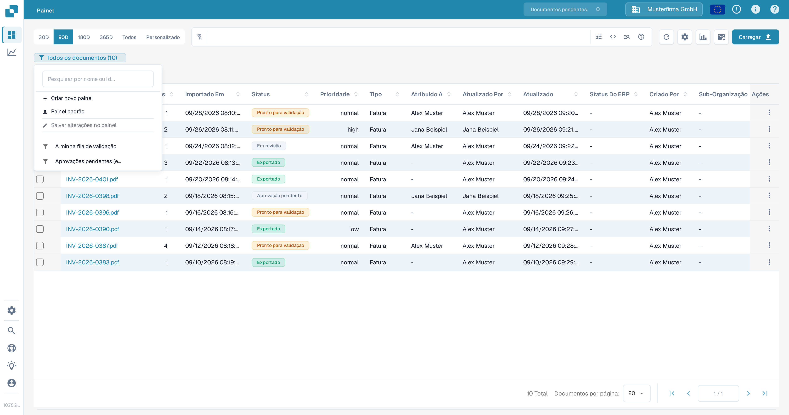
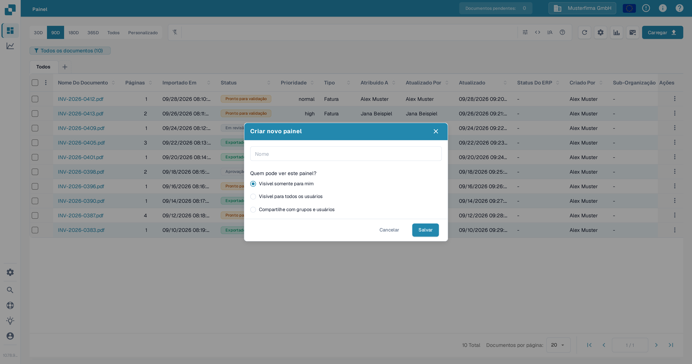
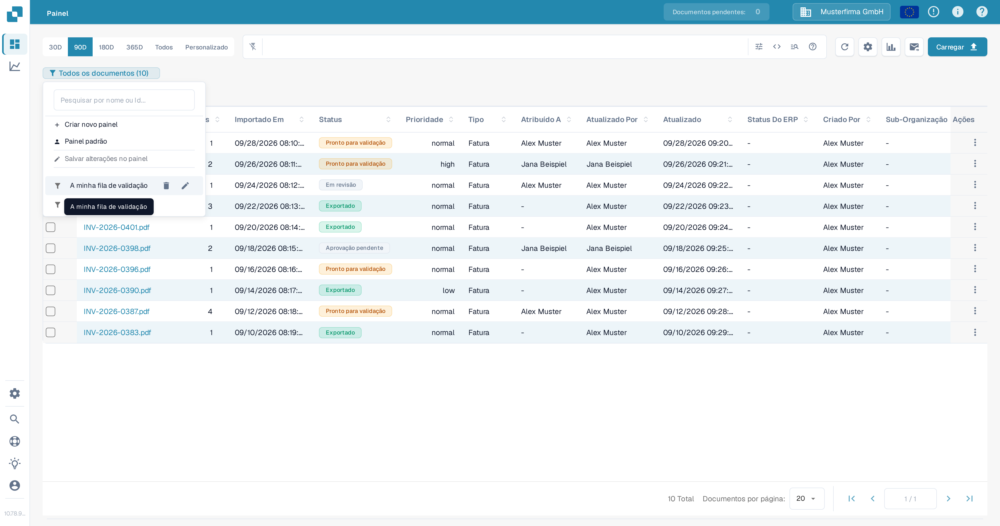

# Painéis pessoais

Um painel pessoal salva uma vista da lista de documentos para que você possa
voltar aos filtros e colunas que usa com frequência. Você pode mantê-lo
privado, torná-lo visível para todos na sua organização ou compartilhá-lo com
grupos e usuários selecionados. Para saber como filtrar a lista de documentos
antes de salvar uma vista, consulte [Pesquisa rápida](quick-search.md).

## Criar um painel

1. No **Painel**, defina os filtros e as colunas que deseja salvar.
2. Selecione o emblema do painel abaixo da barra de pesquisa. Ele mostra a
   vista atual e o número de documentos, como **Todos os documentos (10)**.
3. Selecione **Criar novo painel**.

<figure><figcaption>
Abra o emblema do painel atual para criar uma vista salva.
</figcaption></figure>

4. Insira um nome e escolha quem pode ver o painel:
   * **Visível somente para mim** mantém a vista privada.
   * **Visível para todos os usuários** disponibiliza o painel para a sua
     organização.
   * **Compartilhe com grupos e usuários** permite selecionar grupos ou
     pessoas específicas.
5. Selecione **Salvar**.

<figure><figcaption>
Dê um nome ao painel e escolha a visibilidade antes de salvá-lo.
</figcaption></figure>

<figure><figcaption>
Selecione grupos ou usuários quando quiser compartilhar o painel com pessoas específicas.
</figcaption></figure>

## Abrir ou alterar um painel

Selecione o emblema do painel e escolha um painel salvo na lista. Selecione
**Painel padrão** para voltar à vista padrão. O emblema mostra o nome do
painel ativo.

Para alterar um painel seu, passe o mouse sobre o nome dele na lista e
selecione o ícone de **lápis**. Em **Editar painel**, altere o nome ou a
visibilidade e selecione **Salvar**. Um painel compartilhado com você por
outra pessoa não pode ser editado pela sua conta.

<figure><figcaption>
Passe o mouse sobre um painel seu para revelar os controles de edição e exclusão.
</figcaption></figure>

<figure><figcaption>
Use o diálogo Editar painel para renomear o painel ou alterar quem pode vê-lo.
</figcaption></figure>

## Salvar alterações na vista atual

Depois de alterar filtros ou colunas em um painel seu, selecione **Salvar
alterações no painel** no menu do painel. A ação fica indisponível se nenhum
painel estiver selecionado, se a vista não tiver sido alterada ou se o painel
selecionado pertencer a outra pessoa.

## Excluir um painel

Abra a lista de painéis, passe o mouse sobre um painel seu e selecione o
ícone de **lixeira**. Confirme com **Excluir**. O controle de exclusão fica
indisponível para um painel que outra pessoa compartilhou com você.
