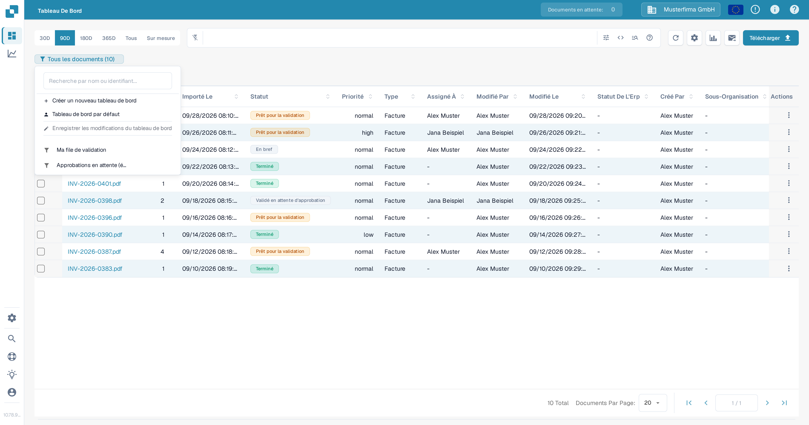
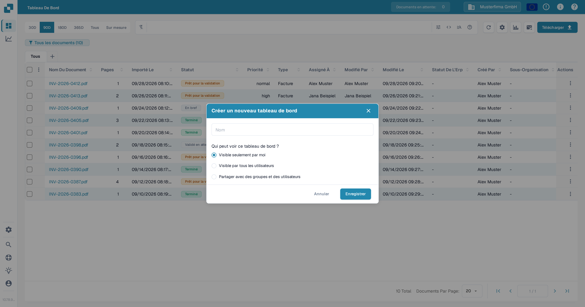
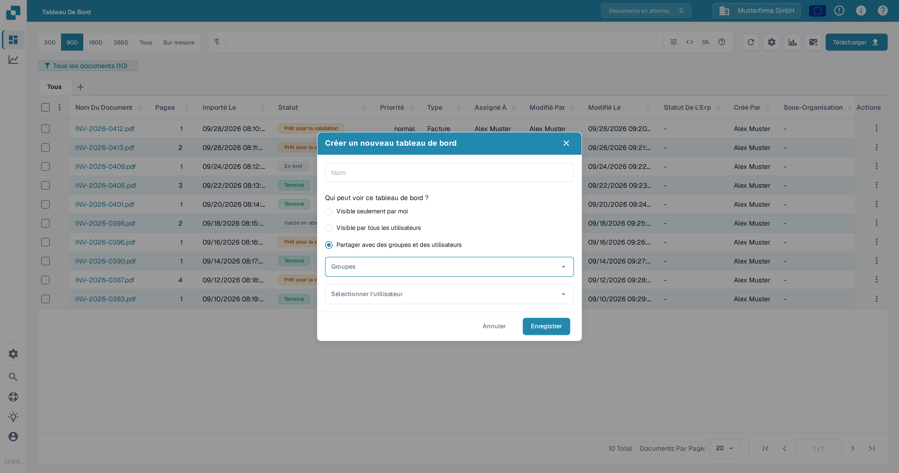
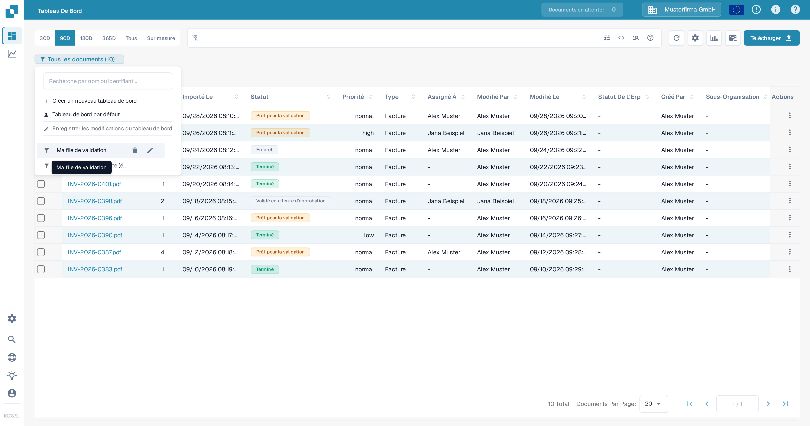
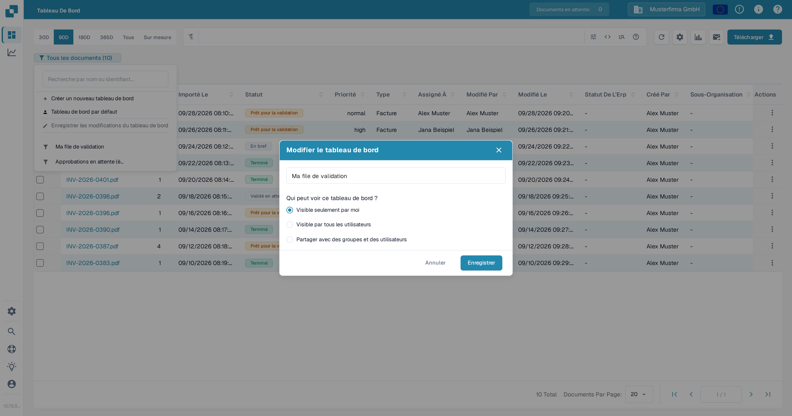

# Tableaux de bord personnels

Un tableau de bord personnel enregistre une vue de la liste des documents, afin que vous retrouviez les filtres et les colonnes que vous utilisez souvent. Vous pouvez le garder privé, le rendre visible pour toute votre organisation ou le partager avec des groupes et des utilisateurs choisis. Pour savoir comment filtrer la liste des documents avant d'enregistrer une vue, consultez [Recherche rapide](quick-search.md).

## Créer un tableau de bord

1. Dans le **Tableau de bord**, définissez les filtres et les colonnes que vous souhaitez enregistrer.
2. Sélectionnez le badge de tableau de bord sous la barre de recherche. Il indique la vue actuelle et le nombre de documents, par exemple **Tous les documents (10)**.
3. Sélectionnez **Créer un nouveau tableau de bord**.

<figure><figcaption>
Ouvrez le badge du tableau de bord actuel pour créer une vue enregistrée.
</figcaption></figure>

4. Saisissez un nom et choisissez qui peut voir le tableau de bord :
   * **Visible seulement par moi** garde la vue privée.
   * **Visible par tous les utilisateurs** la rend disponible pour votre organisation.
   * **Partager avec des groupes et des utilisateurs** vous permet de sélectionner des groupes ou des personnes précises.
5. Sélectionnez **Enregistrer**.

<figure><figcaption>
Donnez un nom au tableau de bord et choisissez sa visibilité avant de l'enregistrer.
</figcaption></figure>

<figure><figcaption>
Sélectionnez des groupes ou des utilisateurs lorsque vous souhaitez partager un tableau de bord avec des personnes précises.
</figcaption></figure>

## Ouvrir ou changer de tableau de bord

Sélectionnez le badge de tableau de bord, puis choisissez un tableau de bord enregistré dans la liste. Sélectionnez **Tableau de bord par défaut** pour revenir à la vue par défaut. Le badge affiche le nom du tableau de bord actif.

Pour modifier un tableau de bord qui vous appartient, survolez son nom dans la liste et sélectionnez l'icône **crayon**. Dans **Modifier le tableau de bord**, changez son nom ou sa visibilité et sélectionnez **Enregistrer**. Un tableau de bord partagé avec vous par une autre personne ne peut pas être modifié depuis votre compte.

<figure><figcaption>
Survolez un tableau de bord qui vous appartient pour afficher ses commandes de modification et de suppression.
</figcaption></figure>

<figure><figcaption>
Utilisez la boîte de dialogue Modifier le tableau de bord pour renommer le tableau de bord ou changer qui peut le voir.
</figcaption></figure>

## Enregistrer les modifications de la vue actuelle

Après avoir modifié les filtres ou les colonnes d'un tableau de bord qui vous appartient, sélectionnez **Enregistrer les modifications du tableau de bord** dans le menu du tableau de bord. Cette action n'est pas disponible si aucun tableau de bord n'est sélectionné, si la vue n'a pas changé ou si le tableau de bord sélectionné appartient à quelqu'un d'autre.

## Supprimer un tableau de bord

Ouvrez la liste des tableaux de bord, survolez un tableau de bord qui vous appartient et sélectionnez l'icône **corbeille**. Confirmez avec **Supprimer**. La commande de suppression n'est pas disponible pour un tableau de bord qu'une autre personne a partagé avec vous.
