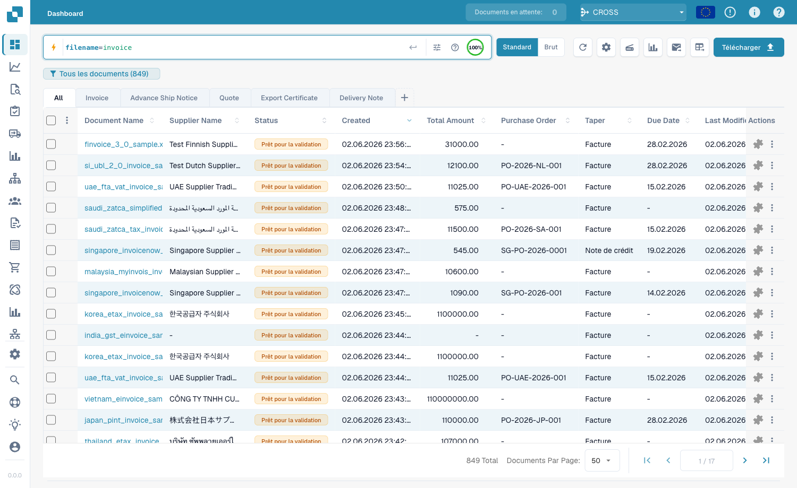
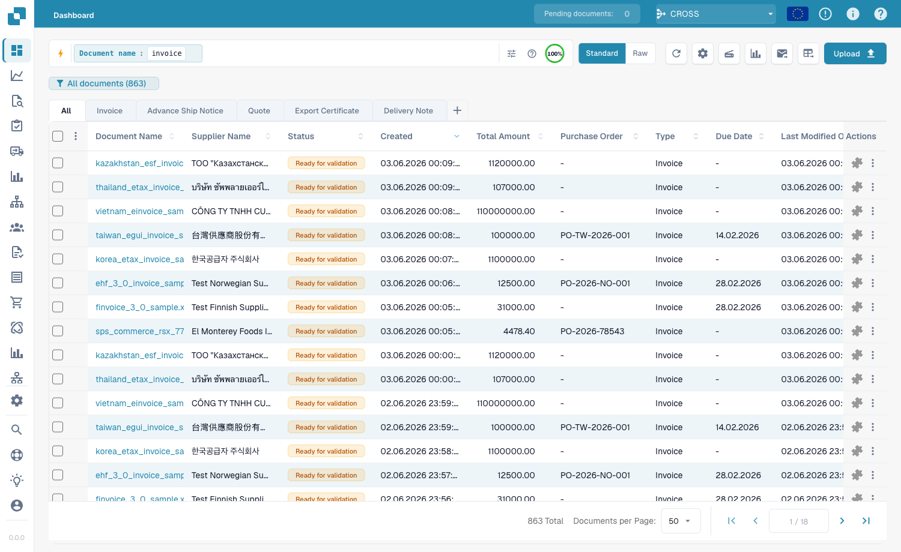
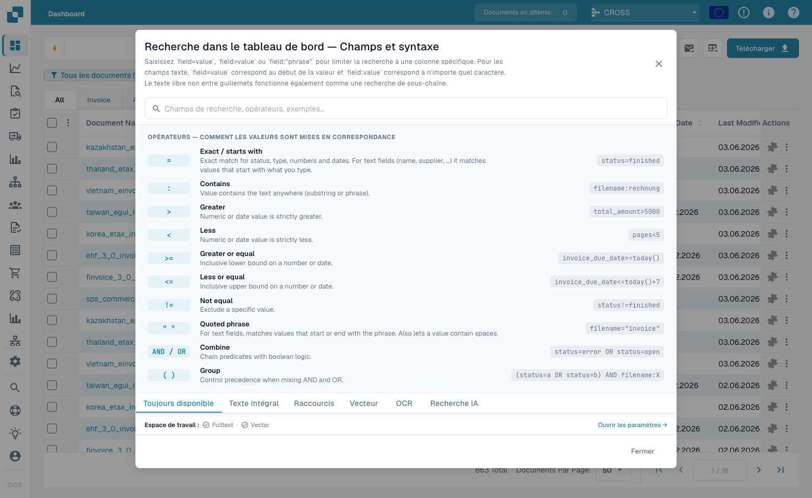

# Recherche rapide

La **Recherche rapide** en haut du tableau de bord est le moyen le plus rapide de
trouver des documents. Tapez ce que vous cherchez — un nom, un statut, un
montant, une date — et la liste se filtre instantanément.

Ce guide est organisé comme la recherche se construit :

1. **Champs standard** — les colonnes que possède chaque document (nom du
   document, statut, dates). Toujours disponibles.
2. **Champs plein texte** — contenu extrait (fournisseur, numéro de commande,
   numéro de facture, montants, lignes). Disponibles quand la recherche plein
   texte est activée.
3. **Opérateurs, raccourcis et recettes** — la référence complète.

> Rien à mémoriser : cliquez dans la barre de recherche et choisissez un champ et
> une valeur dans la liste. Les exemples ci-dessous montrent aussi la forme
> tapée, à copier directement.

---

## Fonctionnement de la barre de recherche — chips, barre d'outils et vue brute

À mesure que vous complétez une condition (un champ, un opérateur et une valeur),
la Recherche rapide la transforme en **chip** — une pastille colorée dans la barre —
et en commence une nouvelle. Un chip affiche le **champ**, l'**opérateur** et la
**valeur**, avec un **×** pour le supprimer. Les chips sont colorés selon
l'emplacement des données :

| Couleur du chip | Type de champ |
|-----------------|---------------|
| **Bleu** | Colonne standard (nom du document, statut, dates) |
| **Orange** | Champ plein texte / extrait (fournisseur, montant, numéro de facture) |
| **Violet** | Recherche vectorielle (sémantique) |
| **Vert** | Recherche dans le texte OCR |

Cliquez sur un chip pour le modifier ; cliquez sur **×** pour le supprimer.
Plusieurs chips combinés sont lus comme un **AND** par défaut.

**Barre d'outils** (à droite de la barre) : **ⓘ Aide** ouvre la référence
intégrée des champs et de la syntaxe ; **Filtres** est un panneau rapide
Statut / Utilisateur / Redémarrage ; l'**anneau d'index** indique quelle part de
l'index plein texte est construite (uniquement quand la recherche plein texte est
activée).

**Vue standard ou brute :** la barre affiche votre requête sous forme de chips
(standard). Passez en **vue brute** pour la voir et la modifier en texte simple —
pratique pour copier ou taper une longue requête. Votre requête est conservée
lorsque vous rechargez la page.

### Trouver des documents par sous-type de facture

```
invoice_sub_type="Cost Invoice"
```

Le sous-type de facture est une liste fixe (p. ex. **Cost Invoice**,
**Purchase Invoice**), donc `=` est une correspondance exacte et la barre propose
un sélecteur de valeurs. Utilisez `invoice_sub_type!="Cost Invoice"` pour tout
sauf ce sous-type.

## Grouper les résultats

Au lieu d'une liste plate, vous pouvez **grouper** les résultats par n'importe
quel champ — fournisseur, statut, type de document ou un intervalle de dates :

```
group by supplier_name
```

La liste affiche des **en-têtes de groupe** repliables, chacun avec un **compte**.
Cliquez sur un en-tête pour le déplier ou le replier ; cliquez dans un groupe pour
**explorer en détail** (appliquer cette valeur comme filtre). Le groupement se
combine avec n'importe quel filtre.

<figure><figcaption><p><code>group by supplier_name</code> — les résultats se replient en un en-tête extensible par fournisseur.</p></figcaption></figure>

---

## Partie 1 — Champs standard

Les champs standard sont les colonnes propres du document. Ils sont **toujours
disponibles**, que la recherche plein texte soit activée ou non.

### Trouver des documents par nom

Le nom du document est la recherche la plus courante. Trois façons de
correspondre — toutes **insensibles à la casse** :

#### `=` → commence par

```
filename=invoice
```

Trouve les documents dont le nom **commence par** « invoice ». La casse étant
ignorée, tous ceux-ci correspondent à `filename=invoice` :

```
Invoice.pdf   iNVoice.pdf   iNvoiCE.pdf   INVOICE.pdf
Invoice.xml   iNVoice.xml   iNvoiCE.edi   …
```

Ne correspond **pas** à `XYZ_Invoice.pdf` (là « invoice » est au milieu — utilisez `:`).

<figure><figcaption><p><code>filename=invoice</code> — uniquement les noms qui <strong>commencent par</strong> « invoice », quelle que soit la casse (<code>INVOICE.pdf</code>, <code>iNvoiCE.pdf</code>, <code>iNVoice.pdf</code>, <code>Invoice.pdf</code> correspondent — 7 résultats).</p></figcaption></figure>

#### `:` → contient (n'importe où)

```
filename:invoice
```

Avec `:`, le mot correspond **n'importe où** dans le nom — `2026_Invoice.pdf`,
`XYZ_Invoice ABC.pdf`, `123_Invoice ABC bla bla.pdf`.

<figure><figcaption><p><code>filename:invoice</code> — correspond à « invoice » à n'importe quelle position du nom (aussi <code>XYZ_Invoice ABC.pdf</code>).</p></figcaption></figure>

#### `="…"` → commence *ou* finit par

```
filename="invoice"
```

Les guillemets font que `=` correspond aux noms qui **commencent ou finissent**
par la valeur.

> **Les trois en une ligne :** `=` → commence par · `:` → contient · `="…"` →
> commence ou finit par. Toutes ignorent la casse.

### Trouver par statut

```
status=ready_for_validation
```

Le statut est une liste fixe, donc `=` est une correspondance **exacte** et la
barre propose un sélecteur de valeurs.

### Trouver par date

```
created_on>2026-05-25
```

Utilisez `>`, `<`, `>=`, `<=` pour des plages de dates. Aussi des dates
**relatives** : `today()`, `today()-7` (7 derniers jours), `today()+30`.

---

## Partie 2 — Champs plein texte

Les champs plein texte recherchent dans le **contenu extrait** — fournisseur,
numéro de commande, numéro de facture, montants, lignes. Ils apparaissent en
**orange** et nécessitent la **recherche plein texte activée**. Les règles de
correspondance sont identiques aux champs texte standard (`=` commence-par,
`:` contient, `="…"` commence-ou-finit).

### Trouver les documents d'un fournisseur

```
supplier_name=Test
```

Commence-par sur le nom de fournisseur extrait ; `supplier_name:fuji` correspond
n'importe où ; `supplier_name:"Ruiz Foods"` met entre guillemets une valeur avec
espaces.

### Trouver par montant

```
total_amount>5000
```

Utilisez `>`, `<`, `>=`, `<=` ou `between 1000 and 5000` pour une fenêtre.

### Trouver ce qui manque

```
supplier_name=""
```

`=""` signifie « ce champ **n'est pas renseigné** » ; `supplier_name!=""` signifie
« a un fournisseur quelconque ». La même vérification s'applique à tout champ,
p. ex. `ap_assignment_code=""`.

---

## Filtres intelligents — un clic

En haut du menu déroulant de recherche se trouvent les **Filtres intelligents** :
des recherches prêtes en un clic. Chacun est un raccourci d'une requête que vous
pourriez aussi taper :

| Filtre intelligent | Trouve | Équivaut à |
|--------------------|--------|------------|
| ⚠️ **En retard** | Date d'échéance dépassée | `invoice_due_date<today()` |
| 🕐 **Bientôt dû** | Dans les 7 prochains jours | `invoice_due_date<=today()+7` |
| 👤 **Affecté à moi** | En attente de votre action | `assigned_to=<vous>` |
| 📅 **Boîte du jour** | Importés aujourd'hui | `imported_on>=today()` |
| 📋 **En attente de validation** | Prêts à valider | `status=ready_for_validation` |
| 🧾 **Documents électroniques** | E-factures (XML, ZUGFeRD, EDI) | `is_edoc=true` |
| ✅ **Correspondance PO totale** | Totalement rapproché d'une commande | `po_match_status=full_matched` |
| ➗ **Correspondance PO partielle** | Partiellement rapproché | `po_match_status=partial_matched` |
| 📉 **Correspondance PO inférieure** | Quantité ou prix sous la commande | `po_match_status=under_matched` |

Les trois filtres **correspondance PO** et les champs plein texte nécessitent la
recherche plein texte activée.

---

## Partie 3 — Opérateurs, connecteurs, raccourcis

### L'aide intégrée

L'**icône d'aide** dans la barre de recherche ouvre une référence complète de
tous les champs, opérateurs et raccourcis de votre espace de travail.

<figure><figcaption><p>L'aide intégrée <strong>Recherche du tableau de bord — Champs et syntaxe</strong> liste chaque opérateur et comment les valeurs correspondent (p. ex. « Exact / commence par »).</p></figcaption></figure>

### Ce que signifie `=` selon le type de champ

Toute correspondance de texte ignore la casse.

| Type de champ | Exemple | `=` signifie |
|---------------|---------|--------------|
| Texte (nom, fournisseur, commande) | `filename=invoice` | **commence par** |
| Texte, n'importe où | `filename:invoice` | **contient** |
| Texte, début *ou* fin | `filename="invoice"` | **commence ou finit par** |
| Statut / type / correspondance PO (listes fixes) | `status=finished` | **exact** |
| Identifiants (n° facture, id fournisseur) | `invoice_number=INV-100` | **exact** |
| Nombre | `total_amount>5000` | plage (`> < >= <= between`) |
| Date | `created_on>2026-01-01` | plage + `today()±N` |

### Opérateurs

| Opérateur | Signification |
|-----------|---------------|
| `=` | commence-par (texte) / exact (liste, nombre, date) |
| `:` | contient (texte, n'importe où) |
| `="…"` | commence-par ou finit-par (texte) |
| `!=` | l'inverse de `=` |
| `>` `<` `>=` `<=` | supérieur / inférieur à |
| `between … and …` | plage inclusive |
| `field=""` / `field!=""` | est vide / est renseigné |
| `today()`, `today()-7`, `today()+30` | dates relatives |

### Connecteurs

Combinez des conditions avec **AND** (les deux), **OR** (l'une), **NOT** et des
parenthèses `( … )` pour grouper :

```
status=ready_for_validation AND supplier_name=Test
(status=error OR status=failed) AND created_on>today()-1
```

### Raccourcis

Des formes plus courtes pour les mêmes requêtes :

| Raccourci | Équivaut à |
|-----------|------------|
| `total_amount gt 5000` | `total_amount>5000` (alias gt/gte/lt/lte) |
| `due_date > today` | `due_date>today()` |
| `imported_on this_week` | cette semaine ISO (aussi `last_week`, `this_month`, …) |
| `ap_assignment_code is empty` | `ap_assignment_code=""` |
| `status:open` | `status=ready_for_validation` (open/closed/failed/done) |
| `total_amount not between 100, 200` | `total_amount<100 OR total_amount>200` |
| `status in (finished, error)` | `status=finished OR status=error` |
| `not status=finished` | `status!=finished` |
| `filename contains rechnung` | `filename:rechnung` |
| `total_amount > 5k` | `total_amount>5000` (`k`=mille, `M`=million) |
| `overdue` | `invoice_due_date<today() AND status!=finished` |
| `#INV-1234` | `invoice_id:INV-1234` |
| `@User` | `assigned_to:User` |
| `$5000+` | `total_amount>=5000` |

---

## Partie 4 — Modes de recherche avancés

Au-delà de la recherche par champs, trois préfixes recherchent dans le contenu.

### Recherche vectorielle (sémantique) — `vector:`

Correspond par **sens**, pas par texte exact. Nécessite le module Vector.

```
vector: invoices about office supplies
vector: shipping delays with Hamburg port
```

### Recherche texte OCR — `ocr:`

Recherche dans le **texte des pages** extrait par l'OCR, pas seulement les
colonnes.

```
ocr: Versandkosten
ocr: "purchase order PO-12345"
ocr: Hamburg AND doc_type=INVOICE
```

### Recherche en langage naturel (IA) — `ai:`

Décrivez en langage normal ce que vous cherchez ; l'IA lit votre phrase et
extrait des filtres (fournisseur, dates, montants) en une requête structurée.

```
ai: invoices from Ruiz over 1000 last quarter
ai: overdue invoices waiting on approval
```

---

### Recettes

| Vous voulez… | Tapez ceci |
|--------------|------------|
| Prêt à valider, totalement rapproché | `status=ready_for_validation AND po_match_status=full_matched` |
| Ce fournisseur, cette semaine | `supplier_name=Test AND created_on>today()-7` |
| Factures en retard de montant élevé | `total_amount>5000 AND invoice_due_date<today()` |
| Deux fournisseurs à la fois | `supplier_name=fuji OR supplier_name=acme` |
| Documents en erreur d'aujourd'hui | `(status=error OR status=failed) AND created_on>today()-1` |
| Par préfixe de numéro de commande | `purchase_order=PO-2026` |

> Les champs orange (plein texte) et les filtres intelligents PO nécessitent la
> **recherche plein texte** activée.
