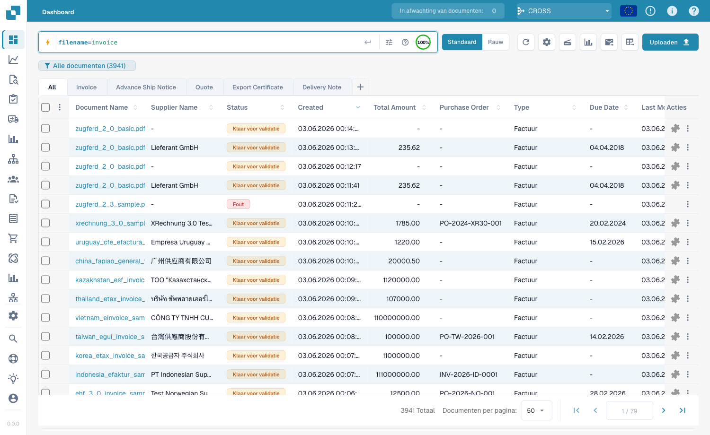
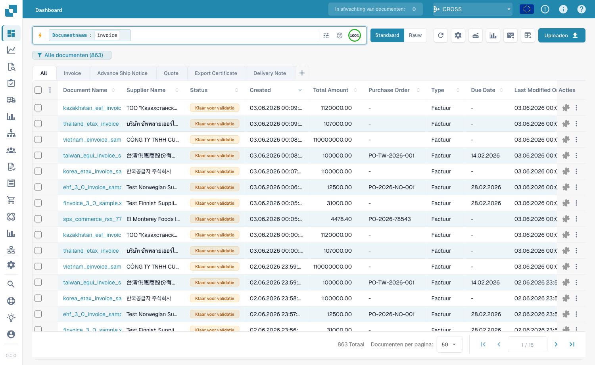
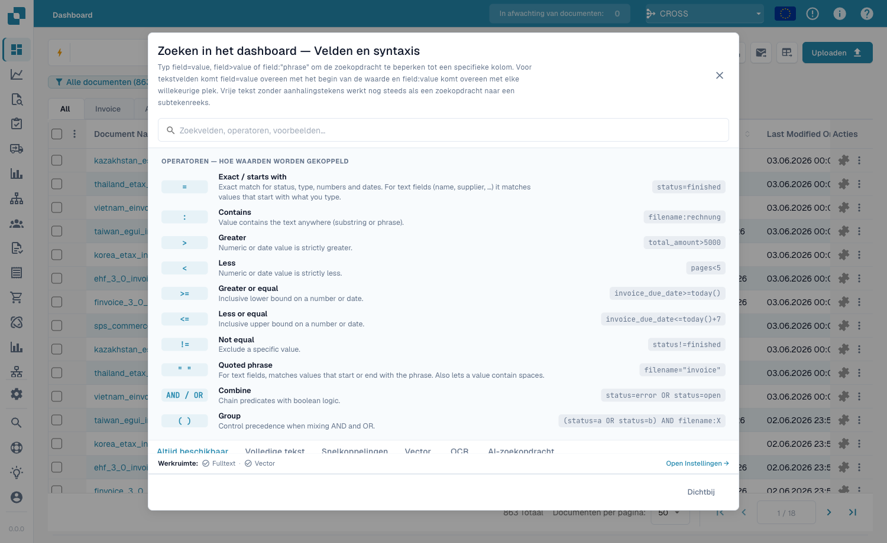

# Snel zoeken

**Snel zoeken** bovenaan het dashboard is de snelste manier om documenten te
vinden. Typ wat je zoekt — een naam, een status, een bedrag, een datum — en de
lijst filtert direct.

Deze gids is opgebouwd zoals het zoeken zelf:

1. **Standaardvelden** — de kolommen die elk document heeft (documentnaam,
   status, datums). Altijd beschikbaar.
2. **Fulltext-velden** — geëxtraheerde inhoud (leverancier, ordernummer,
   factuurnummer, bedragen, regels). Beschikbaar wanneer fulltext-zoeken aanstaat.
3. **Operatoren, sneltoetsen en recepten** — de volledige referentie.

> Je hoeft niets te onthouden: klik in de zoekbalk en kies een veld en waarde uit
> de lijst. De voorbeelden hieronder tonen ook de getypte vorm om direct te
> kopiëren.

---

## Deel 1 — Standaardvelden

Standaardvelden zijn de eigen kolommen van het document. Ze zijn **altijd
beschikbaar**, of fulltext-zoeken nu aanstaat of niet.

### Documenten op naam vinden

De documentnaam is de meest voorkomende zoekopdracht. Drie manieren — allemaal
**hoofdletterongevoelig**:

#### `=` → begint met

```
filename=invoice
```

Vindt documenten waarvan de naam **begint met** "invoice". Omdat hoofdletters
worden genegeerd, komen al deze overeen met `filename=invoice`:

```
Invoice.pdf   iNVoice.pdf   iNvoiCE.pdf   INVOICE.pdf
Invoice.xml   iNVoice.xml   iNvoiCE.edi   …
```

Komt **niet** overeen met `XYZ_Invoice.pdf` (daar staat "invoice" in het midden — gebruik `:`).

<figure><figcaption><p><code>filename=invoice</code> — alleen namen die <strong>beginnen met</strong> "invoice", in elke schrijfwijze (<code>INVOICE.pdf</code>, <code>iNvoiCE.pdf</code>, <code>iNVoice.pdf</code>, <code>Invoice.pdf</code> komen overeen — 7 resultaten).</p></figcaption></figure>

#### `:` → bevat (overal)

```
filename:invoice
```

Met `:` komt het woord **overal** in de naam overeen — `2026_Invoice.pdf`,
`XYZ_Invoice ABC.pdf`, `123_Invoice ABC bla bla.pdf`.

<figure><figcaption><p><code>filename:invoice</code> — komt overeen met "invoice" op elke positie in de naam (ook <code>XYZ_Invoice ABC.pdf</code>).</p></figcaption></figure>

#### `="…"` → begint *of* eindigt met

```
filename="invoice"
```

Aanhalingstekens laten `=` namen matchen die met de waarde **beginnen of
eindigen**.

> **De drie in één regel:** `=` → begint met · `:` → bevat · `="…"` → begint of
> eindigt met. Alle negeren hoofdletters.

### Op status vinden

```
status=ready_for_validation
```

Status is een vaste lijst, dus `=` is een **exacte** match en de balk biedt een
waardekiezer.

### Op datum vinden

```
created_on>2026-05-25
```

Gebruik `>`, `<`, `>=`, `<=` voor datumbereiken. Ook **relatieve** datums:
`today()`, `today()-7` (laatste 7 dagen), `today()+30`.

---

## Deel 2 — Fulltext-velden

Fulltext-velden doorzoeken de **geëxtraheerde inhoud** — leverancier, ordernummer,
factuurnummer, bedragen, regels. Ze verschijnen in het **oranje** en vereisen dat
**fulltext-zoeken aanstaat**. De matchregels zijn identiek aan standaard
tekstvelden (`=` begint-met, `:` bevat, `="…"` begint-of-eindigt).

### Documenten van een leverancier vinden

```
supplier_name=Test
```

Begint-met op de geëxtraheerde leveranciersnaam; `supplier_name:fuji` matcht
overal; `supplier_name:"Ruiz Foods"` zet een waarde met spaties tussen
aanhalingstekens.

### Op bedrag vinden

```
total_amount>5000
```

Gebruik `>`, `<`, `>=`, `<=` of `between 1000 and 5000` voor een venster.

### Vinden wat ontbreekt

```
supplier_name=""
```

`=""` betekent "dit veld is **niet ingevuld**"; `supplier_name!=""` betekent
"heeft een leverancier". Dezelfde controle werkt op elk veld, bijv.
`ap_assignment_code=""`.

---

## Slimme filters — één klik

Bovenaan het zoek-dropdownmenu vind je de **Slimme filters**: kant-en-klare
zoekopdrachten met één klik. Elk is een sneltoets voor een query die je ook kunt
typen:

| Slim filter | Vindt | Komt overeen met |
|-------------|-------|------------------|
| ⚠️ **Achterstallig** | Vervaldatum verstreken | `invoice_due_date<today()` |
| 🕐 **Bijna vervallen** | Binnen 7 dagen | `invoice_due_date<=today()+7` |
| 👤 **Aan mij toegewezen** | Wacht op jouw actie | `assigned_to=<jij>` |
| 📅 **Inbox van vandaag** | Vandaag geïmporteerd | `imported_on>=today()` |
| 📋 **Wacht op validatie** | Klaar om te valideren | `status=ready_for_validation` |
| 🧾 **Elektronische documenten** | E-facturen (XML, ZUGFeRD, EDI) | `is_edoc=true` |
| ✅ **Volledige PO-match** | Volledig afgestemd op een order | `po_match_status=full_matched` |
| ➗ **Gedeeltelijke PO-match** | Gedeeltelijk afgestemd | `po_match_status=partial_matched` |
| 📉 **Onder-PO-match** | Aantal of prijs onder de order | `po_match_status=under_matched` |

De drie **PO-match**-filters en de fulltext-velden vereisen dat fulltext-zoeken
aanstaat.

---

## Deel 3 — Operatoren, verbindingen, sneltoetsen

### De ingebouwde hulp

Het **hulppictogram** in de zoekbalk opent een volledige referentie van alle
velden, operatoren en sneltoetsen van je werkruimte.

<figure><figcaption><p>De ingebouwde hulp <strong>Dashboard zoeken — Velden en syntaxis</strong> toont elke operator en hoe waarden matchen (bijv. "Exact / begint met").</p></figcaption></figure>

### Wat `=` betekent per veldtype

Elke tekstmatch negeert hoofdletters.

| Veldtype | Voorbeeld | `=` betekent |
|----------|-----------|--------------|
| Tekst (naam, leverancier, order) | `filename=invoice` | **begint met** |
| Tekst, overal | `filename:invoice` | **bevat** |
| Tekst, begin *of* eind | `filename="invoice"` | **begint of eindigt met** |
| Status / type / PO-match (vaste lijsten) | `status=finished` | **exact** |
| Identifiers (factuurnr., leverancier-id) | `invoice_number=INV-100` | **exact** |
| Getal | `total_amount>5000` | bereik (`> < >= <= between`) |
| Datum | `created_on>2026-01-01` | bereik + `today()±N` |

### Operatoren

| Operator | Betekenis |
|----------|-----------|
| `=` | begint-met (tekst) / exact (lijst, getal, datum) |
| `:` | bevat (tekst, overal) |
| `="…"` | begint-met of eindigt-met (tekst) |
| `!=` | het tegenovergestelde van `=` |
| `>` `<` `>=` `<=` | groter / kleiner dan |
| `between … and …` | inclusief bereik |
| `field=""` / `field!=""` | is leeg / is ingevuld |
| `today()`, `today()-7`, `today()+30` | relatieve datums |

### Verbindingen

Combineer voorwaarden met **AND** (beide), **OR** (een), **NOT** en haakjes
`( … )` om te groeperen:

```
status=ready_for_validation AND supplier_name=Test
(status=error OR status=failed) AND created_on>today()-1
```

### Sneltoetsen

Kortere schrijfwijzen voor dezelfde queries:

| Sneltoets | Komt overeen met |
|-----------|------------------|
| `total_amount gt 5000` | `total_amount>5000` (alias gt/gte/lt/lte) |
| `due_date > today` | `due_date>today()` |
| `imported_on this_week` | deze ISO-week (ook `last_week`, `this_month`, …) |
| `ap_assignment_code is empty` | `ap_assignment_code=""` |
| `status:open` | `status=ready_for_validation` (open/closed/failed/done) |
| `total_amount not between 100, 200` | `total_amount<100 OR total_amount>200` |
| `status in (finished, error)` | `status=finished OR status=error` |
| `not status=finished` | `status!=finished` |
| `filename contains rechnung` | `filename:rechnung` |
| `total_amount > 5k` | `total_amount>5000` (`k`=duizend, `M`=miljoen) |
| `overdue` | `invoice_due_date<today() AND status!=finished` |
| `#INV-1234` | `invoice_id:INV-1234` |
| `@User` | `assigned_to:User` |
| `$5000+` | `total_amount>=5000` |

---

## Deel 4 — Geavanceerde zoekmodi

Naast het zoeken op velden doorzoeken drie prefixen de documentinhoud zelf.

### Vector- (semantisch) zoeken — `vector:`

Matcht op **betekenis**, niet op exacte tekst. Vereist de Vector-module.

```
vector: invoices about office supplies
vector: shipping delays with Hamburg port
```

### OCR-tekst zoeken — `ocr:`

Doorzoekt de **paginatekst** die OCR heeft geëxtraheerd, niet alleen de kolommen.

```
ocr: Versandkosten
ocr: "purchase order PO-12345"
ocr: Hamburg AND doc_type=INVOICE
```

### Zoeken in natuurlijke taal (AI) — `ai:`

Beschrijf in gewone taal wat je zoekt; de AI leest je zin en haalt filters
(leverancier, datums, bedragen) eruit in een gestructureerde query.

```
ai: invoices from Ruiz over 1000 last quarter
ai: overdue invoices waiting on approval
```

---

### Recepten

| Je wilt… | Typ dit |
|----------|---------|
| Klaar om te valideren, volledig afgestemd | `status=ready_for_validation AND po_match_status=full_matched` |
| Deze leverancier, deze week | `supplier_name=Test AND created_on>today()-7` |
| Achterstallige facturen met hoog bedrag | `total_amount>5000 AND invoice_due_date<today()` |
| Twee leveranciers tegelijk | `supplier_name=fuji OR supplier_name=acme` |
| Foutdocumenten van vandaag | `(status=error OR status=failed) AND created_on>today()-1` |
| Op ordernummer-prefix | `purchase_order=PO-2026` |

> Oranje (fulltext-)velden en de slimme PO-filters vereisen dat **fulltext-zoeken**
> aanstaat.
