# Pesquisa rápida

A **Pesquisa rápida** no topo do painel é a forma mais rápida de encontrar
documentos. Digite o que procura — um nome, um estado, um valor, uma data — e a
lista filtra-se instantaneamente.

Este guia está organizado tal como a pesquisa se constrói:

1. **Campos padrão** — as colunas que todo documento tem (nome do documento,
   estado, datas). Sempre disponíveis.
2. **Campos de texto completo** — conteúdo extraído (fornecedor, número de
   encomenda, número de fatura, valores, linhas). Disponíveis quando a pesquisa
   de texto completo está ativada.
3. **Operadores, atalhos e receitas** — a referência completa.

> Não precisa de memorizar nada: clique na barra de pesquisa e escolha um campo
> e um valor da lista. Os exemplos abaixo mostram também a forma escrita para
> copiar diretamente.

---

## Como funciona a barra de pesquisa — chips, barra de ferramentas e vista bruta

À medida que completa uma condição (um campo, um operador e um valor), a Pesquisa
rápida transforma-a num **chip** — uma pílula colorida dentro da barra — e inicia
um novo. Um chip mostra o **campo**, o **operador** e o **valor**, com um **×**
para o remover. Os chips têm cores conforme o local onde os dados residem:

| Cor do chip | Tipo de campo |
|-------------|---------------|
| **Azul** | Coluna padrão (nome do documento, estado, datas) |
| **Laranja** | Campo de texto completo / extraído (fornecedor, valor, número de fatura) |
| **Roxo** | Pesquisa vetorial (semântica) |
| **Verde** | Pesquisa de texto OCR |

Clique num chip para o editar; clique em **×** para o eliminar. Vários chips
combinados são lidos como **AND** por predefinição.

**Barra de ferramentas** (à direita da barra): **ⓘ Ajuda** abre a referência
integrada de campos e sintaxe; **Filtros** é um painel rápido de Estado /
Utilizador / Reiniciar; o **anel de índice** mostra que percentagem do índice de
texto completo já está construída (apenas quando a pesquisa de texto completo
está ativada).

**Vista padrão vs. vista bruta:** a barra mostra a sua consulta sob a forma de
chips (padrão). Mude para a **vista bruta** para a ver e editar como texto
simples — prático para copiar ou escrever uma consulta longa. A sua consulta é
memorizada quando recarrega a página.

### Encontrar documentos por subtipo de fatura

```
invoice_sub_type="Cost Invoice"
```

O subtipo de fatura é uma lista fixa (p. ex. **Cost Invoice**, **Purchase
Invoice**), por isso `=` é uma correspondência exata e a barra oferece um seletor
de valores. Use `invoice_sub_type!="Cost Invoice"` para tudo exceto esse subtipo.

## Agrupar resultados

Em vez de uma lista plana, pode **agrupar** os resultados por qualquer campo —
fornecedor, estado, tipo de documento ou um intervalo de datas:

```
group by supplier_name
```

A lista mostra **cabeçalhos de grupo** recolhíveis, cada um com uma **contagem**.
Clique num cabeçalho para o expandir ou recolher; clique dentro de um grupo para
**detalhar** (aplicar esse valor como filtro). O agrupamento combina-se com
qualquer filtro.

<figure><figcaption><p><code>group by supplier_name</code> — os resultados recolhem-se num cabeçalho expansível por fornecedor.</p></figcaption></figure>

---

## Parte 1 — Campos padrão

Os campos padrão são as próprias colunas do documento. Estão **sempre
disponíveis**, esteja ou não ativada a pesquisa de texto completo.

### Encontrar documentos por nome

O nome do documento é a pesquisa mais comum. Três formas de corresponder — todas
**sem distinção de maiúsculas/minúsculas**:

#### `=` → começa por

```
filename=invoice
```

Encontra documentos cujo nome **começa por** «invoice». Como ignora maiúsculas,
todos estes correspondem a `filename=invoice`:

```
Invoice.pdf   iNVoice.pdf   iNvoiCE.pdf   INVOICE.pdf
Invoice.xml   iNVoice.xml   iNvoiCE.edi   …
```

**Não** corresponde a `XYZ_Invoice.pdf` (aí «invoice» está no meio — use `:`).

<figure>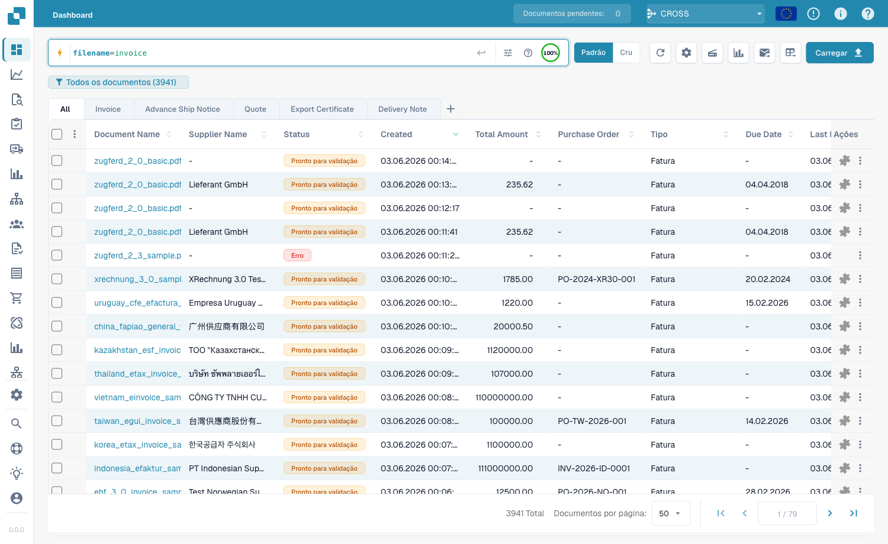<figcaption><p><code>filename=invoice</code> — apenas nomes que <strong>começam por</strong> «invoice», em qualquer capitalização (<code>INVOICE.pdf</code>, <code>iNvoiCE.pdf</code>, <code>iNVoice.pdf</code>, <code>Invoice.pdf</code> correspondem — 7 resultados).</p></figcaption></figure>

#### `:` → contém (em qualquer lugar)

```
filename:invoice
```

Com `:` a palavra corresponde **em qualquer parte** do nome — `2026_Invoice.pdf`,
`XYZ_Invoice ABC.pdf`, `123_Invoice ABC bla bla.pdf`.

<figure>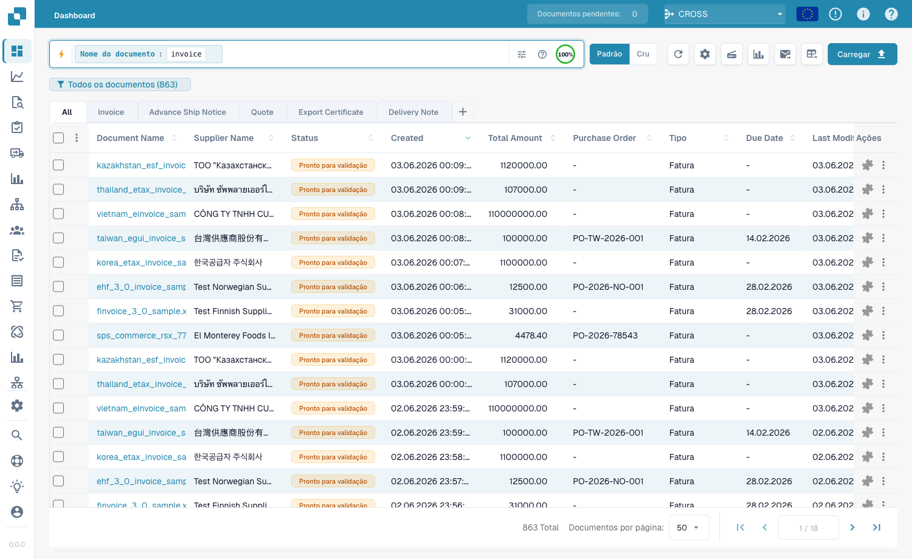<figcaption><p><code>filename:invoice</code> — corresponde a «invoice» em qualquer posição do nome (também <code>XYZ_Invoice ABC.pdf</code>).</p></figcaption></figure>

#### `="…"` → começa *ou* termina por

```
filename="invoice"
```

As aspas fazem com que `=` corresponda a nomes que **começam ou terminam** pelo
valor.

> **As três numa linha:** `=` → começa por · `:` → contém · `="…"` → começa ou
> termina por. Todas ignoram maiúsculas/minúsculas.

### Encontrar por estado

```
status=ready_for_validation
```

O estado é uma lista fixa, por isso `=` é uma correspondência **exata** e a barra
oferece um seletor de valores.

### Encontrar por data

```
created_on>2026-05-25
```

Use `>`, `<`, `>=`, `<=` para intervalos de datas. Também datas **relativas**:
`today()`, `today()-7` (últimos 7 dias), `today()+30`.

---

## Parte 2 — Campos de texto completo

Os campos de texto completo pesquisam no **conteúdo extraído** — fornecedor,
número de encomenda, número de fatura, valores, linhas. Aparecem a **laranja** e
exigem a **pesquisa de texto completo ativada**. As regras de correspondência são
idênticas aos campos de texto padrão (`=` começa-por, `:` contém, `="…"`
começa-ou-termina).

### Encontrar documentos de um fornecedor

```
supplier_name=Test
```

Começa-por no nome de fornecedor extraído; `supplier_name:fuji` corresponde em
qualquer parte; `supplier_name:"Ruiz Foods"` coloca entre aspas um valor com
espaços.

### Encontrar por valor

```
total_amount>5000
```

Use `>`, `<`, `>=`, `<=` ou `between 1000 and 5000` para uma janela.

### Encontrar o que falta

```
supplier_name=""
```

`=""` significa «este campo **não está preenchido**»; `supplier_name!=""`
significa «tem qualquer fornecedor». A mesma verificação serve para qualquer
campo, p. ex. `ap_assignment_code=""`.

---

## Filtros inteligentes — um clique

No topo do menu suspenso de pesquisa encontra os **Filtros inteligentes**:
pesquisas prontas com um clique. Cada um é um atalho de uma consulta que também
poderia escrever:

| Filtro inteligente | Encontra | Equivale a |
|--------------------|----------|------------|
| ⚠️ **Vencidos** | Após a data de vencimento | `invoice_due_date<today()` |
| 🕐 **A vencer em breve** | Nos próximos 7 dias | `invoice_due_date<=today()+7` |
| 👤 **Atribuídos a mim** | A aguardar a sua ação | `assigned_to=<você>` |
| 📅 **Caixa de hoje** | Importados hoje | `imported_on>=today()` |
| 📋 **A aguardar validação** | Prontos a validar | `status=ready_for_validation` |
| 🧾 **Documentos eletrónicos** | E-faturas (XML, ZUGFeRD, EDI) | `is_edoc=true` |
| ✅ **Correspondência PO total** | Totalmente conciliado com uma encomenda | `po_match_status=full_matched` |
| ➗ **Correspondência PO parcial** | Parcialmente conciliado | `po_match_status=partial_matched` |
| 📉 **Correspondência PO inferior** | Quantidade ou preço abaixo da encomenda | `po_match_status=under_matched` |

Os três filtros de **correspondência PO** e os campos de texto completo exigem a
pesquisa de texto completo ativada.

---

## Parte 3 — Operadores, conectores, atalhos

### A ajuda integrada

O **ícone de ajuda** na barra de pesquisa abre uma referência completa de todos
os campos, operadores e atalhos do seu espaço de trabalho.

<figure>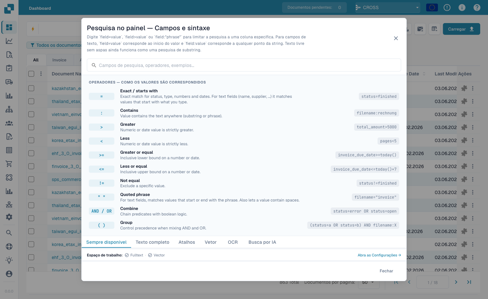<figcaption><p>A ajuda integrada <strong>Pesquisa do painel — Campos e sintaxe</strong> lista cada operador e como os valores correspondem (p. ex. «Exato / começa por»).</p></figcaption></figure>

### O que `=` significa por tipo de campo

Toda correspondência de texto ignora maiúsculas/minúsculas.

| Tipo de campo | Exemplo | `=` significa |
|---------------|---------|---------------|
| Texto (nome, fornecedor, encomenda) | `filename=invoice` | **começa por** |
| Texto, em qualquer lugar | `filename:invoice` | **contém** |
| Texto, início *ou* fim | `filename="invoice"` | **começa ou termina por** |
| Estado / tipo / correspondência PO (listas fixas) | `status=finished` | **exato** |
| Identificadores (nº fatura, id fornecedor) | `invoice_number=INV-100` | **exato** |
| Número | `total_amount>5000` | intervalo (`> < >= <= between`) |
| Data | `created_on>2026-01-01` | intervalo + `today()±N` |

### Operadores

| Operador | Significado |
|----------|-------------|
| `=` | começa-por (texto) / exato (lista, número, data) |
| `:` | contém (texto, em qualquer lugar) |
| `="…"` | começa-por ou termina-por (texto) |
| `!=` | o oposto de `=` |
| `>` `<` `>=` `<=` | maior / menor que |
| `between … and …` | intervalo inclusivo |
| `field=""` / `field!=""` | está vazio / está preenchido |
| `today()`, `today()-7`, `today()+30` | datas relativas |

### Conectores

Combine condições com **AND** (ambas), **OR** (uma), **NOT** e parênteses
`( … )` para agrupar:

```
status=ready_for_validation AND supplier_name=Test
(status=error OR status=failed) AND created_on>today()-1
```

### Atalhos

Formas mais curtas para as mesmas consultas:

| Atalho | Equivale a |
|--------|------------|
| `total_amount gt 5000` | `total_amount>5000` (aliases gt/gte/lt/lte) |
| `due_date > today` | `due_date>today()` |
| `imported_on this_week` | esta semana ISO (também `last_week`, `this_month`, …) |
| `ap_assignment_code is empty` | `ap_assignment_code=""` |
| `status:open` | `status=ready_for_validation` (open/closed/failed/done) |
| `total_amount not between 100, 200` | `total_amount<100 OR total_amount>200` |
| `status in (finished, error)` | `status=finished OR status=error` |
| `not status=finished` | `status!=finished` |
| `filename contains rechnung` | `filename:rechnung` |
| `total_amount > 5k` | `total_amount>5000` (`k`=mil, `M`=milhão) |
| `overdue` | `invoice_due_date<today() AND status!=finished` |
| `#INV-1234` | `invoice_id:INV-1234` |
| `@User` | `assigned_to:User` |
| `$5000+` | `total_amount>=5000` |

### Galeria consulta + resultado para atalhos

Estes exemplos mostram cada padrão de atalho com a consulta digitada e o resultado exibido no painel. O primeiro grupo usa campos padrão e funciona mesmo sem pesquisa de texto completo ativada. O segundo grupo usa campos somente de texto completo, como valor ou data de vencimento.

#### Funciona sem texto completo

##### Aliases de operadores

- Consulta: `created_on gt 2026-05-25`
- Equivale a: `created_on>2026-05-25`
- Resultado: Filtra por Created após 25 de maio de 2026.

<figure><figcaption><p><code>created_on gt 2026-05-25</code> - Filtra por Created após 25 de maio de 2026.</p></figcaption></figure>

##### Palavras de data sem parênteses

- Consulta: `created_on < today`
- Equivale a: `created_on<today()`
- Resultado: Expande a palavra today para today().

<figure>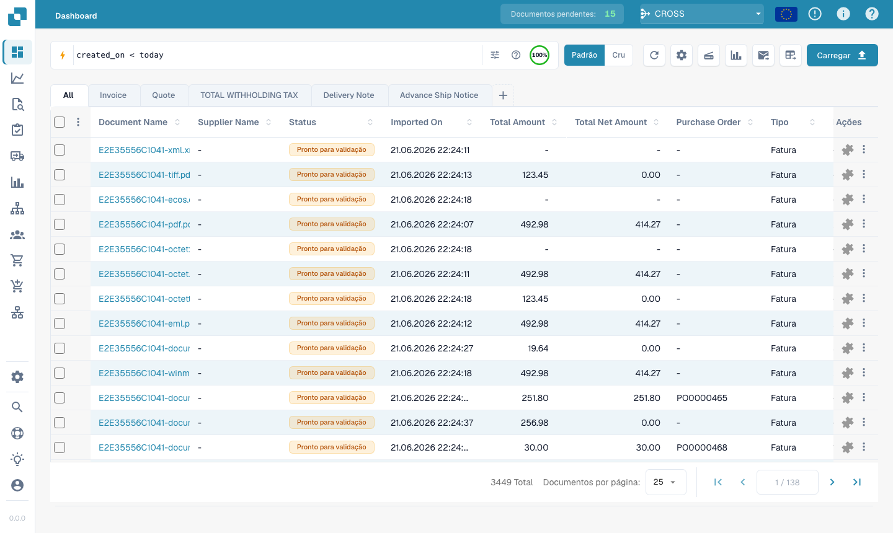<figcaption><p><code>created_on &lt; today</code> - Expande a palavra today para today().</p></figcaption></figure>

##### Período relativo

- Consulta: `created_on this_month`
- Equivale a: `created_on>=first day of this month AND created_on<=last day of this month`
- Resultado: Expande this_month para um intervalo de datas.

<figure>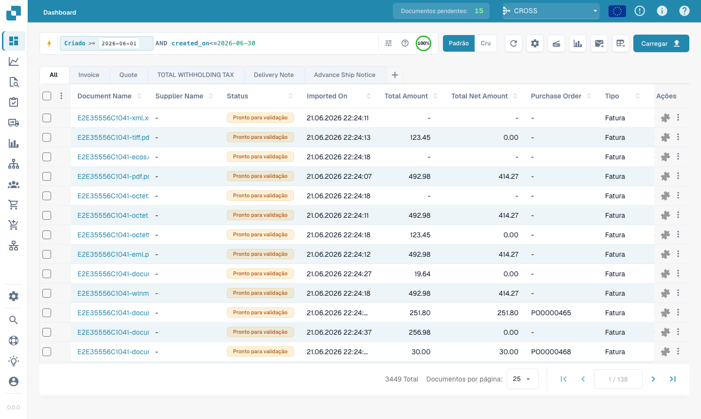<figcaption><p><code>created_on this_month</code> - Expande this_month para um intervalo de datas.</p></figcaption></figure>

##### Palavras vazio/definido

- Consulta: `assigned_to is empty`
- Equivale a: `assigned_to=""`
- Resultado: Encontra documentos sem responsável.

<figure>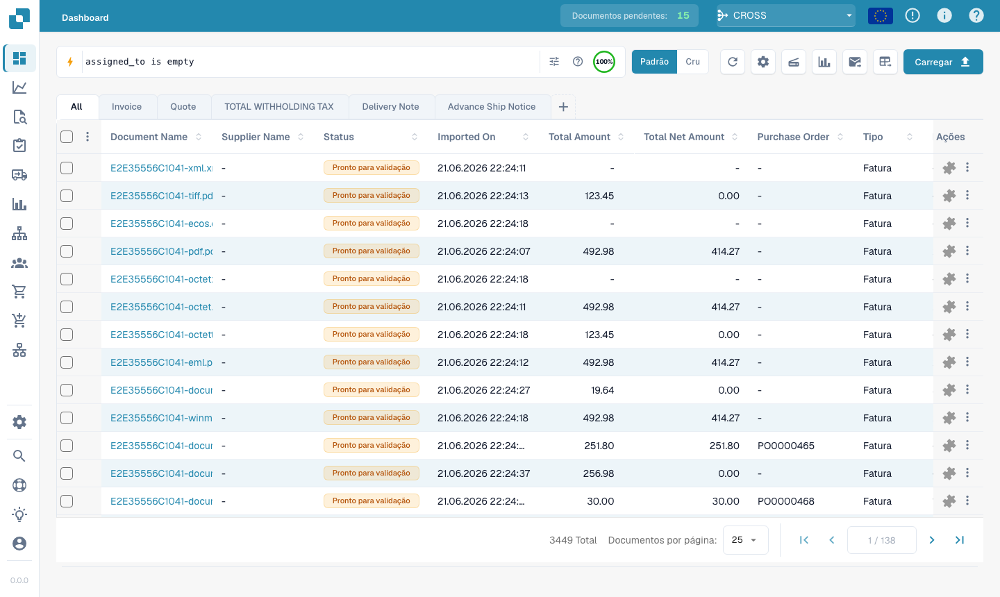<figcaption><p><code>assigned_to is empty</code> - Encontra documentos sem responsável.</p></figcaption></figure>

##### Status legível

- Consulta: `status:open`
- Equivale a: `status=ready_for_validation`
- Resultado: Mapeia open para o status de validação.

<figure>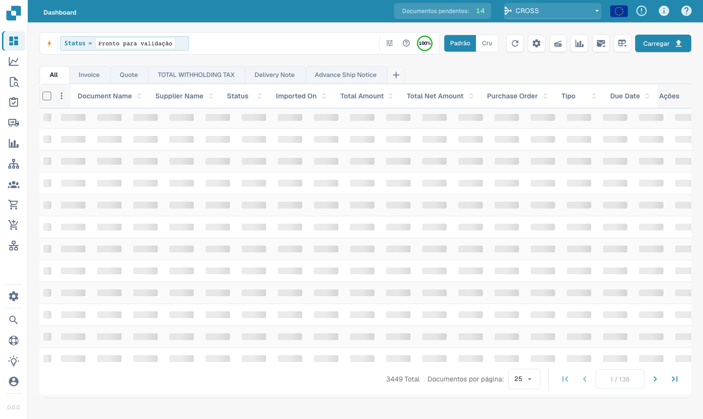<figcaption><p><code>status:open</code> - Mapeia open para o status de validação.</p></figcaption></figure>

##### Não entre

- Consulta: `created_on not between 2026-06-01, 2026-06-15`
- Equivale a: `(created_on<2026-06-01 OR created_on>2026-06-15)`
- Resultado: Encontra valores fora de uma janela de datas.

<figure>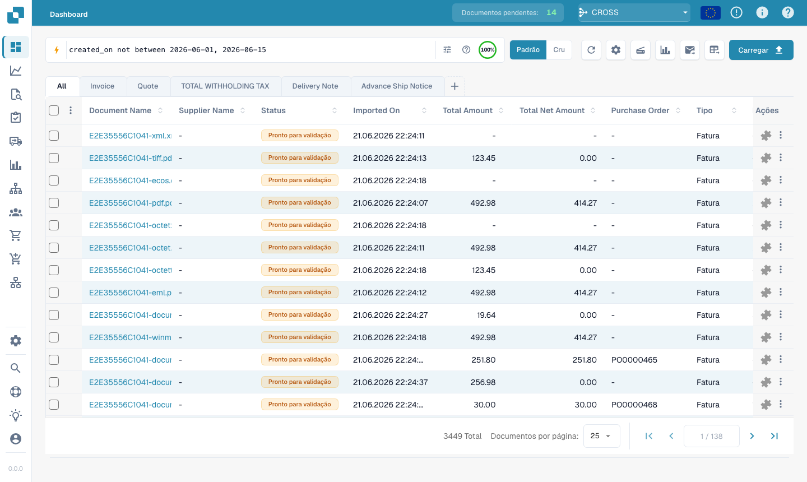<figcaption><p><code>created_on not between 2026-06-01, 2026-06-15</code> - Encontra valores fora de uma janela de datas.</p></figcaption></figure>

##### Lista in

- Consulta: `status in (ready_for_validation, exported)`
- Equivale a: `status=ready_for_validation OR status=exported`
- Resultado: Corresponde a qualquer status listado.

<figure>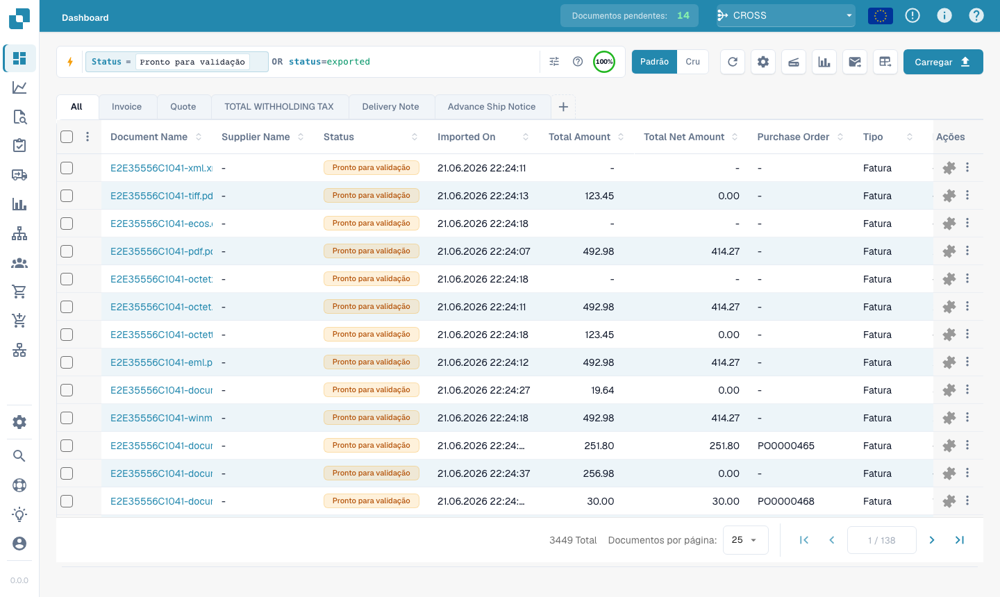<figcaption><p><code>status in (ready_for_validation, exported)</code> - Corresponde a qualquer status listado.</p></figcaption></figure>

##### Prefixo de negação

- Consulta: `not status=finished`
- Equivale a: `status!=finished`
- Resultado: Inverte o predicado de status finished.

<figure><figcaption><p><code>not status=finished</code> - Inverte o predicado de status finished.</p></figcaption></figure>

##### Texto contém

- Consulta: `filename contains E2E`
- Equivale a: `filename:E2E`
- Resultado: Usa contains como busca de substring no nome do arquivo.

<figure>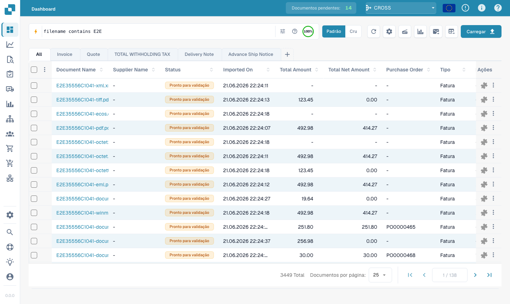<figcaption><p><code>filename contains E2E</code> - Usa contains como busca de substring no nome do arquivo.</p></figcaption></figure>

##### Prefixo de fatura

- Consulta: `#INV-1234`
- Equivale a: `invoice_id:INV-1234`
- Resultado: Mapeia #... para uma busca por ID da fatura.

<figure>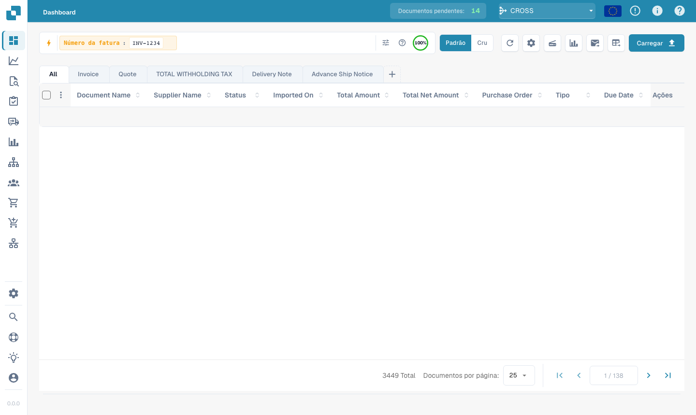<figcaption><p><code>#INV-1234</code> - Mapeia #... para uma busca por ID da fatura.</p></figcaption></figure>

##### Prefixo de responsável

- Consulta: `@Daniel`
- Equivale a: `assigned_to:"Daniel"`
- Resultado: Mapeia @... para uma busca por nome do responsável.

<figure><figcaption><p><code>@Daniel</code> - Mapeia @... para uma busca por nome do responsável.</p></figcaption></figure>

#### Requer pesquisa de texto completo

Se você usar o mesmo atalho com um campo somente de texto completo, a consulta ainda requer texto completo. Por exemplo, `ap_assignment_code is empty` usa o mesmo atalho vazio/definido que `assigned_to is empty`, mas o campo AP é de texto completo.

##### Sufixo de valor

- Consulta: `total_amount > 5k`
- Equivale a: `total_amount>5000`
- Resultado: Expande k para milhares em um campo de valor.

<figure>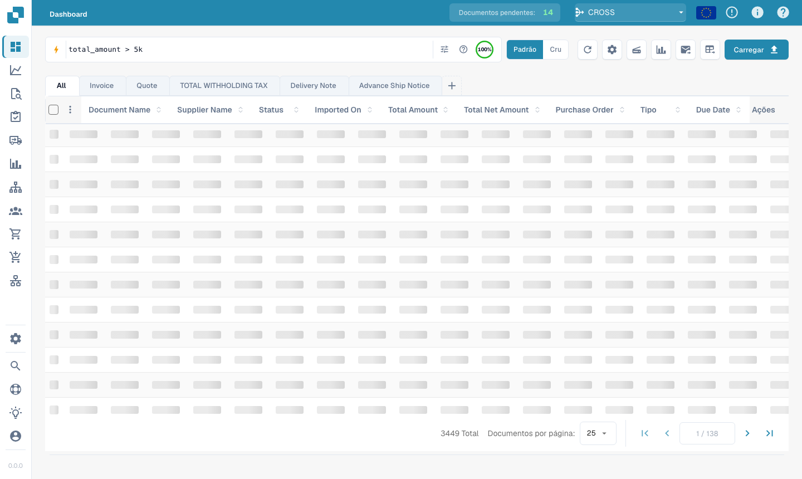<figcaption><p><code>total_amount &gt; 5k</code> - Expande k para milhares em um campo de valor.</p></figcaption></figure>

##### Atalho vencidas

- Consulta: `overdue`
- Equivale a: `invoice_due_date<today() AND status!=finished`
- Resultado: Encontra faturas não concluídas após o vencimento.

<figure><figcaption><p><code>overdue</code> - Encontra faturas não concluídas após o vencimento.</p></figcaption></figure>

##### Prefixo de valor

- Consulta: `$5000+`
- Equivale a: `total_amount>=5000`
- Resultado: Mapeia $...+ para um limite de valor.

<figure>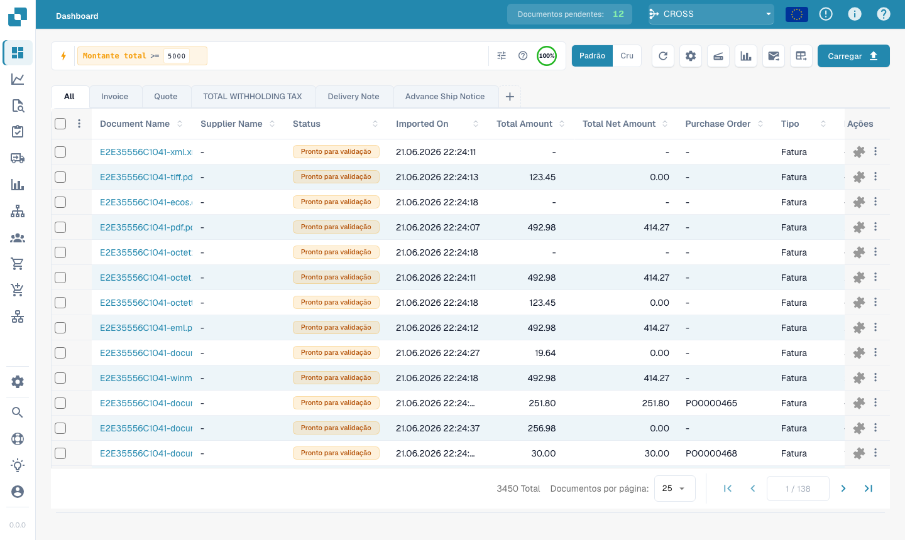<figcaption><p><code>$5000+</code> - Mapeia $...+ para um limite de valor.</p></figcaption></figure>

---

## Parte 4 — Modos de pesquisa avançados

Além da pesquisa por campos, três prefixos pesquisam no próprio conteúdo.

### Pesquisa vetorial (semântica) — `vector:`

Corresponde por **significado**, não por texto exato. Requer o módulo Vector.

```
vector: invoices about office supplies
vector: shipping delays with Hamburg port
```

### Pesquisa de texto OCR — `ocr:`

Pesquisa no **texto das páginas** extraído pelo OCR, não apenas nas colunas.

```
ocr: Versandkosten
ocr: "purchase order PO-12345"
ocr: Hamburg AND doc_type=INVOICE
```

### Pesquisa em linguagem natural (IA) — `ai:`

Descreva em linguagem normal o que procura; a IA lê a frase e extrai filtros
(fornecedor, datas, valores) numa consulta estruturada.

```
ai: invoices from Ruiz over 1000 last quarter
ai: overdue invoices waiting on approval
```

---

### Receitas

| Você quer… | Escreva isto |
|------------|--------------|
| Pronto a validar, totalmente conciliado | `status=ready_for_validation AND po_match_status=full_matched` |
| Este fornecedor, esta semana | `supplier_name=Test AND created_on>today()-7` |
| Faturas vencidas de valor elevado | `total_amount>5000 AND invoice_due_date<today()` |
| Dois fornecedores ao mesmo tempo | `supplier_name=fuji OR supplier_name=acme` |
| Documentos com erro de hoje | `(status=error OR status=failed) AND created_on>today()-1` |
| Por prefixo de número de encomenda | `purchase_order=PO-2026` |

> Os campos laranja (texto completo) e os filtros inteligentes de PO exigem a
> **pesquisa de texto completo** ativada.
