_Englischer Inhalt unten – Übersetzung ausstehend_

# Quick Search

**Quick Search** is the fastest way to find documents on the Dashboard. You
type what you're looking for — a name, a status, an amount, a date — and the
document list filters instantly.

This guide is organised the way the search is built up:

1. **Standard fields** — the columns every document has (document name, status,
   dates). Always available.
2. **Fulltext fields** — extracted content (supplier, purchase order, invoice
   number, amounts, line items). Available when fulltext search is enabled.
3. **Operators, shortcuts & recipes** — the full reference once you're
   comfortable.

> You don't have to memorise anything: click the search bar and pick a field and
> value from the list — Quick Search builds the query for you. The examples below
> also show the typed form so you can copy them directly.

<figure>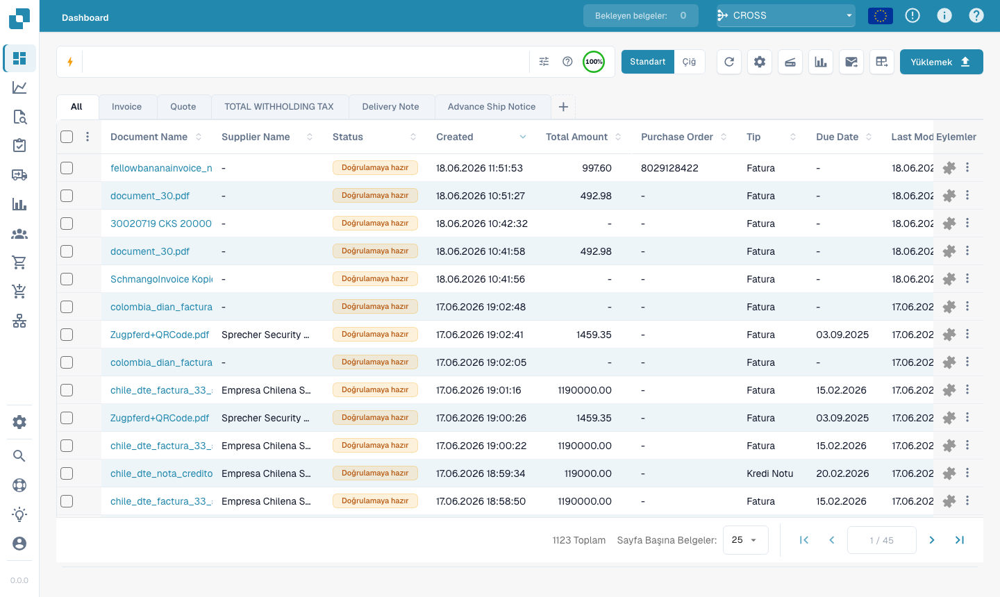<figcaption><p>The Quick Search bar at the top of the Dashboard.</p></figcaption></figure>

---

## How the search bar works — chips, toolbar & raw view

Before the fields themselves, it helps to know how the bar is laid out.

### Conditions become chips

As you complete a condition (a field, an operator and a value) Quick Search turns
it into a **chip** — a coloured pill inside the bar — and starts a fresh one. A
chip shows the **field**, the **operator** and the **value**, with a **×** to
remove it. Chips are colour-coded by where the data lives:

| Chip colour | Field type |
|-------------|------------|
| **Blue** | Standard column (document name, status, dates) |
| **Orange** | Fulltext / extracted field (supplier, amount, invoice number) |
| **Purple** | Vector (semantic) search |
| **Green** | OCR text search |

Click a chip to edit it (it expands back to text); click **×** to delete it.
Several chips combined read as **AND** by default.

### The toolbar

At the right-hand end of the bar:

- **ⓘ Help** — opens the in-app **Dashboard Search — Fields & Syntax** reference
  listing every field, operator and shortcut available in your workspace.
- **Filters (tune)** — a quick panel for the common Status / User / Restart
  filters, with **Clear filters** and **Apply**.
- **Index ring** — a small progress ring showing how much of your fulltext index
  is built (only shown when fulltext search is enabled).

### Standard vs. raw view

The bar normally shows your query as chips (**standard view**). Switch to **raw
view** to see and edit the query as plain text (e.g.
`status=ready_for_validation AND supplier_name=Test`) — useful for copying,
sharing, or typing a long query directly. Your query survives the switch and is
remembered when you reload the Dashboard.

---

## Part 1 — Standard fields

Standard fields are the document's own columns. They are **always available**,
whether or not fulltext search is switched on.

### Find documents by name

The document name is the most common search. There are three ways to match it —
all **case-insensitive**:

#### `=` → starts with

```
filename=invoice
```

Finds documents whose name **starts with** "invoice". Matching ignores case, so
all of these match `filename=invoice`:

```
Invoice.pdf   iNVoice.pdf   iNvoiCE.pdf   INVOICE.pdf
Invoice.xml   iNVoice.xml   iNvoiCE.edi   …
```

It does **not** match `XYZ_Invoice.pdf` (there "invoice" is in the middle — use
`:` for that).

<figure>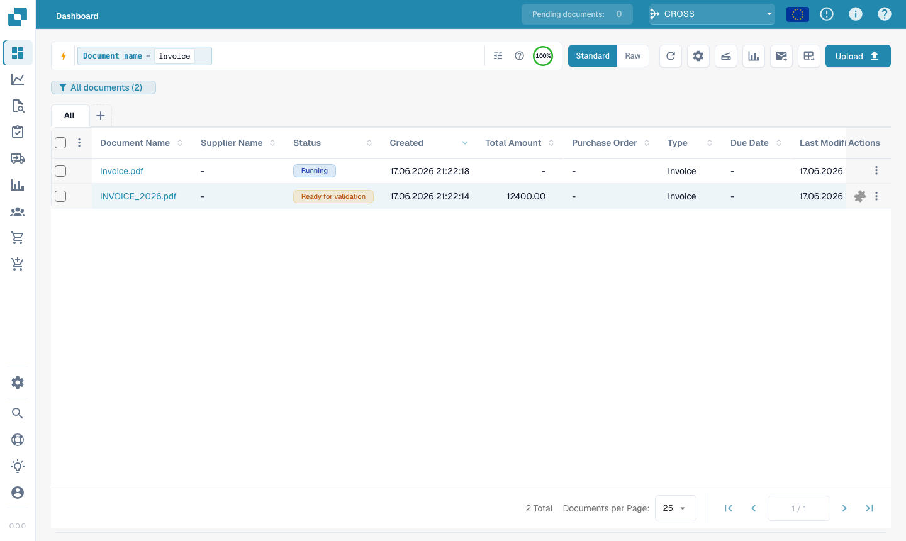<figcaption><p><code>filename=invoice</code> — only names that <strong>start with</strong> "invoice", any capitalisation (<code>Invoice.pdf</code>, <code>iNVoice.pdf</code>, <code>INVOICE_2026.pdf</code> … all match). Compare with <code>:</code> below.</p></figcaption></figure>

#### `:` → contains (anywhere)

```
filename:invoice
```

Use `:` to match the word **anywhere** in the name — `2026_Invoice.pdf`,
`vietnam_einvoice_sample.xml`, `scan_invoice_copy.pdf`.

<figure>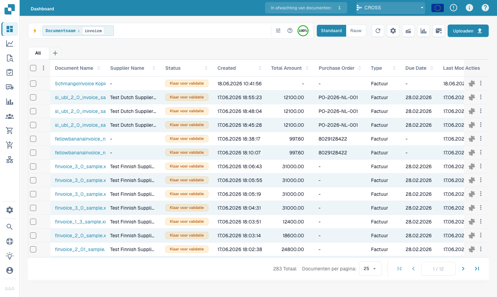<figcaption><p><code>filename:invoice</code> — matches the word anywhere in the document name.</p></figcaption></figure>

#### `="…"` → starts *or* ends with

```
filename="invoice"
```

Quotes make `=` match names that **start or end** with the value — handy for a
leading code or a file ending.

> **The three in one line:** `=` → starts with · `:` → contains · `="…"` →
> starts or ends with. All ignore upper/lower case. You can see this summarised
> any time via the **help icon** in the search bar (next section).

### Find documents by status

```
status=ready_for_validation
```

Status is a fixed list, so `=` is an **exact** match and the bar offers a value
picker when you type `status=`.

<figure>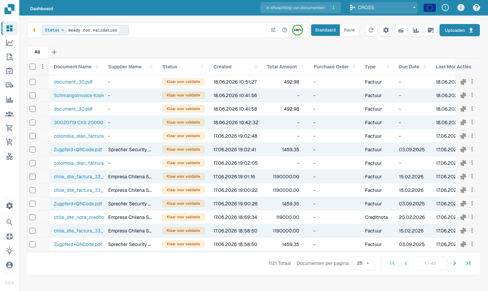<figcaption><p><code>status=ready_for_validation</code> — exact match on a fixed-list field.</p></figcaption></figure>

### Find documents by date

```
created_on>2026-05-25
```

Use `>`, `<`, `>=`, `<=` for date ranges. You can also use **relative** dates:
`today()`, `today()-7` (last 7 days), `today()+30` (next 30 days).

<figure><figcaption><p><code>created_on&#62;2026-05-25</code> — documents created after a date.</p></figcaption></figure>

### Find documents by invoice sub-type

```
invoice_sub_type="Cost Invoice"
```

Invoice sub-type is a fixed list (for example **Cost Invoice** or **Purchase
Invoice**), so `=` is an **exact** match and the bar offers a value picker when
you type `invoice_sub_type=`. Use `invoice_sub_type!="Cost Invoice"` for
everything except that sub-type.

---

## Part 2 — Fulltext fields

Fulltext fields search the **extracted content** of your documents — supplier,
purchase order, invoice number, amounts, line items. They appear in **orange**
and are available when **fulltext search is enabled** for your organisation. The
matching rules are exactly the same as for standard text fields
(`=` starts-with, `:` contains, `="…"` starts-or-ends).

### Find documents from a supplier

```
supplier_name=Test
```

Starts-with on the extracted supplier name. Use `supplier_name:fuji` to match
anywhere, or `supplier_name:"Ruiz Foods"` to quote a value with spaces.

<figure>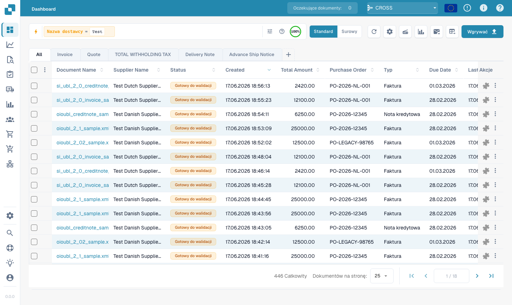<figcaption><p><code>supplier_name=Test</code> — every result's supplier starts with "Test".</p></figcaption></figure>

### Find documents by purchase order

```
purchase_order=PO
```

Starts-with on the extracted PO number — great for a PO prefix.

<figure>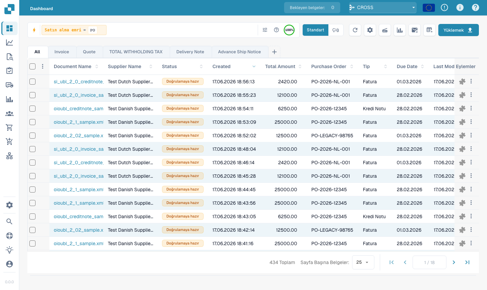<figcaption><p><code>purchase_order=PO</code> — documents whose PO number starts with "PO".</p></figcaption></figure>

### Find documents by amount

```
total_amount>5000
```

Use `>`, `<`, `>=`, `<=`, or `between 100 and 500` for a span.

<figure>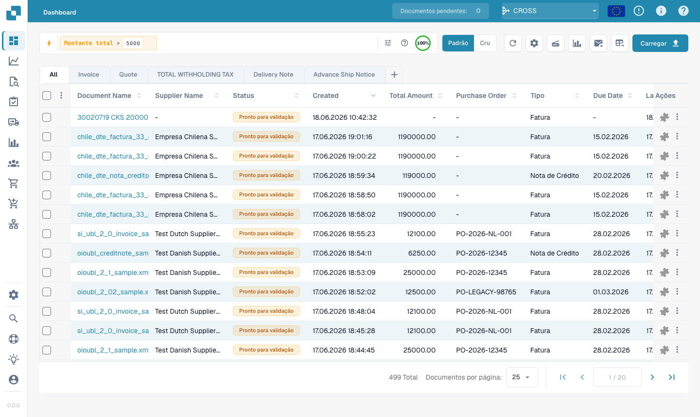<figcaption><p><code>total_amount&#62;5000</code> — invoices above 5,000.</p></figcaption></figure>

For a window, use `between`:

```
total_amount between 1000 and 5000
```

This is shorthand for `total_amount>=1000 AND total_amount<=5000`.

<figure>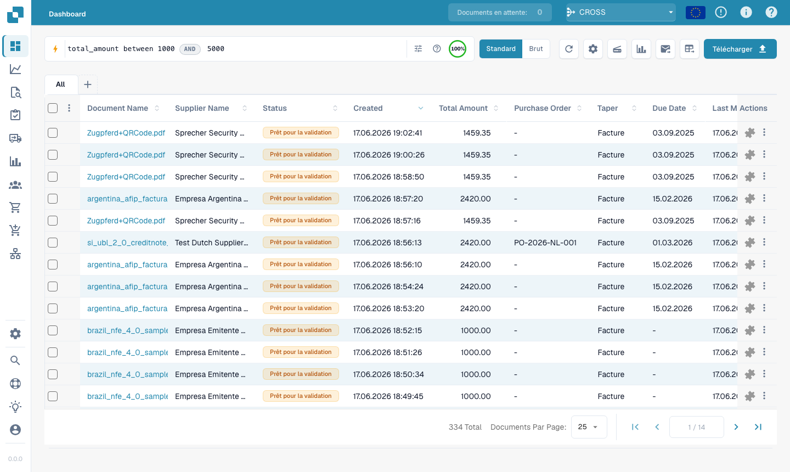<figcaption><p><code>total_amount between 1000 and 5000</code> — every result falls inside the window.</p></figcaption></figure>

### Find what's missing

```
supplier_name=""
```

`=""` means "this field is **not set**"; `supplier_name!=""` means "has any
supplier".

<figure>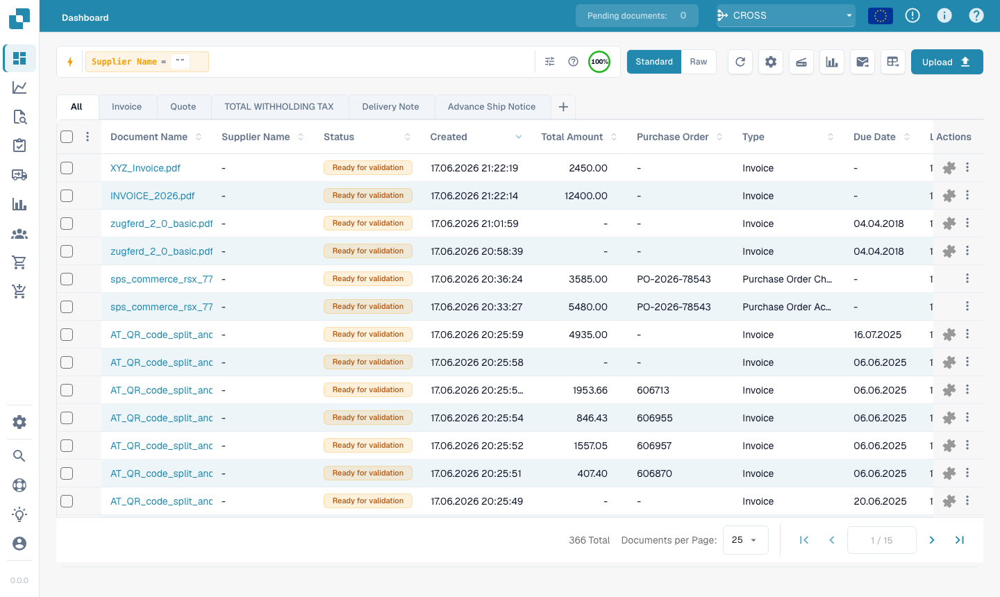<figcaption><p><code>supplier_name=""</code> — documents that have no supplier yet.</p></figcaption></figure>

The same presence check works on any field — for example documents still
missing an AP assignment code:

```
ap_assignment_code=""
```

<figure>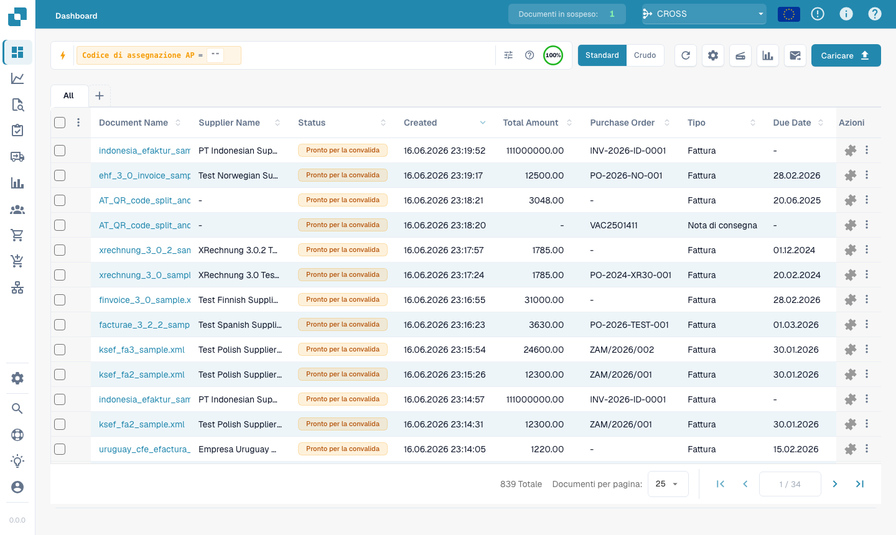<figcaption><p><code>ap_assignment_code=""</code> — documents that have no AP assignment code. Use <code>ap_assignment_code!=""</code> for those that do.</p></figcaption></figure>

---

## Smart Filters — one click

At the top of the Quick Search dropdown (click into the search bar) you'll find
**Smart Filters**: ready-made searches you apply with a single click. Each one
is just a shortcut for a query you could also type yourself:

| Smart Filter | Finds | Same as typing |
|--------------|-------|----------------|
| ⚠️ **Overdue** | Past their due date | `invoice_due_date<today()` |
| 🕐 **Due soon** | Within the next 7 days | `invoice_due_date<=today()+7` |
| 👤 **Assigned to me** | Items waiting for your action | `assigned_to=<you>` |
| 📅 **Today's inbox** | Imported today | `imported_on>=today()` |
| 📋 **Pending validation** | Ready to be validated | `status=ready_for_validation` |
| 🧾 **Electronic documents** | E-invoices (XML, ZUGFeRD, EDI) | `is_edoc=true` |
| ✅ **Full PO match** | Fully matched to a purchase order | `po_match_status=full_matched` |
| ➗ **Partial PO match** | Partially matched to a purchase order | `po_match_status=partial_matched` |
| 📉 **Under PO match** | Quantity or unit price under the purchase order | `po_match_status=under_matched` |

The three **PO match** filters and the fulltext fields require fulltext search
to be enabled for your organisation.

<figure>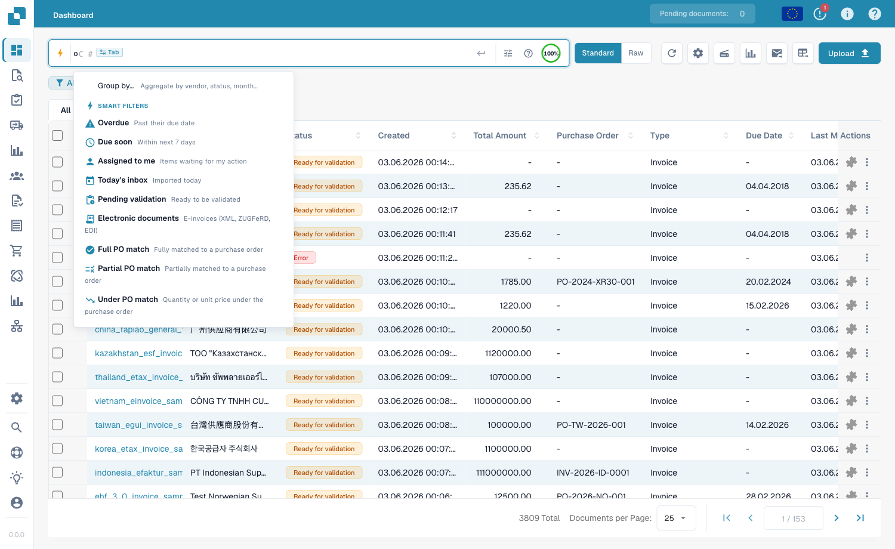<figcaption><p>The Smart Filters at the top of the Quick Search dropdown — one click applies the filter (Overdue, Due soon, Assigned to me, Today's inbox, Pending validation, Electronic documents, Full / Partial / Under PO match).</p></figcaption></figure>

---

## Grouping results

Instead of a flat list, you can **group** the results by any field — supplier,
status, document type, sub-organisation, or a date bucket. Add a grouping from
the search bar:

```
group by supplier_name
```

The list then shows collapsible **group headers**, each with the group's name and
a **count** (e.g. *Ruiz Foods (12)*). Click a header to expand or collapse that
group. For date fields you can group by **day, week or month**.

<figure>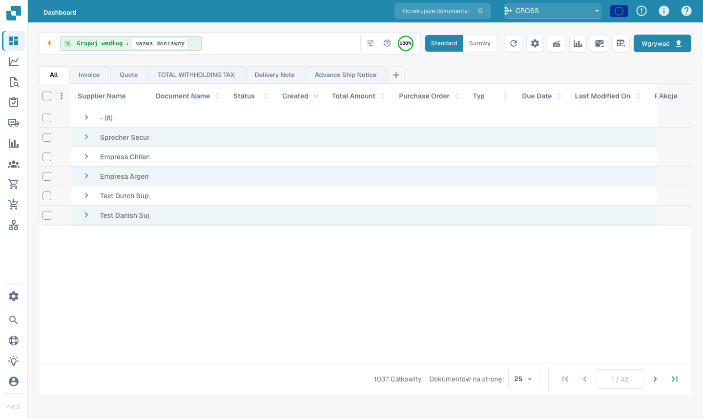<figcaption><p><code>group by supplier_name</code> — results collapse into one expandable header per supplier.</p></figcaption></figure>

Grouping combines with any filter — `status=ready_for_validation group by
supplier_name` groups only the matching documents. Clicking into a group
**drills down**: it applies that group's value as a filter and returns you to the
flat list for that selection.

---

## Part 3 — Operators, connectors, shortcuts

### The built-in help

The **help icon** in the search bar opens a complete reference of every field,
operator and shortcut available in your workspace — including which fields are
standard vs. fulltext.

<figure><figcaption><p>The built-in <strong>Dashboard Search — Fields &#38; Syntax</strong> help, listing every operator and how values are matched.</p></figcaption></figure>

### How `=` matches, by field type

All text matching ignores case.

| Field type | Example | `=` means |
|------------|---------|-----------|
| Text (name, supplier, purchase order) | `filename=invoice` | **starts with** |
| Text, anywhere | `filename:invoice` | **contains** |
| Text, start *or* end | `filename="invoice"` | **starts or ends with** |
| Status / type / PO match (fixed lists) | `status=finished` | **exact** |
| Identifiers (invoice number, supplier id) | `invoice_number=INV-100` | **exact** |
| Number | `total_amount>5000` | range (`> < >= <= between`) |
| Date | `created_on>2026-01-01` | range + `today()±N` |

### Operators

| Operator | Meaning |
|----------|---------|
| `=` | starts-with (text) / exact (list, number, date) |
| `:` | contains (text, anywhere) |
| `="…"` | starts-with or ends-with (text) |
| `!=` | the opposite of `=` |
| `>` `<` `>=` `<=` | greater / less than |
| `between … and …` | inclusive range |
| `field=""` / `field!=""` | is empty / is set |
| `today()`, `today()-7`, `today()+30` | relative dates |

### Connectors

Combine conditions with **AND** (both true), **OR** (either), **NOT**, and
parentheses `( … )` for grouping:

```
status=ready_for_validation AND supplier_name=Test
(status=error OR status=failed) AND created_on>today()-1
```

<figure>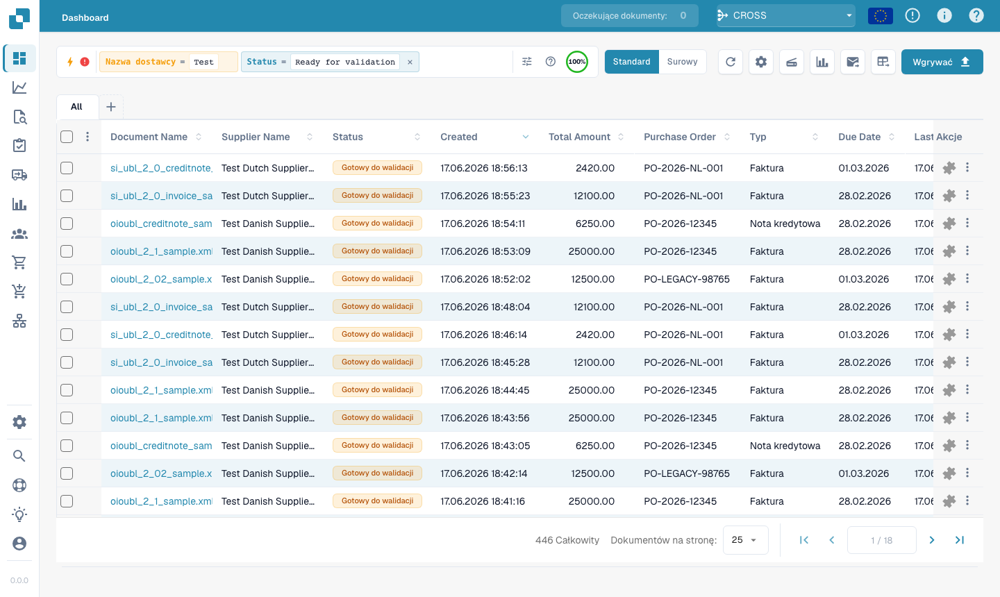<figcaption><p><code>status=ready_for_validation AND supplier_name=Test</code> — two conditions combined.</p></figcaption></figure>

### Shortcuts

Shorter phrasings for the same queries — use whichever reads better:

| Shortcut | Same as | Description |
|----------|---------|-------------|
| `total_amount gt 5000` | `total_amount>5000` | Word aliases for comparison operators (`gt`/`gte`/`lt`/`lte`/`eq`/`ne`) |
| `due_date > today` | `due_date>today()` | Bare `today` / `yesterday` / `tomorrow` |
| `imported_on this_week` | `imported_on>=today()-7 AND imported_on<=today()` | Relative periods (`this_week`, `last_week`, `this_month`, …) |
| `ap_assignment_code is empty` | `ap_assignment_code=""` | Whether a field has any value |
| `status:open` | `status=ready_for_validation` | Friendly status label (`open`/`closed`/`failed`/`done`) |
| `total_amount not between 100, 200` | `total_amount<100 OR total_amount>200` | Value outside a window |
| `status in (finished, error)` | `status=finished OR status=error` | Match any value from a list |
| `not status=finished` | `status!=finished` | Negate any predicate |
| `filename contains rechnung` | `filename:rechnung` | String match (`contains`/`starts_with`/`ends_with`) |
| `total_amount > 5k` | `total_amount>5000` | Currency suffix `k` (×1 000), `M` (×1 000 000) |
| `overdue` | `invoice_due_date<today() AND status!=finished` | Unpaid invoices past due |
| `#INV-1234` | `invoice_id:INV-1234` | Twitter-style prefix for invoice id |
| `@User` | `assigned_to:User` | Twitter-style prefix for assignee |
| `$5000+` | `total_amount>=5000` | `$` prefix for amount thresholds |

---

## Part 4 — Advanced search modes

Beyond field search, three prefix modes search the document content itself.

### Vector (semantic) search — `vector:`

Matches by **meaning**, not exact text — useful for "find documents about XYZ".
Requires the Vector module; applies to document content.

```
vector: invoices about office supplies
vector: shipping delays with Hamburg port
```

<figure>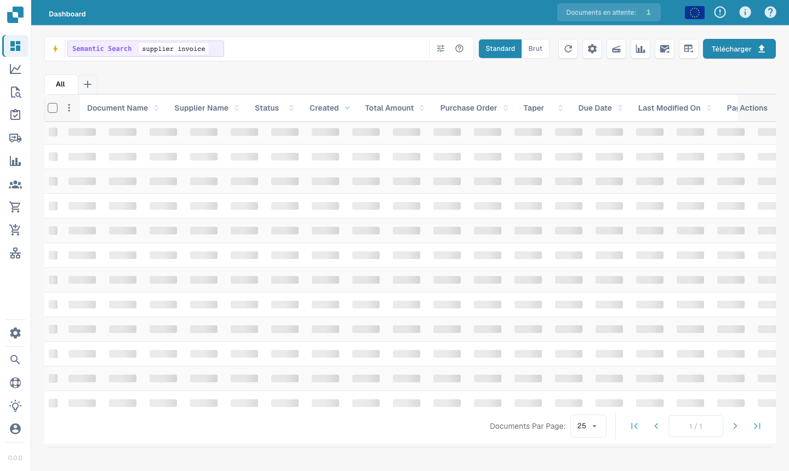<figcaption><p><code>vector: supplier invoice</code> — semantically related documents, even without those exact words.</p></figcaption></figure>

### OCR text search — `ocr:`

Searches **inside the page text** the OCR engine extracted — not just the
structured columns. Useful when the value you remember is in the document body.

```
ocr: Versandkosten
ocr: "purchase order PO-12345"
ocr: Hamburg AND doc_type=INVOICE
ocr: IBAN
```

<figure>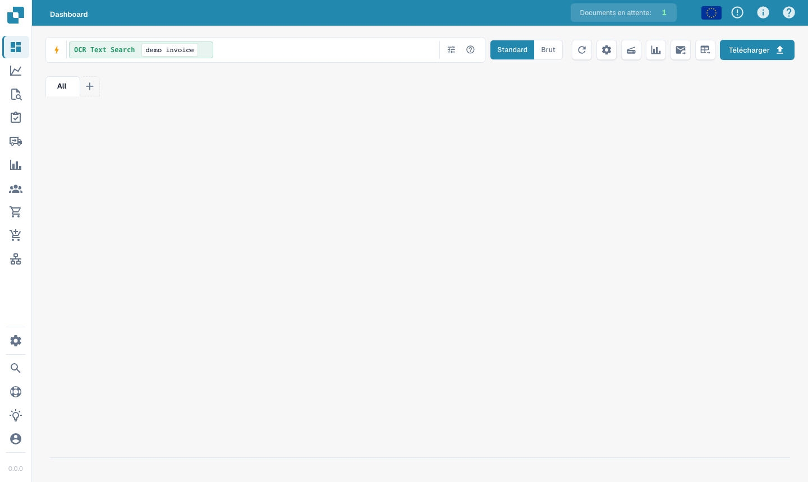<figcaption><p><code>ocr: demo invoice</code> — matches text found anywhere on the document pages.</p></figcaption></figure>

### Natural-language (AI) search — `ai:`

Describe what you want in plain English; the AI reads your phrase and extracts
filters (supplier, dates, amounts) into a structured query. Unlike Vector, it
**builds a query** rather than finding similar documents.

```
ai: invoices from Ruiz over 1000 last quarter
ai: overdue invoices waiting on approval
ai: shipping documents from Hamburg last month
```

<figure>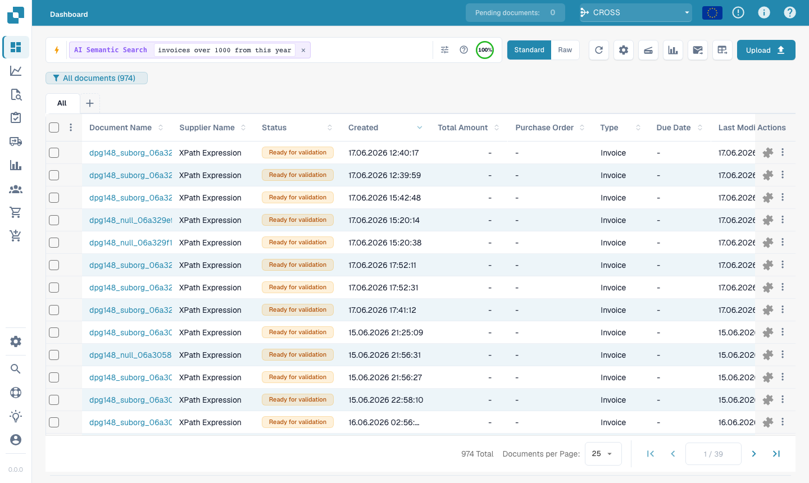<figcaption><p><code>ai: invoices over 1000 from this year</code> — the AI turns the sentence into filters automatically.</p></figcaption></figure>

---

### Recipes

| You want… | Type this |
|-----------|-----------|
| Ready to validate, fully matched | `status=ready_for_validation AND po_match_status=full_matched` |
| This supplier, this week | `supplier_name=Test AND created_on>today()-7` |
| High-value overdue invoices | `total_amount>5000 AND invoice_due_date<today()` |
| Two suppliers at once | `supplier_name=fuji OR supplier_name=acme` |
| Errored docs from today | `(status=error OR status=failed) AND created_on>today()-1` |
| Electronic credit notes | `is_edoc=true AND sub_doc_type=CREDIT_NOTE` |
| By purchase-order prefix | `purchase_order=PO-2026` |

> Orange (fulltext) fields require **fulltext search** to be enabled for your
> organisation. A literal `%` or `_` in a value is treated as a normal character.
