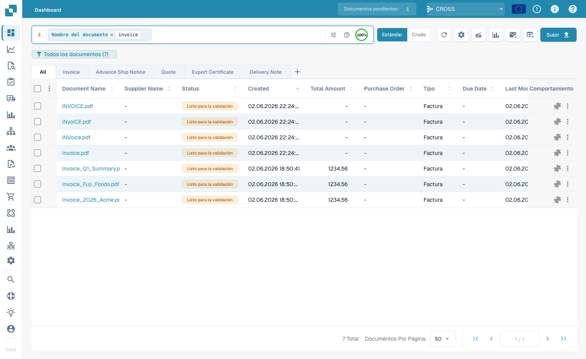
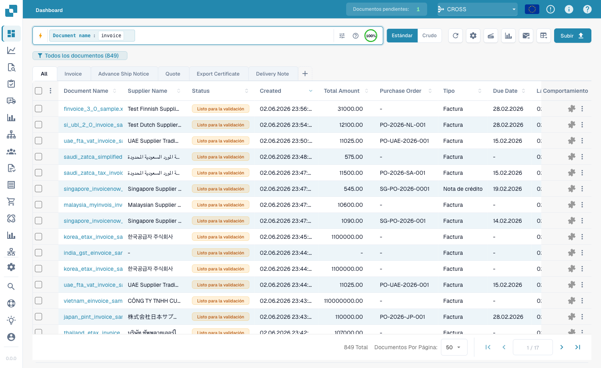
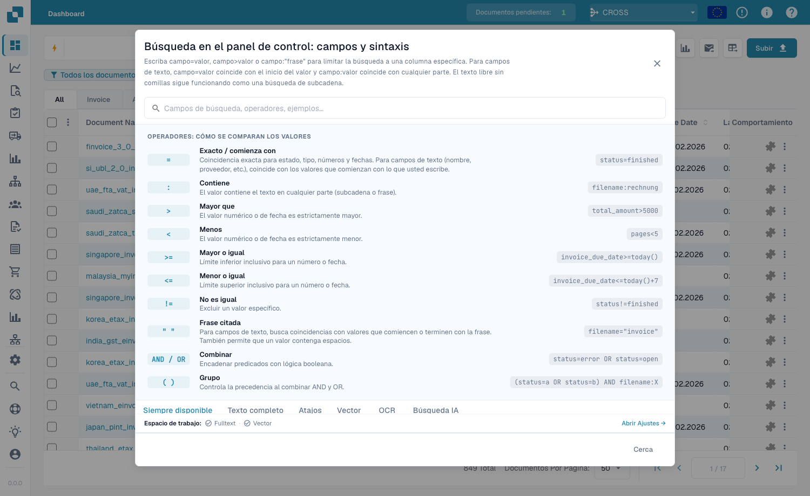

# Búsqueda rápida

La **Búsqueda rápida** en la parte superior del panel es la forma más rápida de
encontrar documentos. Escribe lo que buscas —un nombre, un estado, un importe,
una fecha— y la lista de documentos se filtra al instante.

Esta guía está organizada igual que se construye la búsqueda:

1. **Campos estándar** — las columnas que tiene todo documento (nombre del
   documento, estado, fechas). Siempre disponibles.
2. **Campos de texto completo** — contenido extraído (proveedor, número de
   pedido, número de factura, importes, líneas). Disponibles cuando la búsqueda
   de texto completo está activada.
3. **Operadores, atajos y recetas** — la referencia completa cuando ya tengas
   confianza.

> No tienes que memorizar nada: haz clic en la barra de búsqueda y elige un campo
> y un valor de la lista. Los ejemplos siguientes muestran también la forma
> escrita para copiarla directamente.

---

## Cómo funciona la barra de búsqueda — chips, barra de herramientas y vista en bruto

A medida que completas una condición (un campo, un operador y un valor), la
Búsqueda rápida la convierte en un **chip** —una pastilla de color dentro de la
barra— y empieza uno nuevo. Cada chip muestra el **campo**, el **operador** y el
**valor**, con una **×** para quitarlo. Los chips llevan un color según dónde
residen los datos:

| Color del chip | Tipo de campo |
|----------------|---------------|
| **Azul** | Columna estándar (nombre del documento, estado, fechas) |
| **Naranja** | Campo de texto completo / extraído (proveedor, importe, número de factura) |
| **Morado** | Búsqueda vectorial (semántica) |
| **Verde** | Búsqueda de texto OCR |

Haz clic en un chip para editarlo; haz clic en la **×** para eliminarlo. Varios
chips combinados se leen como **AND** de forma predeterminada.

**Barra de herramientas** (a la derecha de la barra): **ⓘ Ayuda** abre la
referencia integrada de campos y sintaxis; **Filtros** es un panel rápido de
Estado / Usuario / Reinicio; el **anillo de índice** muestra cuánto del índice
de texto completo está construido (solo cuando la búsqueda de texto completo está
activada).

**Vista estándar frente a vista en bruto:** la barra muestra tu consulta como
chips (estándar). Cambia a la **vista en bruto** para verla y editarla como texto
plano —práctico para copiar o escribir una consulta larga. Tu consulta se
recuerda al recargar.

### Buscar documentos por subtipo de factura

```
invoice_sub_type="Cost Invoice"
```

El subtipo de factura es una lista fija (p. ej. **Cost Invoice**, **Purchase
Invoice**), por lo que `=` es una coincidencia exacta y la barra ofrece un
selector de valores. Usa `invoice_sub_type!="Cost Invoice"` para todo excepto ese
subtipo.

## Agrupar resultados

En lugar de una lista plana, puedes **agrupar** los resultados por cualquier
campo —proveedor, estado, tipo de documento o un intervalo de fechas:

```
group by supplier_name
```

La lista muestra **encabezados de grupo** plegables, cada uno con un **recuento**.
Haz clic en un encabezado para expandirlo o plegarlo; entra en un grupo para
**desglosarlo** (aplicar ese valor como filtro). La agrupación se combina con
cualquier filtro.

<figure><figcaption><p><code>group by supplier_name</code> — los resultados se pliegan en un encabezado expandible por cada proveedor.</p></figcaption></figure>

---

## Parte 1 — Campos estándar

Los campos estándar son las propias columnas del documento. Están **siempre
disponibles**, esté o no activada la búsqueda de texto completo.

### Buscar documentos por nombre

El nombre del documento es la búsqueda más habitual. Hay tres maneras de
coincidir —todas **sin distinguir mayúsculas/minúsculas**:

#### `=` → empieza por

```
filename=invoice
```

Encuentra documentos cuyo nombre **empieza por** «invoice». Como no distingue
mayúsculas, todos estos coinciden con `filename=invoice`:

```
Invoice.pdf   iNVoice.pdf   iNvoiCE.pdf   INVOICE.pdf
Invoice.xml   iNVoice.xml   iNvoiCE.edi   …
```

**No** coincide con `XYZ_Invoice.pdf` (ahí «invoice» está en medio — usa `:`).

<figure><figcaption><p><code>filename=invoice</code> — solo nombres que <strong>empiezan por</strong> «invoice», en cualquier capitalización (<code>INVOICE.pdf</code>, <code>iNvoiCE.pdf</code>, <code>iNVoice.pdf</code>, <code>Invoice.pdf</code> coinciden — 7 resultados).</p></figcaption></figure>

#### `:` → contiene (en cualquier lugar)

```
filename:invoice
```

Con `:` coincides con la palabra **en cualquier parte** del nombre —
`2026_Invoice.pdf`, `XYZ_Invoice ABC.pdf`, `123_Invoice ABC bla bla.pdf`.

<figure><figcaption><p><code>filename:invoice</code> — coincide con «invoice» en cualquier posición del nombre (también <code>XYZ_Invoice ABC.pdf</code>).</p></figcaption></figure>

#### `="…"` → empieza *o* termina por

```
filename="invoice"
```

Las comillas hacen que `=` coincida con nombres que **empiezan o terminan** por
el valor.

> **Las tres en una línea:** `=` → empieza por · `:` → contiene · `="…"` →
> empieza o termina por. Todas ignoran mayúsculas/minúsculas.

### Buscar por estado

```
status=ready_for_validation
```

El estado es una lista fija, por lo que `=` es una coincidencia **exacta** y la
barra ofrece un selector de valores al escribir `status=`.

### Buscar por fecha

```
created_on>2026-05-25
```

Usa `>`, `<`, `>=`, `<=` para rangos de fechas. También fechas **relativas**:
`today()`, `today()-7` (últimos 7 días), `today()+30` (próximos 30 días).

---

## Parte 2 — Campos de texto completo

Los campos de texto completo buscan en el **contenido extraído** —proveedor,
número de pedido, número de factura, importes, líneas. Aparecen en **naranja** y
están disponibles cuando la **búsqueda de texto completo está activada**. Las
reglas de coincidencia son idénticas a las de los campos de texto estándar
(`=` empieza-por, `:` contiene, `="…"` empieza-o-termina).

### Buscar documentos de un proveedor

```
supplier_name=Test
```

Empieza-por sobre el nombre de proveedor extraído; `supplier_name:fuji` coincide
en cualquier parte; `supplier_name:"Ruiz Foods"` entrecomilla un valor con
espacios.

### Buscar por importe

```
total_amount>5000
```

Usa `>`, `<`, `>=`, `<=` o `between 1000 and 5000` para una ventana.

### Encontrar lo que falta

```
supplier_name=""
```

`=""` significa «este campo **no está establecido**»; `supplier_name!=""`
significa «tiene cualquier proveedor». La misma comprobación sirve para cualquier
campo, p. ej. `ap_assignment_code=""`.

---

## Filtros inteligentes — un clic

En la parte superior del desplegable de búsqueda encontrarás los **Filtros
inteligentes**: búsquedas listas con un clic. Cada uno es un atajo de una
consulta que también podrías escribir:

| Filtro inteligente | Encuentra | Equivale a |
|--------------------|-----------|------------|
| ⚠️ **Vencidos** | Pasada su fecha de vencimiento | `invoice_due_date<today()` |
| 🕐 **Vencen pronto** | En los próximos 7 días | `invoice_due_date<=today()+7` |
| 👤 **Asignados a mí** | Esperan tu acción | `assigned_to=<tú>` |
| 📅 **Bandeja de hoy** | Importados hoy | `imported_on>=today()` |
| 📋 **Pendientes de validación** | Listos para validar | `status=ready_for_validation` |
| 🧾 **Documentos electrónicos** | E-facturas (XML, ZUGFeRD, EDI) | `is_edoc=true` |
| ✅ **Coincidencia total de PO** | Totalmente conciliado con un pedido | `po_match_status=full_matched` |
| ➗ **Coincidencia parcial de PO** | Parcialmente conciliado | `po_match_status=partial_matched` |
| 📉 **Coincidencia inferior de PO** | Cantidad o precio por debajo del pedido | `po_match_status=under_matched` |

Los tres filtros de **coincidencia de PO** y los campos de texto completo
requieren la búsqueda de texto completo activada.

---

## Parte 3 — Operadores, conectores, atajos

### La ayuda integrada

El **icono de ayuda** en la barra de búsqueda abre una referencia completa de
todos los campos, operadores y atajos de tu espacio de trabajo —incluido qué
campos son estándar y cuáles de texto completo.

<figure><figcaption><p>La ayuda integrada <strong>Búsqueda del panel — Campos y sintaxis</strong> lista cada operador y cómo coinciden los valores (p. ej. «Exacto / empieza por»).</p></figcaption></figure>

### Qué significa `=` según el tipo de campo

Toda coincidencia de texto ignora mayúsculas/minúsculas.

| Tipo de campo | Ejemplo | `=` significa |
|---------------|---------|---------------|
| Texto (nombre, proveedor, pedido) | `filename=invoice` | **empieza por** |
| Texto, en cualquier parte | `filename:invoice` | **contiene** |
| Texto, inicio *o* fin | `filename="invoice"` | **empieza o termina por** |
| Estado / tipo / coincidencia PO (listas fijas) | `status=finished` | **exacto** |
| Identificadores (nº factura, id proveedor) | `invoice_number=INV-100` | **exacto** |
| Número | `total_amount>5000` | rango (`> < >= <= between`) |
| Fecha | `created_on>2026-01-01` | rango + `today()±N` |

### Operadores

| Operador | Significado |
|----------|-------------|
| `=` | empieza-por (texto) / exacto (lista, número, fecha) |
| `:` | contiene (texto, en cualquier parte) |
| `="…"` | empieza-por o termina-por (texto) |
| `!=` | lo contrario de `=` |
| `>` `<` `>=` `<=` | mayor / menor que |
| `between … and …` | rango inclusivo |
| `field=""` / `field!=""` | está vacío / está establecido |
| `today()`, `today()-7`, `today()+30` | fechas relativas |

### Conectores

Combina condiciones con **AND** (ambas), **OR** (cualquiera), **NOT** y
paréntesis `( … )` para agrupar:

```
status=ready_for_validation AND supplier_name=Test
(status=error OR status=failed) AND created_on>today()-1
```

### Atajos

Formas más cortas para las mismas consultas:

| Atajo | Equivale a |
|-------|------------|
| `total_amount gt 5000` | `total_amount>5000` (alias gt/gte/lt/lte) |
| `due_date > today` | `due_date>today()` (today/yesterday/tomorrow) |
| `imported_on this_week` | esta semana ISO (también `last_week`, `this_month`, …) |
| `ap_assignment_code is empty` | `ap_assignment_code=""` |
| `status:open` | `status=ready_for_validation` (open/closed/failed/done) |
| `total_amount not between 100, 200` | `total_amount<100 OR total_amount>200` |
| `status in (finished, error)` | `status=finished OR status=error` |
| `not status=finished` | `status!=finished` |
| `filename contains rechnung` | `filename:rechnung` |
| `total_amount > 5k` | `total_amount>5000` (`k`=mil, `M`=millón) |
| `overdue` | `invoice_due_date<today() AND status!=finished` |
| `#INV-1234` | `invoice_id:INV-1234` |
| `@User` | `assigned_to:User` |
| `$5000+` | `total_amount>=5000` |

---

## Parte 4 — Modos de búsqueda avanzados

Más allá de la búsqueda por campos, tres prefijos buscan en el propio contenido.

### Búsqueda vectorial (semántica) — `vector:`

Coincide por **significado**, no por texto exacto. Requiere el módulo Vector.

```
vector: invoices about office supplies
vector: shipping delays with Hamburg port
```

### Búsqueda de texto OCR — `ocr:`

Busca en el **texto de las páginas** que extrajo el OCR, no solo en las columnas.

```
ocr: Versandkosten
ocr: "purchase order PO-12345"
ocr: Hamburg AND doc_type=INVOICE
```

### Búsqueda en lenguaje natural (IA) — `ai:`

Describe en lenguaje normal lo que buscas; la IA lee tu frase y extrae filtros
(proveedor, fechas, importes) en una consulta estructurada.

```
ai: invoices from Ruiz over 1000 last quarter
ai: overdue invoices waiting on approval
```

---

### Recetas

| Quieres… | Escribe esto |
|----------|--------------|
| Listo para validar, totalmente conciliado | `status=ready_for_validation AND po_match_status=full_matched` |
| Este proveedor, esta semana | `supplier_name=Test AND created_on>today()-7` |
| Facturas vencidas de alto importe | `total_amount>5000 AND invoice_due_date<today()` |
| Dos proveedores a la vez | `supplier_name=fuji OR supplier_name=acme` |
| Documentos con error de hoy | `(status=error OR status=failed) AND created_on>today()-1` |
| Por prefijo de número de pedido | `purchase_order=PO-2026` |

> Los campos naranja (texto completo) y los filtros inteligentes de PO requieren
> la **búsqueda de texto completo** activada.
