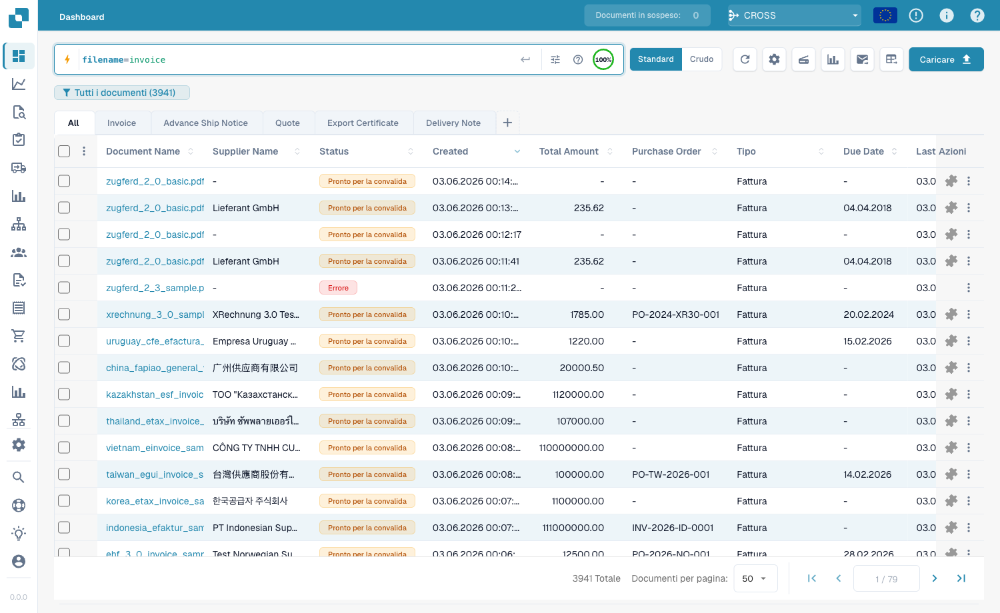
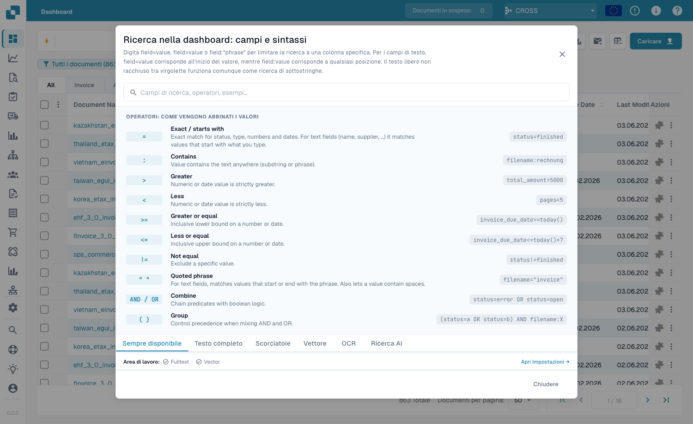

# Ricerca rapida

La **Ricerca rapida** in cima alla dashboard è il modo più veloce per trovare
documenti. Digita ciò che cerchi — un nome, uno stato, un importo, una data — e
l'elenco si filtra all'istante.

Questa guida è organizzata come si costruisce la ricerca:

1. **Campi standard** — le colonne che ha ogni documento (nome documento, stato,
   date). Sempre disponibili.
2. **Campi full-text** — contenuto estratto (fornitore, numero d'ordine, numero
   fattura, importi, righe). Disponibili quando la ricerca full-text è attiva.
3. **Operatori, scorciatoie e ricette** — il riferimento completo.

> Non devi memorizzare nulla: clicca nella barra di ricerca e scegli un campo e
> un valore dall'elenco. Gli esempi sotto mostrano anche la forma digitata, da
> copiare direttamente.

---

## Come funziona la barra di ricerca — chip, barra degli strumenti e vista grezza

Man mano che completi una condizione (un campo, un operatore e un valore) la
Ricerca rapida la trasforma in un **chip** — una pillola colorata all'interno
della barra — e ne avvia uno nuovo. Un chip mostra il **campo**, l'**operatore**
e il **valore**, con una **×** per rimuoverlo. I chip sono codificati per colore
in base a dove risiedono i dati:

| Colore del chip | Tipo di campo |
|-----------------|---------------|
| **Blu** | Colonna standard (nome documento, stato, date) |
| **Arancione** | Campo full-text / estratto (fornitore, importo, numero fattura) |
| **Viola** | Ricerca vettoriale (semantica) |
| **Verde** | Ricerca testo OCR |

Clicca un chip per modificarlo; clicca **×** per eliminarlo. Più chip combinati
sono letti come **AND** per impostazione predefinita.

**Barra degli strumenti** (a destra della barra): **ⓘ Guida** apre il riferimento
integrato di campi e sintassi; **Filtri** è un pannello rapido di Stato / Utente /
Riavvio; l'**anello dell'indice** mostra quanta parte dell'indice full-text è
costruita (solo quando la ricerca full-text è attiva).

**Vista standard vs. grezza:** la barra mostra la tua query come chip (standard).
Passa alla **vista grezza** per vederla e modificarla come testo semplice — comodo
per copiare o digitare una query lunga. La tua query viene ricordata quando
ricarichi la pagina.

### Trovare documenti per sotto-tipo di fattura

```
invoice_sub_type="Cost Invoice"
```

Il sotto-tipo di fattura è un elenco fisso (es. **Cost Invoice**, **Purchase
Invoice**), quindi `=` è una corrispondenza esatta e la barra offre un selettore di
valori. Usa `invoice_sub_type!="Cost Invoice"` per tutto tranne quel sotto-tipo.

## Raggruppare i risultati

Invece di un elenco piatto puoi **raggruppare** i risultati per qualsiasi campo —
fornitore, stato, tipo di documento o un intervallo di date:

```
group by supplier_name
```

L'elenco mostra **intestazioni di gruppo** comprimibili, ciascuna con un
**conteggio**. Clicca un'intestazione per espanderla o comprimerla; clicca
all'interno di un gruppo per **approfondire** (applicare quel valore come filtro).
Il raggruppamento si combina con qualsiasi filtro.

<figure><figcaption><p><code>group by supplier_name</code> — i risultati si comprimono in un'unica intestazione espandibile per fornitore.</p></figcaption></figure>

---

## Parte 1 — Campi standard

I campi standard sono le colonne proprie del documento. Sono **sempre
disponibili**, che la ricerca full-text sia attiva o meno.

### Trovare documenti per nome

Il nome del documento è la ricerca più comune. Tre modi di corrispondere — tutti
**senza distinzione tra maiuscole/minuscole**:

#### `=` → inizia con

```
filename=invoice
```

Trova i documenti il cui nome **inizia con** «invoice». Poiché ignora le
maiuscole, tutti questi corrispondono a `filename=invoice`:

```
Invoice.pdf   iNVoice.pdf   iNvoiCE.pdf   INVOICE.pdf
Invoice.xml   iNVoice.xml   iNvoiCE.edi   …
```

**Non** corrisponde a `XYZ_Invoice.pdf` (lì «invoice» è nel mezzo — usa `:`).

<figure><figcaption><p><code>filename=invoice</code> — solo nomi che <strong>iniziano con</strong> «invoice», in qualsiasi capitalizzazione (<code>INVOICE.pdf</code>, <code>iNvoiCE.pdf</code>, <code>iNVoice.pdf</code>, <code>Invoice.pdf</code> corrispondono — 7 risultati).</p></figcaption></figure>

#### `:` → contiene (ovunque)

```
filename:invoice
```

Con `:` la parola corrisponde **ovunque** nel nome — `2026_Invoice.pdf`,
`XYZ_Invoice ABC.pdf`, `123_Invoice ABC bla bla.pdf`.

<figure><figcaption><p><code>filename:invoice</code> — corrisponde a «invoice» in qualsiasi posizione del nome (anche <code>XYZ_Invoice ABC.pdf</code>).</p></figcaption></figure>

#### `="…"` → inizia *o* finisce con

```
filename="invoice"
```

Le virgolette fanno sì che `=` corrisponda ai nomi che **iniziano o finiscono**
con il valore.

> **Le tre in una riga:** `=` → inizia con · `:` → contiene · `="…"` → inizia o
> finisce con. Tutte ignorano maiuscole/minuscole.

### Trovare per stato

```
status=ready_for_validation
```

Lo stato è un elenco fisso, quindi `=` è una corrispondenza **esatta** e la barra
offre un selettore di valori.

### Trovare per data

```
created_on>2026-05-25
```

Usa `>`, `<`, `>=`, `<=` per intervalli di date. Anche date **relative**:
`today()`, `today()-7` (ultimi 7 giorni), `today()+30`.

---

## Parte 2 — Campi full-text

I campi full-text cercano nel **contenuto estratto** — fornitore, numero
d'ordine, numero fattura, importi, righe. Appaiono in **arancione** e richiedono
la **ricerca full-text attiva**. Le regole di corrispondenza sono identiche ai
campi di testo standard (`=` inizia-con, `:` contiene, `="…"` inizia-o-finisce).

### Trovare i documenti di un fornitore

```
supplier_name=Test
```

Inizia-con sul nome fornitore estratto; `supplier_name:fuji` corrisponde ovunque;
`supplier_name:"Ruiz Foods"` racchiude tra virgolette un valore con spazi.

### Trovare per importo

```
total_amount>5000
```

Usa `>`, `<`, `>=`, `<=` o `between 1000 and 5000` per una finestra.

### Trovare ciò che manca

```
supplier_name=""
```

`=""` significa «questo campo **non è impostato**»; `supplier_name!=""` significa
«ha un fornitore qualsiasi». Lo stesso controllo vale per qualsiasi campo, es.
`ap_assignment_code=""`.

---

## Filtri intelligenti — un clic

In cima al menu a tendina della ricerca trovi i **Filtri intelligenti**: ricerche
pronte con un clic. Ognuno è una scorciatoia per una query che potresti anche
digitare:

| Filtro intelligente | Trova | Equivale a |
|---------------------|-------|------------|
| ⚠️ **Scaduti** | Oltre la data di scadenza | `invoice_due_date<today()` |
| 🕐 **In scadenza** | Nei prossimi 7 giorni | `invoice_due_date<=today()+7` |
| 👤 **Assegnati a me** | In attesa della tua azione | `assigned_to=<tu>` |
| 📅 **Posta di oggi** | Importati oggi | `imported_on>=today()` |
| 📋 **In attesa di validazione** | Pronti da validare | `status=ready_for_validation` |
| 🧾 **Documenti elettronici** | E-fatture (XML, ZUGFeRD, EDI) | `is_edoc=true` |
| ✅ **Corrispondenza PO completa** | Completamente riconciliato con un ordine | `po_match_status=full_matched` |
| ➗ **Corrispondenza PO parziale** | Parzialmente riconciliato | `po_match_status=partial_matched` |
| 📉 **Corrispondenza PO inferiore** | Quantità o prezzo sotto l'ordine | `po_match_status=under_matched` |

I tre filtri **corrispondenza PO** e i campi full-text richiedono la ricerca
full-text attiva.

---

## Parte 3 — Operatori, connettori, scorciatoie

### La guida integrata

L'**icona della guida** nella barra di ricerca apre un riferimento completo di
tutti i campi, operatori e scorciatoie del tuo spazio di lavoro.

<figure><figcaption><p>La guida integrata <strong>Ricerca dashboard — Campi e sintassi</strong> elenca ogni operatore e come corrispondono i valori (es. «Esatto / inizia con»).</p></figcaption></figure>

### Cosa significa `=` per tipo di campo

Ogni corrispondenza di testo ignora maiuscole/minuscole.

| Tipo di campo | Esempio | `=` significa |
|---------------|---------|---------------|
| Testo (nome, fornitore, ordine) | `filename=invoice` | **inizia con** |
| Testo, ovunque | `filename:invoice` | **contiene** |
| Testo, inizio *o* fine | `filename="invoice"` | **inizia o finisce con** |
| Stato / tipo / corrispondenza PO (elenchi fissi) | `status=finished` | **esatto** |
| Identificatori (n° fattura, id fornitore) | `invoice_number=INV-100` | **esatto** |
| Numero | `total_amount>5000` | intervallo (`> < >= <= between`) |
| Data | `created_on>2026-01-01` | intervallo + `today()±N` |

### Operatori

| Operatore | Significato |
|-----------|-------------|
| `=` | inizia-con (testo) / esatto (elenco, numero, data) |
| `:` | contiene (testo, ovunque) |
| `="…"` | inizia-con o finisce-con (testo) |
| `!=` | l'opposto di `=` |
| `>` `<` `>=` `<=` | maggiore / minore di |
| `between … and …` | intervallo inclusivo |
| `field=""` / `field!=""` | è vuoto / è impostato |
| `today()`, `today()-7`, `today()+30` | date relative |

### Connettori

Combina condizioni con **AND** (entrambe), **OR** (una), **NOT** e parentesi
`( … )` per raggruppare:

```
status=ready_for_validation AND supplier_name=Test
(status=error OR status=failed) AND created_on>today()-1
```

### Scorciatoie

Forme più brevi per le stesse query:

| Scorciatoia | Equivale a |
|-------------|------------|
| `total_amount gt 5000` | `total_amount>5000` (alias gt/gte/lt/lte) |
| `due_date > today` | `due_date>today()` |
| `imported_on this_week` | questa settimana ISO (anche `last_week`, `this_month`, …) |
| `ap_assignment_code is empty` | `ap_assignment_code=""` |
| `status:open` | `status=ready_for_validation` (open/closed/failed/done) |
| `total_amount not between 100, 200` | `total_amount<100 OR total_amount>200` |
| `status in (finished, error)` | `status=finished OR status=error` |
| `not status=finished` | `status!=finished` |
| `filename contains rechnung` | `filename:rechnung` |
| `total_amount > 5k` | `total_amount>5000` (`k`=mille, `M`=milione) |
| `overdue` | `invoice_due_date<today() AND status!=finished` |
| `#INV-1234` | `invoice_id:INV-1234` |
| `@User` | `assigned_to:User` |
| `$5000+` | `total_amount>=5000` |

### Galleria query + risultato per le scorciatoie

Questi esempi mostrano ogni modello di scorciatoia con la query digitata e il risultato visualizzato nella dashboard. Il primo gruppo usa campi standard e funziona anche senza ricerca full-text attiva. Il secondo gruppo usa campi solo full-text, come importo o data di scadenza.

#### Funziona senza full-text

##### Alias degli operatori

- Query: `created_on gt 2026-05-25`
- Equivale a: `created_on>2026-05-25`
- Risultato: Filtra per Created dopo il 25 maggio 2026.

<figure><figcaption><p><code>created_on gt 2026-05-25</code> - Filtra per Created dopo il 25 maggio 2026.</p></figcaption></figure>

##### Parole data senza parentesi

- Query: `created_on < today`
- Equivale a: `created_on<today()`
- Risultato: Espande la parola today in today().

<figure><figcaption><p><code>created_on &lt; today</code> - Espande la parola today in today().</p></figcaption></figure>

##### Periodo relativo

- Query: `created_on this_month`
- Equivale a: `created_on>=first day of this month AND created_on<=last day of this month`
- Risultato: Espande this_month in un intervallo di date.

<figure><figcaption><p><code>created_on this_month</code> - Espande this_month in un intervallo di date.</p></figcaption></figure>

##### Parole vuoto/impostato

- Query: `assigned_to is empty`
- Equivale a: `assigned_to=""`
- Risultato: Trova documenti senza assegnatario.

<figure><figcaption><p><code>assigned_to is empty</code> - Trova documenti senza assegnatario.</p></figcaption></figure>

##### Stato leggibile

- Query: `status:open`
- Equivale a: `status=ready_for_validation`
- Risultato: Mappa open allo stato di validazione.

<figure><figcaption><p><code>status:open</code> - Mappa open allo stato di validazione.</p></figcaption></figure>

##### Non compreso tra

- Query: `created_on not between 2026-06-01, 2026-06-15`
- Equivale a: `(created_on<2026-06-01 OR created_on>2026-06-15)`
- Risultato: Trova valori fuori da una finestra di date.

<figure><figcaption><p><code>created_on not between 2026-06-01, 2026-06-15</code> - Trova valori fuori da una finestra di date.</p></figcaption></figure>

##### Lista in

- Query: `status in (ready_for_validation, exported)`
- Equivale a: `status=ready_for_validation OR status=exported`
- Risultato: Corrisponde a uno qualsiasi degli stati elencati.

<figure><figcaption><p><code>status in (ready_for_validation, exported)</code> - Corrisponde a uno qualsiasi degli stati elencati.</p></figcaption></figure>

##### Prefisso di negazione

- Query: `not status=finished`
- Equivale a: `status!=finished`
- Risultato: Inverte il predicato dello stato finished.

<figure><figcaption><p><code>not status=finished</code> - Inverte il predicato dello stato finished.</p></figcaption></figure>

##### Testo contiene

- Query: `filename contains E2E`
- Equivale a: `filename:E2E`
- Risultato: Usa contains come ricerca di sottostringa nel nome file.

<figure><figcaption><p><code>filename contains E2E</code> - Usa contains come ricerca di sottostringa nel nome file.</p></figcaption></figure>

##### Prefisso fattura

- Query: `#INV-1234`
- Equivale a: `invoice_id:INV-1234`
- Risultato: Mappa #... a una ricerca per ID fattura.

<figure><figcaption><p><code>#INV-1234</code> - Mappa #... a una ricerca per ID fattura.</p></figcaption></figure>

##### Prefisso assegnatario

- Query: `@Daniel`
- Equivale a: `assigned_to:"Daniel"`
- Risultato: Mappa @... a una ricerca per nome assegnatario.

<figure><figcaption><p><code>@Daniel</code> - Mappa @... a una ricerca per nome assegnatario.</p></figcaption></figure>

#### Richiede la ricerca full-text

Se usi la stessa scorciatoia con un campo solo full-text, la query richiede comunque il full-text. Ad esempio, `ap_assignment_code is empty` usa la stessa scorciatoia vuoto/impostato di `assigned_to is empty`, ma il campo AP è full-text.

##### Suffisso importo

- Query: `total_amount > 5k`
- Equivale a: `total_amount>5000`
- Risultato: Espande k in migliaia su un campo importo.

<figure><figcaption><p><code>total_amount &gt; 5k</code> - Espande k in migliaia su un campo importo.</p></figcaption></figure>

##### Scorciatoia scadute

- Query: `overdue`
- Equivale a: `invoice_due_date<today() AND status!=finished`
- Risultato: Trova fatture non completate oltre la scadenza.

<figure><figcaption><p><code>overdue</code> - Trova fatture non completate oltre la scadenza.</p></figcaption></figure>

##### Prefisso importo

- Query: `$5000+`
- Equivale a: `total_amount>=5000`
- Risultato: Mappa $...+ a una soglia di importo.

<figure><figcaption><p><code>$5000+</code> - Mappa $...+ a una soglia di importo.</p></figcaption></figure>

---

## Parte 4 — Modalità di ricerca avanzate

Oltre alla ricerca per campi, tre prefissi cercano nel contenuto del documento.

### Ricerca vettoriale (semantica) — `vector:`

Corrisponde per **significato**, non per testo esatto. Richiede il modulo Vector.

```
vector: invoices about office supplies
vector: shipping delays with Hamburg port
```

### Ricerca testo OCR — `ocr:`

Cerca nel **testo delle pagine** estratto dall'OCR, non solo nelle colonne.

```
ocr: Versandkosten
ocr: "purchase order PO-12345"
ocr: Hamburg AND doc_type=INVOICE
```

### Ricerca in linguaggio naturale (IA) — `ai:`

Descrivi in linguaggio normale ciò che cerchi; l'IA legge la frase ed estrae
filtri (fornitore, date, importi) in una query strutturata.

```
ai: invoices from Ruiz over 1000 last quarter
ai: overdue invoices waiting on approval
```

---

### Ricette

| Vuoi… | Digita questo |
|-------|---------------|
| Pronto da validare, completamente riconciliato | `status=ready_for_validation AND po_match_status=full_matched` |
| Questo fornitore, questa settimana | `supplier_name=Test AND created_on>today()-7` |
| Fatture scadute di importo elevato | `total_amount>5000 AND invoice_due_date<today()` |
| Due fornitori insieme | `supplier_name=fuji OR supplier_name=acme` |
| Documenti in errore di oggi | `(status=error OR status=failed) AND created_on>today()-1` |
| Per prefisso del numero d'ordine | `purchase_order=PO-2026` |

> I campi arancioni (full-text) e i filtri intelligenti PO richiedono la
> **ricerca full-text** attiva.
