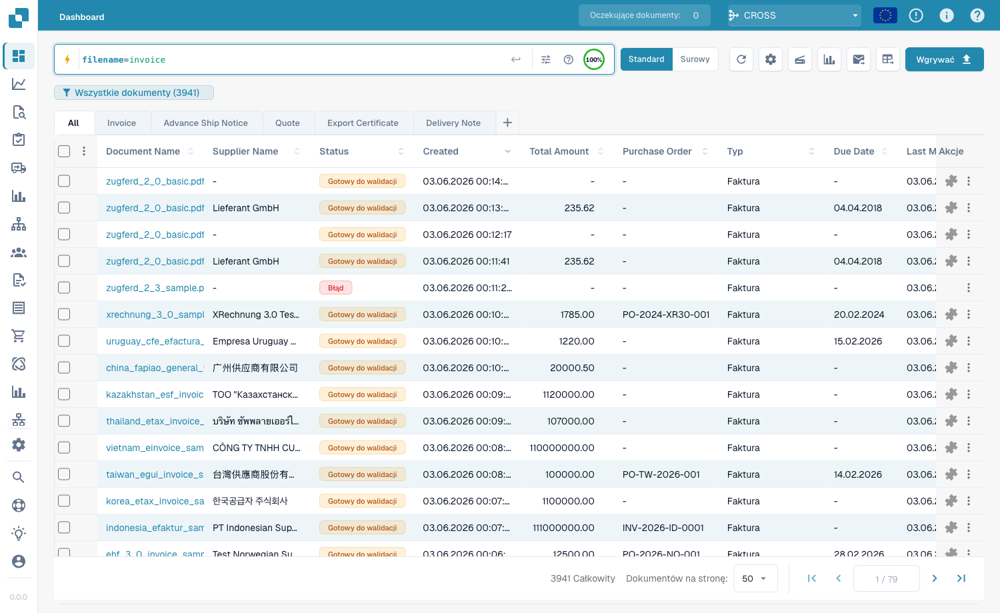
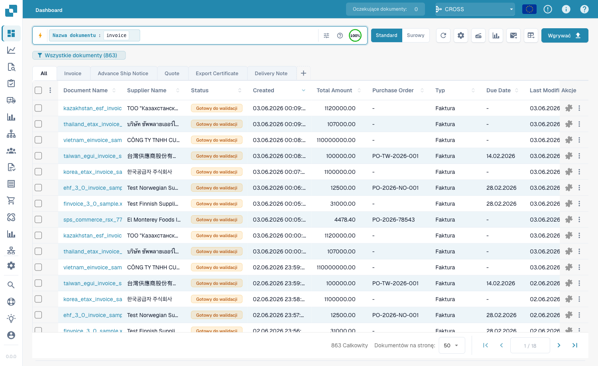

# Szybkie wyszukiwanie

**Szybkie wyszukiwanie** u góry pulpitu to najszybszy sposób na znalezienie
dokumentów. Wpisz, czego szukasz — nazwę, status, kwotę, datę — a lista
filtruje się natychmiast.

Ten przewodnik jest ułożony tak, jak buduje się wyszukiwanie:

1. **Pola standardowe** — kolumny, które ma każdy dokument (nazwa dokumentu,
   status, daty). Zawsze dostępne.
2. **Pola pełnotekstowe** — wyodrębniona treść (dostawca, numer zamówienia,
   numer faktury, kwoty, pozycje). Dostępne, gdy włączone jest wyszukiwanie
   pełnotekstowe.
3. **Operatory, skróty i przepisy** — pełna dokumentacja.

> Nie musisz niczego pamiętać: kliknij pasek wyszukiwania i wybierz pole oraz
> wartość z listy. Poniższe przykłady pokazują też formę wpisywaną do skopiowania.

---

## Część 1 — Pola standardowe

Pola standardowe to własne kolumny dokumentu. Są **zawsze dostępne**, niezależnie
od tego, czy wyszukiwanie pełnotekstowe jest włączone.

### Znajdowanie dokumentów po nazwie

Nazwa dokumentu to najczęstsze wyszukiwanie. Trzy sposoby dopasowania — wszystkie
**bez rozróżniania wielkości liter**:

#### `=` → zaczyna się od

```
filename=invoice
```

Znajduje dokumenty, których nazwa **zaczyna się od** „invoice". Ponieważ wielkość
liter jest ignorowana, wszystkie te pasują do `filename=invoice`:

```
Invoice.pdf   iNVoice.pdf   iNvoiCE.pdf   INVOICE.pdf
Invoice.xml   iNVoice.xml   iNvoiCE.edi   …
```

**Nie** pasuje do `XYZ_Invoice.pdf` (tam „invoice" jest w środku — użyj `:`).

<figure><figcaption><p><code>filename=invoice</code> — tylko nazwy, które <strong>zaczynają się od</strong> „invoice", w dowolnej wielkości liter (<code>INVOICE.pdf</code>, <code>iNvoiCE.pdf</code>, <code>iNVoice.pdf</code>, <code>Invoice.pdf</code> pasują — 7 wyników).</p></figcaption></figure>

#### `:` → zawiera (gdziekolwiek)

```
filename:invoice
```

Z `:` słowo pasuje **w dowolnym miejscu** nazwy — `2026_Invoice.pdf`,
`XYZ_Invoice ABC.pdf`, `123_Invoice ABC bla bla.pdf`.

<figure><figcaption><p><code>filename:invoice</code> — pasuje do „invoice" na dowolnej pozycji w nazwie (także <code>XYZ_Invoice ABC.pdf</code>).</p></figcaption></figure>

#### `="…"` → zaczyna się *lub* kończy na

```
filename="invoice"
```

Cudzysłowy sprawiają, że `=` pasuje do nazw, które **zaczynają się lub kończą**
na wartość.

> **Trzy w jednej linii:** `=` → zaczyna się od · `:` → zawiera · `="…"` →
> zaczyna się lub kończy na. Wszystkie ignorują wielkość liter.

### Znajdowanie po statusie

```
status=ready_for_validation
```

Status to lista stała, więc `=` to dopasowanie **dokładne**, a pasek oferuje
wybór wartości.

### Znajdowanie po dacie

```
created_on>2026-05-25
```

Użyj `>`, `<`, `>=`, `<=` dla zakresów dat. Także daty **względne**: `today()`,
`today()-7` (ostatnie 7 dni), `today()+30`.

---

## Część 2 — Pola pełnotekstowe

Pola pełnotekstowe przeszukują **wyodrębnioną treść** — dostawcę, numer
zamówienia, numer faktury, kwoty, pozycje. Pojawiają się na **pomarańczowo** i
wymagają włączonego **wyszukiwania pełnotekstowego**. Reguły dopasowania są
identyczne jak w polach tekstowych standardowych (`=` zaczyna-się-od, `:` zawiera,
`="…"` zaczyna-lub-kończy).

### Znajdowanie dokumentów dostawcy

```
supplier_name=Test
```

Zaczyna-się-od na wyodrębnionej nazwie dostawcy; `supplier_name:fuji` pasuje
gdziekolwiek; `supplier_name:"Ruiz Foods"` ujmuje wartość ze spacjami w
cudzysłów.

### Znajdowanie po kwocie

```
total_amount>5000
```

Użyj `>`, `<`, `>=`, `<=` lub `between 1000 and 5000` dla przedziału.

### Znajdowanie tego, czego brakuje

```
supplier_name=""
```

`=""` oznacza „to pole jest **niewypełnione**"; `supplier_name!=""` oznacza „ma
dowolnego dostawcę". Ta sama kontrola działa na każdym polu, np.
`ap_assignment_code=""`.

---

## Filtry inteligentne — jedno kliknięcie

U góry listy rozwijanej wyszukiwania znajdziesz **Filtry inteligentne**: gotowe
wyszukiwania jednym kliknięciem. Każdy to skrót zapytania, które możesz też
wpisać:

| Filtr inteligentny | Znajduje | Odpowiada |
|--------------------|----------|-----------|
| ⚠️ **Przeterminowane** | Po terminie płatności | `invoice_due_date<today()` |
| 🕐 **Wkrótce wymagalne** | W ciągu 7 dni | `invoice_due_date<=today()+7` |
| 👤 **Przypisane do mnie** | Czekają na Twoje działanie | `assigned_to=<Ty>` |
| 📅 **Dzisiejsza skrzynka** | Zaimportowane dziś | `imported_on>=today()` |
| 📋 **Oczekujące na walidację** | Gotowe do walidacji | `status=ready_for_validation` |
| 🧾 **Dokumenty elektroniczne** | E-faktury (XML, ZUGFeRD, EDI) | `is_edoc=true` |
| ✅ **Pełne dopasowanie PO** | W pełni dopasowane do zamówienia | `po_match_status=full_matched` |
| ➗ **Częściowe dopasowanie PO** | Częściowo dopasowane | `po_match_status=partial_matched` |
| 📉 **Dopasowanie PO poniżej** | Ilość lub cena poniżej zamówienia | `po_match_status=under_matched` |

Trzy filtry **dopasowania PO** oraz pola pełnotekstowe wymagają włączonego
wyszukiwania pełnotekstowego.

---

## Część 3 — Operatory, łączniki, skróty

### Wbudowana pomoc

**Ikona pomocy** na pasku wyszukiwania otwiera pełną dokumentację wszystkich pól,
operatorów i skrótów Twojego obszaru roboczego.

<figure><figcaption><p>Wbudowana pomoc <strong>Wyszukiwanie pulpitu — Pola i składnia</strong> wymienia każdy operator i sposób dopasowania wartości (np. „Dokładne / zaczyna się od").</p></figcaption></figure>

### Co oznacza `=` zależnie od typu pola

Każde dopasowanie tekstu ignoruje wielkość liter.

| Typ pola | Przykład | `=` oznacza |
|----------|----------|-------------|
| Tekst (nazwa, dostawca, zamówienie) | `filename=invoice` | **zaczyna się od** |
| Tekst, gdziekolwiek | `filename:invoice` | **zawiera** |
| Tekst, początek *lub* koniec | `filename="invoice"` | **zaczyna się lub kończy na** |
| Status / typ / dopasowanie PO (listy stałe) | `status=finished` | **dokładne** |
| Identyfikatory (nr faktury, id dostawcy) | `invoice_number=INV-100` | **dokładne** |
| Liczba | `total_amount>5000` | zakres (`> < >= <= between`) |
| Data | `created_on>2026-01-01` | zakres + `today()±N` |

### Operatory

| Operator | Znaczenie |
|----------|-----------|
| `=` | zaczyna-się-od (tekst) / dokładne (lista, liczba, data) |
| `:` | zawiera (tekst, gdziekolwiek) |
| `="…"` | zaczyna-się-od lub kończy-na (tekst) |
| `!=` | przeciwieństwo `=` |
| `>` `<` `>=` `<=` | większe / mniejsze niż |
| `between … and …` | zakres włączny |
| `field=""` / `field!=""` | jest puste / jest ustawione |
| `today()`, `today()-7`, `today()+30` | daty względne |

### Łączniki

Łącz warunki za pomocą **AND** (oba), **OR** (jeden), **NOT** i nawiasów
`( … )` do grupowania:

```
status=ready_for_validation AND supplier_name=Test
(status=error OR status=failed) AND created_on>today()-1
```

### Skróty

Krótsze formy tych samych zapytań:

| Skrót | Odpowiada |
|-------|-----------|
| `total_amount gt 5000` | `total_amount>5000` (aliasy gt/gte/lt/lte) |
| `due_date > today` | `due_date>today()` |
| `imported_on this_week` | bieżący tydzień ISO (także `last_week`, `this_month`, …) |
| `ap_assignment_code is empty` | `ap_assignment_code=""` |
| `status:open` | `status=ready_for_validation` (open/closed/failed/done) |
| `total_amount not between 100, 200` | `total_amount<100 OR total_amount>200` |
| `status in (finished, error)` | `status=finished OR status=error` |
| `not status=finished` | `status!=finished` |
| `filename contains rechnung` | `filename:rechnung` |
| `total_amount > 5k` | `total_amount>5000` (`k`=tysiąc, `M`=milion) |
| `overdue` | `invoice_due_date<today() AND status!=finished` |
| `#INV-1234` | `invoice_id:INV-1234` |
| `@User` | `assigned_to:User` |
| `$5000+` | `total_amount>=5000` |

---

## Część 4 — Zaawansowane tryby wyszukiwania

Poza wyszukiwaniem po polach trzy prefiksy przeszukują samą treść dokumentu.

### Wyszukiwanie wektorowe (semantyczne) — `vector:`

Dopasowuje według **znaczenia**, nie dokładnego tekstu. Wymaga modułu Vector.

```
vector: invoices about office supplies
vector: shipping delays with Hamburg port
```

### Wyszukiwanie tekstu OCR — `ocr:`

Przeszukuje **tekst stron** wyodrębniony przez OCR, nie tylko kolumny.

```
ocr: Versandkosten
ocr: "purchase order PO-12345"
ocr: Hamburg AND doc_type=INVOICE
```

### Wyszukiwanie w języku naturalnym (AI) — `ai:`

Opisz zwykłym językiem, czego szukasz; AI czyta zdanie i wyodrębnia filtry
(dostawca, daty, kwoty) w ustrukturyzowane zapytanie.

```
ai: invoices from Ruiz over 1000 last quarter
ai: overdue invoices waiting on approval
```

---

### Przepisy

| Chcesz… | Wpisz to |
|---------|----------|
| Gotowe do walidacji, w pełni dopasowane | `status=ready_for_validation AND po_match_status=full_matched` |
| Ten dostawca, w tym tygodniu | `supplier_name=Test AND created_on>today()-7` |
| Przeterminowane faktury o wysokiej kwocie | `total_amount>5000 AND invoice_due_date<today()` |
| Dwóch dostawców naraz | `supplier_name=fuji OR supplier_name=acme` |
| Błędne dokumenty z dziś | `(status=error OR status=failed) AND created_on>today()-1` |
| Po prefiksie numeru zamówienia | `purchase_order=PO-2026` |

> Pola pomarańczowe (pełnotekstowe) i inteligentne filtry PO wymagają włączonego
> **wyszukiwania pełnotekstowego**.
