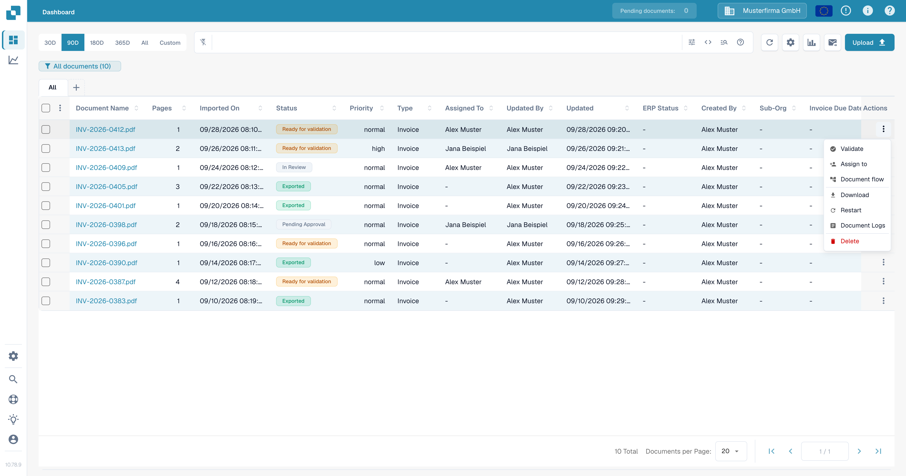

# Validated Extracted Fields

The validation screen allows you to check, edit, and validate all the imported documents. You can see the name of the document, how many pages it consists of, the date it was imported, and its status. The actions button allows you to assign, restart, validate, or delete the document.

<figure><figcaption>
Document list with the Actions menu.
</figcaption></figure>

