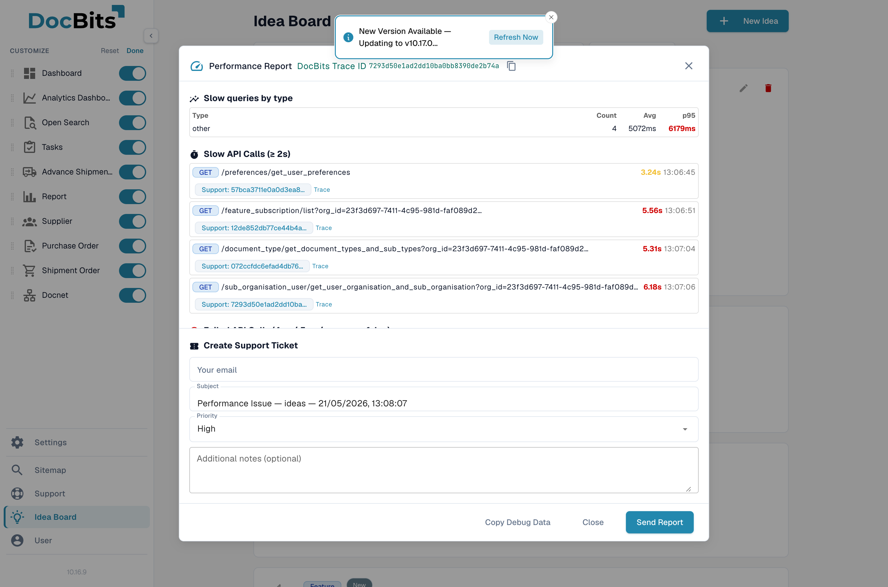

# Debug Collector

Debug Collector, DocBits oturumunuzun tam bir anlık görüntüsünü — ağ etkinliği, hatalar, tarayıcı ortamı ve performans ölçümlerini — yakalar, bunları bir JSON raporu olarak paketler ve isteğe bağlı olarak aynı pencereden doğrudan bir destek bileti açar.

## Nasıl erişilir

Windows ve Linux'ta <kbd>Ctrl</kbd> + <kbd>Shift</kbd> + <kbd>P</kbd>, macOS'ta <kbd>Cmd</kbd> + <kbd>Shift</kbd> + <kbd>P</kbd> tuşlarına basın. Performance Report penceresi hemen açılır.

<figure><figcaption>
Performance Report penceresi yakalanan anlık görüntüyü ve yerleşik destek bileti formunu gösterir.
</figcaption></figure>

## Nelerin yakalandığı

* **API çağrıları** — son 60 REST ve WebSocket çağrısı; süreleri, durum kodları ve isabet ettirilen URL'lerle birlikte. İki saniyeden uzun süren çağrılar ayrı işaretlenir.
* **Hatalar** — son JavaScript hataları ve tarayıcı konsolundan yakalanmamış promise reddetmeleri.
* **Konsol günlükleri** — uygulamanın en son günlük iletileri.
* **Ortam** — tarayıcı sürümü, işletim sistemi, ekran boyutu ve etkin özellik bayrakları.
* **Kullanıcı bağlamı** — rolünüz, organizasyonunuz ve anlık görüntünün alındığı sayfa.
* **Performans ölçümleri** — sayfa yükleme süreleri (LCP, FCP), bellek kullanımı ve DOM boyutu.
* **İz Kimlikleri** — anlık görüntüyü arka uç günlüklerine bağlayan korelasyon kimlikleri.

## Pencereden destek bileti oluşturma

Manuel olarak hiçbir şey indirmenize veya eklemenize gerek yok — pencere yerleşik bir **Create Support Ticket** formu içerir.

1. E-postanızı girin, önerilen konuyu olduğu gibi bırakın veya değiştirin, bir öncelik seçin ve sorun ortaya çıktığında ne yaptığınızı açıklayan notlar ekleyin.
2. **Send Report**'a tıklayın. JSON anlık görüntüsü eklenir ve bilet tek bir adımda oluşturulur.

Bu kadar — destek ekibi, durumu yeniden üretmek için gereken tüm verilerle bileti alır.

Anlık görüntünün yerel bir kopyasını istiyorsanız, JSON'u panoya kopyalamak için **Copy Debug Data**'yı kullanın veya tarayıcınızın Farklı Kaydet özelliğiyle raporu `.json` dosyası olarak saklayın.

## Gizlilik ve veri işleme

* Kimlik doğrulama belirteçleri ve hassas başlıklar, anlık görüntü oluşturulmadan önce yakalanan API çağrılarından maskelenir.
* **Send Report**'a tıklayana kadar tarayıcınızdan hiçbir şey çıkmaz — kısayol yalnızca pencereyi açar.

<mark>Müşteri verisi içeren belgelerle çalışıyorsanız anlık görüntüyü göndermeden önce gözden geçirin. URL'lerde görünür olan belge kimlikleri raporda yer alır.</mark>
