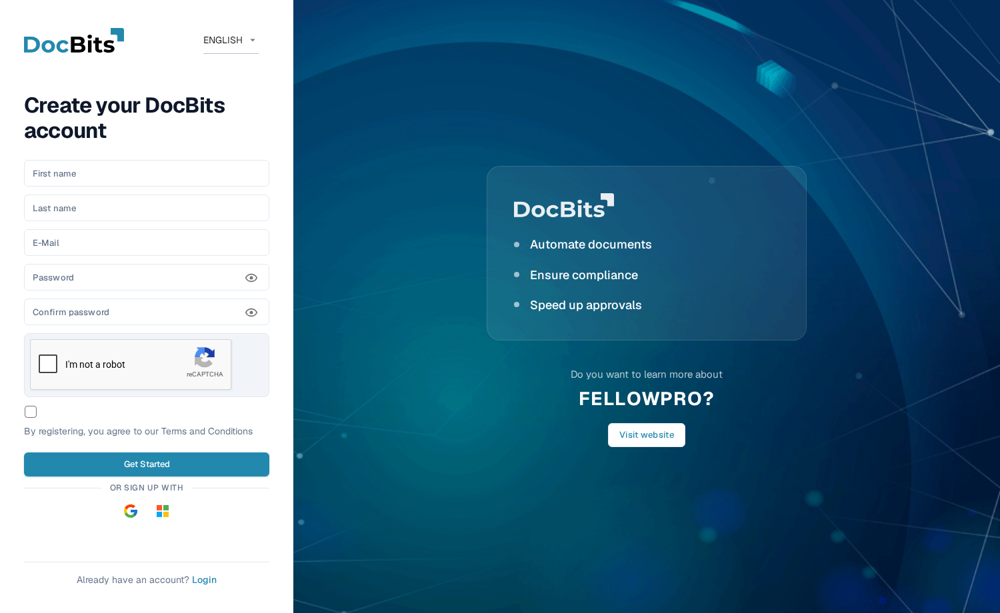
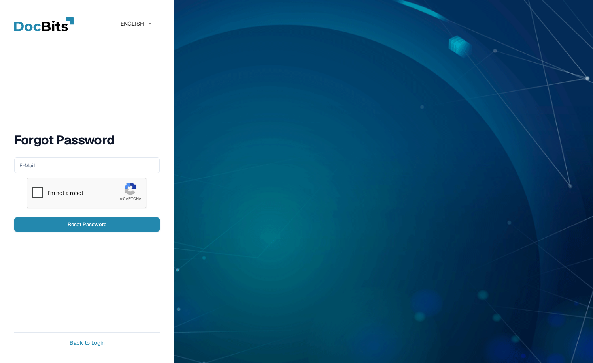
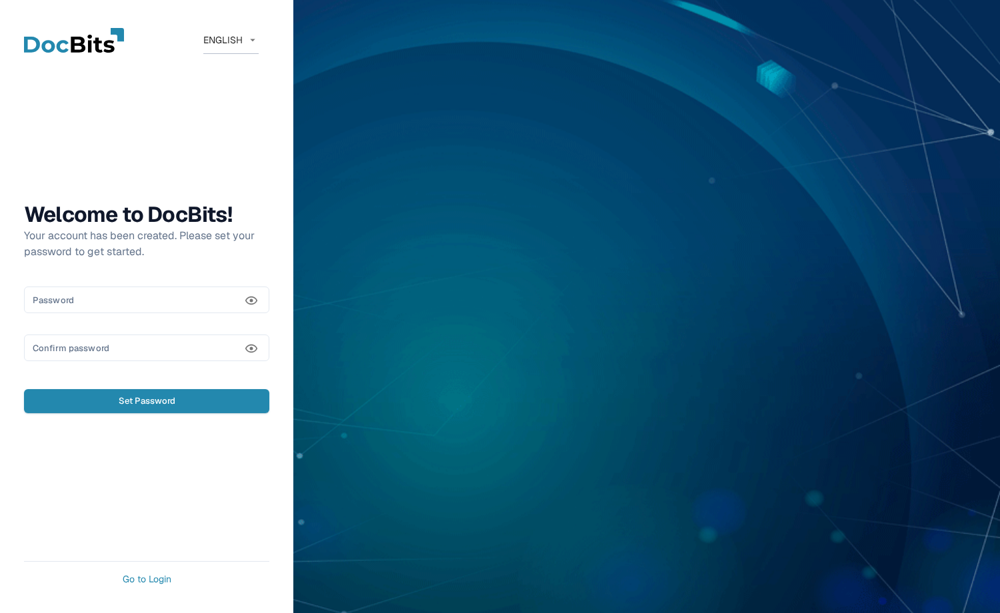

# Getting Access and Signing In

This page explains how to get a DocBits account and how to sign in when you do not have your password:

* [Registration](#registration) — create your own DocBits account.
* [Forgot password](#forgot-password) — reset your password with a reset link.
* [First password for admin-created accounts](#first-password-for-admin-created-accounts) — set the first password for an account your administrator created for you.

Signing in with an existing account, and Two-Factor Authentication, are covered in [Two-Factor Authentication (2FA)](../../overview-and-basics/two-factor-authentication.md). Use the language menu at the top right of these forms if you need another display language.

## Registration

You can create a DocBits account yourself on the registration page. Open it from the **Register** link on the login screen, or navigate to `https://app.docbits.com/register` (use the web address your organisation was given).

<figure><figcaption>
The registration form. All fields are required except where noted.
</figcaption></figure>

Fill in the form:

1. **First name** and **Last name** — your name as it should appear in DocBits.
2. **E-Mail** — your work email address. This is your login identifier.
3. **Password** and **Confirm password** — see the password rules below. A checklist under the password field shows which rules your password already meets.
4. If the page shows a **reCAPTCHA** widget, complete it. The widget only appears when your DocBits deployment has bot protection enabled.
5. Tick the checkbox to confirm that you agree to the **Terms and Conditions**.
6. Click **Get Started**. If you already have an account, click **Login** at the bottom to return to the sign-in page. **Visit website** opens the DocBits website for product information.

Use the eye icon next to a password field to show or hide the characters you entered.

### Password rules

Your password must:

* be between **8 and 20 characters** long,
* contain at least one **uppercase** and one **lowercase** letter,
* contain at least one **digit**,
* contain at least one **special character** (`!@#$%^&*()_+=\[{]\};:,.<>?/\|~-`).

Only letters, digits, and these special characters are allowed.

### Sign up with Google or Microsoft

Instead of a password, you can click the **Google** or **Microsoft** button under **Or sign up with**. DocBits creates your account through your identity provider, and you sign in the same way later.

### Confirm your email address

After you submit the form, DocBits shows a confirmation page and sends a **verification email** to the address you entered. Open the email and click the link inside — it takes you to a confirmation page that verifies your address. If the email does not arrive, the confirmation page offers a **resend** option. Once the address is verified, click **Sign in** and log in with your email and password.

## Forgot password

If you forgot your password:

1. On the login screen, click **Forgot password?**.
2. On the **Forgot Password** page, enter your **E-Mail** address and click **Reset Password**. If a reCAPTCHA widget is shown, complete it first.

   <figure><figcaption>
The Forgot Password page. Enter your account email and DocBits will send you a reset link.
</figcaption></figure>

   If you do not want to reset your password, click **Back to Login** to return to sign-in.

3. DocBits emails you a **password reset link**. Open the email and click the link — it opens the reset page.
4. Enter your **new password twice**. The same password rules as during [registration](#password-rules) apply, and a checklist shows which rules are met.
5. Click **Reset Password**. DocBits confirms the change and takes you back to the login screen, where you can sign in with the new password.


Reset links expire after a short time. If the link no longer works, repeat the steps above to request a new one.


## First password for admin-created accounts

When your administrator adds you as a user (see [Users](../../administration-and-setup/settings/global-settings/groups-users-and-permissions/users/README.md)), you receive an email with your login details and a link to set your **first password**. The link opens the **Set Password** page:

<figure><figcaption>
The Set Password page, shown after an administrator created your account.
</figcaption></figure>

1. Click the link in the invitation email. The page greets you with "Welcome to DocBits! Your account has been created. Please set your password to get started."
2. Enter your password twice — the same [password rules](#password-rules) apply.
3. Click **Set Password**. You can then sign in with your email and this password.

The eye icons show or hide what you entered. If you leave before setting a password, **Go to Login** returns to sign-in.

The link is tied to your account and works only once. If it expires before you use it, ask your administrator to resend the invitation or use **Forgot password?** with your email address.
