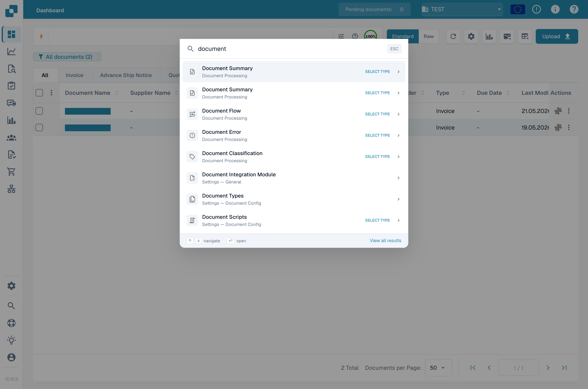

# Globale Snelzoek

Globale Snelzoek is een snelstarter via het toetsenbord die pagina's, instellingen, dashboards en functies binnen pagina's overal in DocBits vindt. Het vervangt het doorklikken in de zijbalk wanneer u al weet waar u heen wilt.

## Hoe te openen

Druk op <kbd>Cmd</kbd> + <kbd>K</kbd> op macOS of <kbd>Ctrl</kbd> + <kbd>K</kbd> op Windows en Linux. De sneltoets werkt vanaf elk scherm.

<figure><figcaption>
De Snelzoek opent boven de huidige pagina.
</figcaption></figure>

## Zoeken

Begin met typen om de catalogus van pagina's en functies te filteren. Snelzoek gebruikt fuzzy matching, dus deelwoorden en kleine typefouten vinden nog steeds de juiste vermelding. De bovenste acht resultaten worden gesorteerd op relevantie.

Elk resultaat toont:

* De naam van de functie of pagina.
* De categorie waartoe het behoort (Instellingen, Dashboard, Validatie enzovoort).
* Een klein badge dat het type vermelding aangeeft — Pagina, Dialoogvenster, Zijbalk, Paneel, Menu of Actie.

Gebruik de pijltjes omhoog en omlaag om een resultaat te markeren en druk dan op <kbd>Enter</kbd> om het te openen. Druk op <kbd>Esc</kbd> om het venster te sluiten.

<mark>Alleen vermeldingen waarvoor u toestemming hebt verschijnen in de resultatenlijst. Alleen-beheerder vermeldingen zijn verborgen voor andere gebruikers.</mark>

## Recente zoekopdrachten

Wanneer het zoekveld leeg is, toont Snelzoek uw vijf meest recente zoekopdrachten zodat u veelgebruikte bestemmingen met één toetsaanslag bereikt. Recente zoekopdrachten worden per browser opgeslagen en niet gesynchroniseerd tussen apparaten.

## Selectiemodus voor documenten

Sommige bestemmingen hebben extra informatie nodig — bijvoorbeeld "Document openen op ID" heeft de document-ID nodig voordat het kan navigeren. Wanneer u zo'n vermelding kiest, schakelt Snelzoek naar **selectiemodus**:

* Voor document-ID's: typ of plak de ID en druk op <kbd>Enter</kbd>.
* Voor documenttypes: kies het type uit de inline-lijst.

De selectiemodus respecteert de statusrechten van het dashboard, dus u ziet alleen documenten die u mag openen.

## Alle resultaten bekijken

Als de acht zichtbare resultaten niet genoeg zijn, klik op de link **Alle resultaten bekijken** in de voettekst om de [Sitemap](sitemap.md) te openen met uw huidige zoekopdracht voorgefilterd.

## Toetsenbordreferentie

| Toets | Actie |
|---|---|
| <kbd>Cmd</kbd>/<kbd>Ctrl</kbd> + <kbd>K</kbd> | Snelzoek vanaf elke locatie openen |
| <kbd>↑</kbd> / <kbd>↓</kbd> | Tussen resultaten bewegen |
| <kbd>Enter</kbd> | Het gemarkeerde resultaat openen |
| <kbd>Esc</kbd> | Het venster sluiten |
