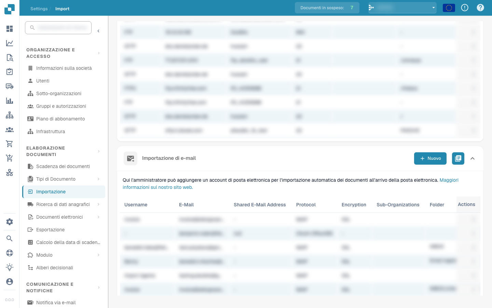
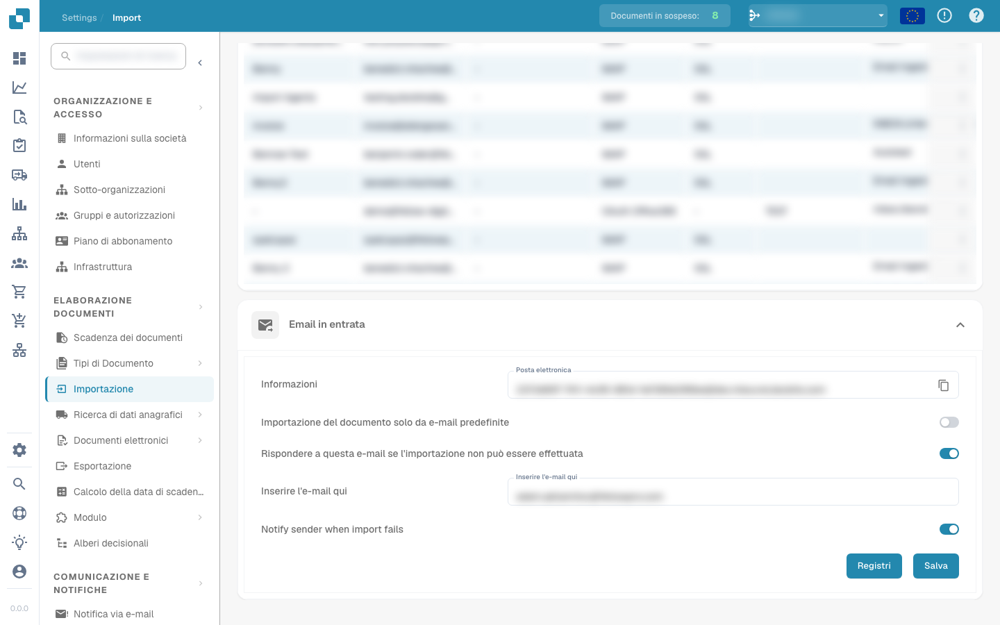

# E-mail

DocBits può importare documenti dalla posta elettronica in due modi. Entrambi si configurano in **Impostazioni → Importazione** (Elaborazione documenti).

## Metodo 1 — Importazione e-mail (collegare una casella)

Collega un account e-mail e DocBits importa automaticamente i documenti all'arrivo di nuove e-mail. Nella pagina di Importazione, apri la sezione **Importazione e-mail** e fai clic su **+ Nuovo**.

<figure><figcaption>Importazione e-mail — collega una casella per l'importazione automatica dei documenti</figcaption></figure>

Quindi scegli il protocollo della tua casella:

* **IMAP** — vedi [IMAP](imap.md)
* **OAuth (Office 365)** — vedi [OAuth Office365](oauth-office365.md)

## Metodo 2 — E-mail in arrivo (inoltrare a DocBits)

Inoltra — o invia direttamente — le e-mail all'indirizzo di ricezione univoco della tua organizzazione e DocBits importa automaticamente gli allegati. Non è necessario collegare alcuna casella. Apri la sezione **E-mail in arrivo** nella pagina di Importazione.

<figure><figcaption>E-mail in arrivo — inoltra i documenti al tuo indirizzo DocBits</figcaption></figure>

* **Info / E-mail** — l'indirizzo di ricezione univoco della tua organizzazione (formato `<org-id>@inbound.docbits.com`). Inoltra i tuoi documenti a questo indirizzo; usa l'icona di copia per copiarlo.
* **Importa documenti solo da e-mail predefinite** — se attivato, vengono importate solo le e-mail dei mittenti aggiunti alla whitelist; le e-mail di qualsiasi altro mittente vengono ignorate.
* **Rispondi a questa e-mail se l'importazione non è possibile** — invia una risposta automatica al mittente quando l'importazione non riesce.
* **Notifica il mittente in caso di importazione non riuscita** — avvisa il mittente se la sua e-mail non è stata importata.
* **Log** — apre il registro di elaborazione delle e-mail in arrivo. Fai clic su **Salva** per applicare le modifiche.
