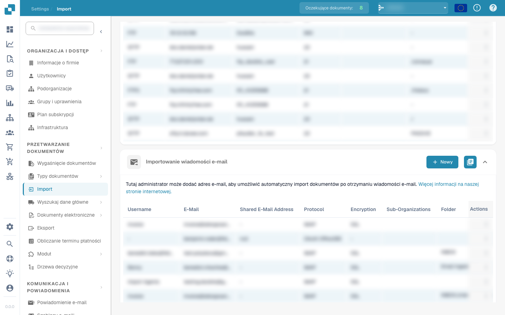
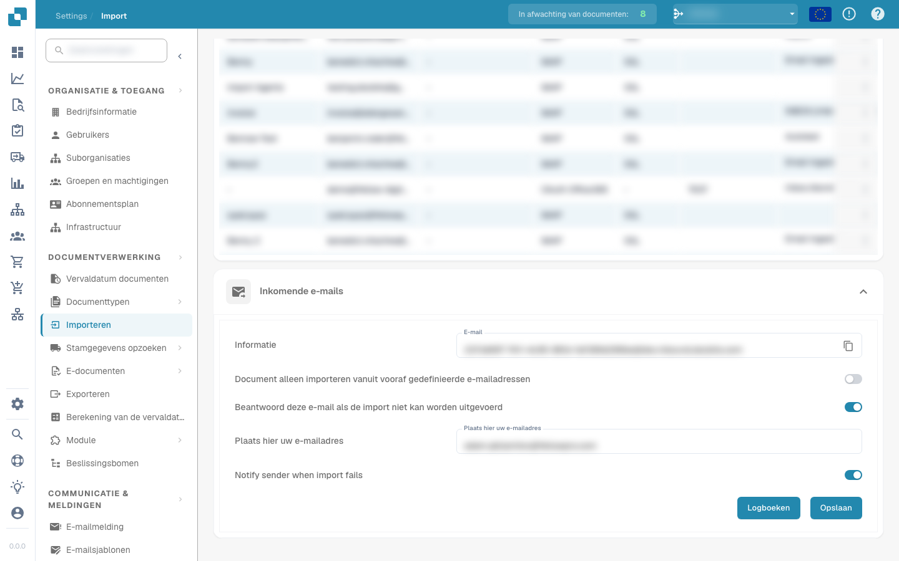

# E-mail

DocBits kan op twee manieren documenten uit e-mail importeren. Beide worden geconfigureerd onder **Instellingen → Import** (Documentverwerking).

## Methode 1 — E-mailimport (een mailbox koppelen)

Koppel een e-mailaccount en DocBits importeert documenten automatisch zodra er nieuwe e-mails binnenkomen. Open op de Import-pagina de sectie **E-mailimport** en klik op **+ Nieuw**.

<figure><figcaption>E-mailimport — koppel een mailbox voor automatische documentimport</figcaption></figure>

Kies vervolgens het protocol van uw mailbox:

* **IMAP** — zie [IMAP](imap.md)
* **OAuth (Office 365)** — zie [OAuth Office365](oauth-office365.md)

## Methode 2 — Inkomende e-mails (doorsturen naar DocBits)

Stuur — of verzend rechtstreeks — e-mails naar het unieke inkomende adres van uw organisatie en DocBits importeert de bijlagen automatisch. Een mailboxkoppeling is niet nodig. Open de sectie **Inkomende e-mails** op de Import-pagina.

<figure><figcaption>Inkomende e-mails — stuur documenten door naar uw DocBits-adres</figcaption></figure>

* **Info / E-mail** — het unieke inkomende adres van uw organisatie (formaat `<org-id>@inbound.docbits.com`). Stuur uw documenten naar dit adres door; gebruik het kopieerpictogram om het te kopiëren.
* **Documenten alleen importeren vanaf vooraf gedefinieerde e-mail(s)** — indien ingeschakeld worden alleen e-mails geïmporteerd van afzenders die u aan de witte lijst toevoegt; e-mails van andere afzenders worden genegeerd.
* **Beantwoord deze e-mail als import niet mogelijk is** — stuurt de afzender een automatisch antwoord wanneer de import mislukt.
* **Afzender informeren wanneer import mislukt** — informeert de afzender als zijn e-mail niet kon worden geïmporteerd.
* **Logboeken** — opent het verwerkingslogboek van inkomende e-mails. Klik op **Opslaan** om uw wijzigingen toe te passen.

## Ondersteunde documentbijlagen

Beide e-mailimportmethoden accepteren deze documentbijlagen:

| Formaat | Bestandsextensies | Typisch gebruik |
| --- | --- | --- |
| PDF | `.pdf` | Facturen en andere PDF-documenten |
| TIFF | `.tif`, `.tiff` | Gescande documenten |
| XML | `.xml` | Gestructureerde elektronische documenten |
| EDI / bestelgegevens | `.edi`, `.purchaseorder` | Elektronische gegevensuitwisseling en inkooporders |

Als een doorstuurdienst een PDF-, TIFF- of XML-bestand als generieke bijlage aanduidt, kan DocBits het herkennen aan de bestandsinhoud of een bekende bestandsextensie. Doorgestuurde `.eml`-berichten kunnen ook ondersteunde documenten bevatten; DocBits haalt die bijlagen in het bericht vóór de import naar buiten.

Afbeeldingen zoals PNG, JPG, GIF en BMP worden niet als document geïmporteerd. Afbeeldingen van handtekeningen en logo's in doorgestuurde e-mails worden overgeslagen. Office-bestanden zoals Word, Excel en PowerPoint worden door deze e-mailimportmethoden niet ondersteund.

Controleer bij doorgestuurde e-mails de **Logboeken** onder **Inkomende e-mails** als een document ontbreekt. Wanneer **Afzender informeren wanneer import mislukt** is ingeschakeld, ontvangt de afzender een uitleg en een link naar deze pagina. Gebruik voor een gekoppelde mailbox de handleiding voor [IMAP](imap.md) of [OAuth (Office 365)](oauth-office365.md).
