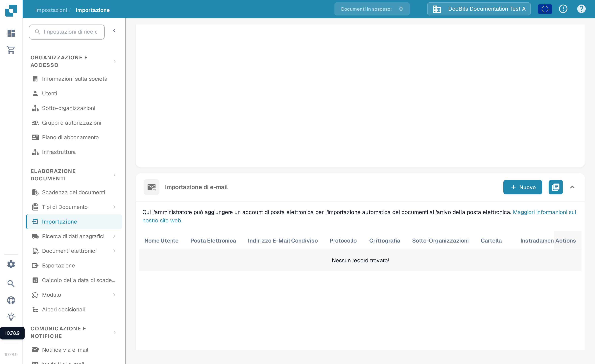
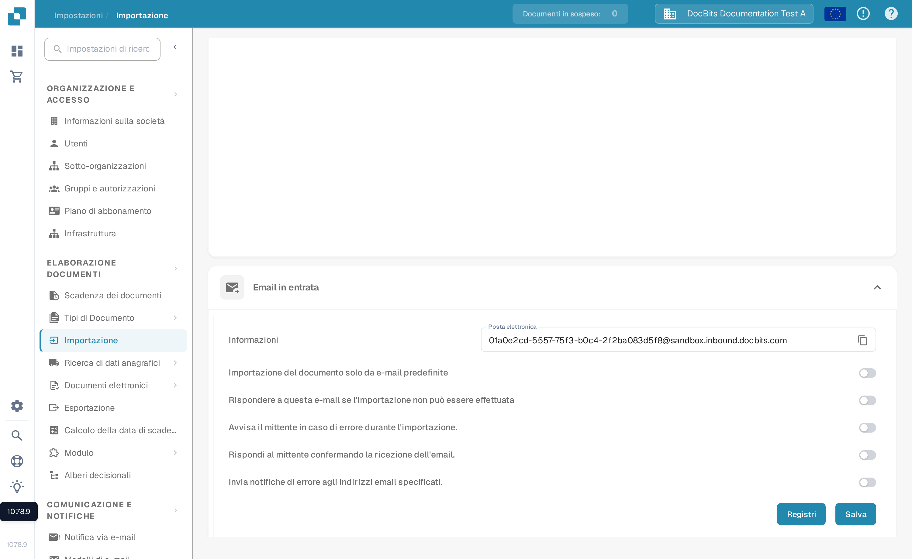

# E-mail

DocBits può importare documenti dalla posta elettronica in due modi. Entrambi si configurano in **Impostazioni → Importazione** (Elaborazione documenti).

## Metodo 1 — Importazione e-mail (collegare una casella)

Collega un account e-mail e DocBits importa automaticamente i documenti all'arrivo di nuove e-mail. Nella pagina di Importazione, apri la sezione **Importazione e-mail** e fai clic su **+ Nuovo**.

<figure><figcaption>Importazione e-mail — collega una casella per l'importazione automatica dei documenti</figcaption></figure>

Quindi scegli il protocollo della tua casella:

* **IMAP** — vedi [IMAP](imap.md)
* **OAuth (Office 365)** — vedi [OAuth Office365](oauth-office365.md)

## Metodo 2 — E-mail in arrivo (inoltrare a DocBits)

Inoltra — o invia direttamente — le e-mail all'indirizzo di ricezione univoco della tua organizzazione e DocBits importa automaticamente gli allegati. Non è necessario collegare alcuna casella. Apri la sezione **E-mail in arrivo** nella pagina di Importazione.

<figure><figcaption>E-mail in arrivo — inoltra i documenti al tuo indirizzo DocBits</figcaption></figure>

* **Info / E-mail** — l'indirizzo di ricezione univoco della tua organizzazione (formato `<org-id>@inbound.docbits.com`). Inoltra i tuoi documenti a questo indirizzo; usa l'icona di copia per copiarlo.
* **Importa documenti solo da e-mail predefinite** — se attivato, vengono importate solo le e-mail dei mittenti aggiunti alla whitelist; le e-mail di qualsiasi altro mittente vengono ignorate.
* **Rispondi a questa e-mail se l'importazione non è possibile** — invia una risposta automatica al mittente quando l'importazione non riesce.
* **Notifica il mittente in caso di importazione non riuscita** — avvisa il mittente se la sua e-mail non è stata importata.
* **Log** — apre il registro di elaborazione delle e-mail in arrivo. Fai clic su **Salva** per applicare le modifiche.

## Allegati di documenti supportati

Entrambi i metodi di importazione tramite e-mail accettano questi allegati di documenti:

| Formato | Estensioni di file | Uso tipico |
| --- | --- | --- |
| PDF | `.pdf` | Fatture e altri documenti PDF |
| TIFF | `.tif`, `.tiff` | Documenti scansionati |
| XML | `.xml` | Documenti elettronici strutturati |
| EDI / dati ordine di acquisto | `.edi`, `.purchaseorder` | Scambio elettronico di dati e ordini di acquisto |

Se un servizio di inoltro contrassegna un file PDF, TIFF o XML come allegato generico, DocBits può riconoscerlo dal contenuto del file o da un'estensione nota. I messaggi `.eml` inoltrati possono anch'essi contenere documenti supportati; DocBits estrae quegli allegati interni prima dell'importazione.

Le immagini come PNG, JPG, GIF e BMP non vengono importate come documenti. Le immagini inline di firme e i loghi nelle e-mail inoltrate vengono ignorati. I file Office come Word, Excel e PowerPoint non sono supportati da questi metodi di importazione tramite e-mail.

Per le e-mail inoltrate, controlla i **Registri** nella sezione **E-mail in arrivo** se un documento manca. Quando **Notifica il mittente in caso di importazione non riuscita** è attivato, il mittente riceve una spiegazione e un link a questa pagina. Per una casella collegata, usa la guida di configurazione [IMAP](imap.md) o [OAuth (Office 365)](oauth-office365.md).
