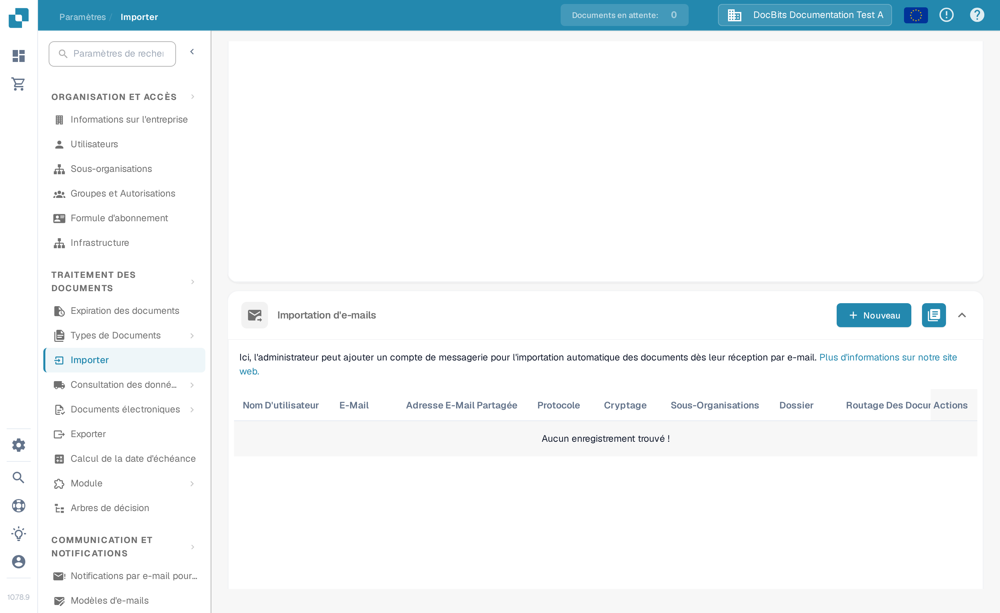

# E-mail

DocBits peut importer des documents depuis la messagerie de deux façons. Les deux se configurent dans **Paramètres → Import** (Traitement des documents).

## Méthode 1 — Import par e-mail (connecter une boîte aux lettres)

Connectez un compte de messagerie et DocBits importe automatiquement les documents dès l'arrivée de nouveaux e-mails. Sur la page Import, ouvrez la section **Importation d'e-mails** et cliquez sur **+ Nouveau**.

<figure><figcaption>Importation d'e-mails — connecter une boîte aux lettres pour l'import automatique de documents</figcaption></figure>

Choisissez ensuite le protocole de votre boîte aux lettres :

* **IMAP** — voir [IMAP](imap.md)
* **OAuth (Office 365)** — voir [OAuth Office365](oauth-office365.md)

## Méthode 2 — E-mails entrants (transférer vers DocBits)

Transférez — ou envoyez directement — les e-mails à l'adresse de réception unique de votre organisation et DocBits importe automatiquement les pièces jointes. Aucune connexion de boîte aux lettres n'est nécessaire. Ouvrez la section **E-mails entrants** sur la page Import.

<figure><figcaption>E-mails entrants — transférez vos documents vers votre adresse DocBits</figcaption></figure>

* **Info / E-mail** — l'adresse de réception unique de votre organisation (format `<org-id>@inbound.docbits.com`). Transférez vos documents à cette adresse ; utilisez l'icône de copie pour la copier.
* **Importer les documents uniquement depuis des e-mails prédéfinis** — lorsqu'elle est activée, seuls les e-mails des expéditeurs ajoutés à la liste blanche sont importés ; les e-mails de tout autre expéditeur sont ignorés.
* **Répondre à cet e-mail si l'import est impossible** — envoie une réponse automatique à l'expéditeur lorsque l'import échoue.
* **Notifier l'expéditeur en cas d'échec de l'import** — informe l'expéditeur si son e-mail n'a pas pu être importé.
* **Journaux** — ouvre le journal de traitement des e-mails entrants. Cliquez sur **Enregistrer** pour appliquer vos modifications.

## Pièces jointes de documents prises en charge

Les deux méthodes d'importation par e-mail acceptent les documents en pièces jointes suivants :

| Format | Extensions de fichiers | Utilisation typique |
| --- | --- | --- |
| PDF | `.pdf` | Factures et autres documents PDF |
| TIFF | `.tif`, `.tiff` | Documents numérisés |
| XML | `.xml` | Documents électroniques structurés |
| EDI / données de commande d'achat | `.edi`, `.purchaseorder` | Échange de données informatisé et commandes d'achat |

Si un service de transfert étiquette un fichier PDF, TIFF ou XML comme pièce jointe générique, DocBits peut l'identifier à partir du contenu du fichier ou d'une extension de fichier connue. Les messages `.eml` transférés peuvent également contenir des documents pris en charge ; DocBits extrait ces pièces jointes internes avant l'importation.

Les images telles que PNG, JPG, GIF et BMP ne sont pas importées en tant que documents. Les images de signature et les logos intégrés aux e-mails transférés sont ignorés. Les fichiers Office tels que Word, Excel et PowerPoint ne sont pas pris en charge par ces méthodes d'importation par e-mail.

Pour les e-mails transférés, consultez **Journaux** sous **E-mails entrants** si un document manque. Lorsque **Notifier l'expéditeur en cas d'échec de l'import** est activé, l'expéditeur reçoit une explication et un lien vers cette page. Pour une boîte aux lettres connectée, utilisez le guide de configuration [IMAP](imap.md) ou [OAuth (Office 365)](oauth-office365.md).

