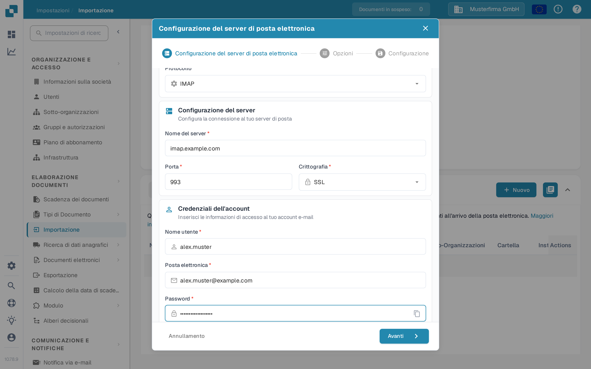

# IMAP



Qui è sufficiente inserire le informazioni richieste del provider di posta elettronica: protocollo, crittografia, nome del server, porta, nome utente, indirizzo e-mail e password, oltre alla cartella di posta.

<figure><figcaption>
La finestra «Configurazione del server di posta elettronica» con valori di esempio: protocollo IMAP, server imap.example.com, porta 993, crittografia SSL.
</figcaption></figure>

## Note

* Inserite tutte le informazioni necessarie nell'interfaccia. Le altre informazioni, come server e porta, dipendono dal provider (una rapida ricerca sul web dovrebbe bastare).
* Cartella e Move-Imported qui hanno la stessa funzione. La cartella non può essere disattivata; se lasciata vuota, viene usata per impostazione predefinita Inbox.
