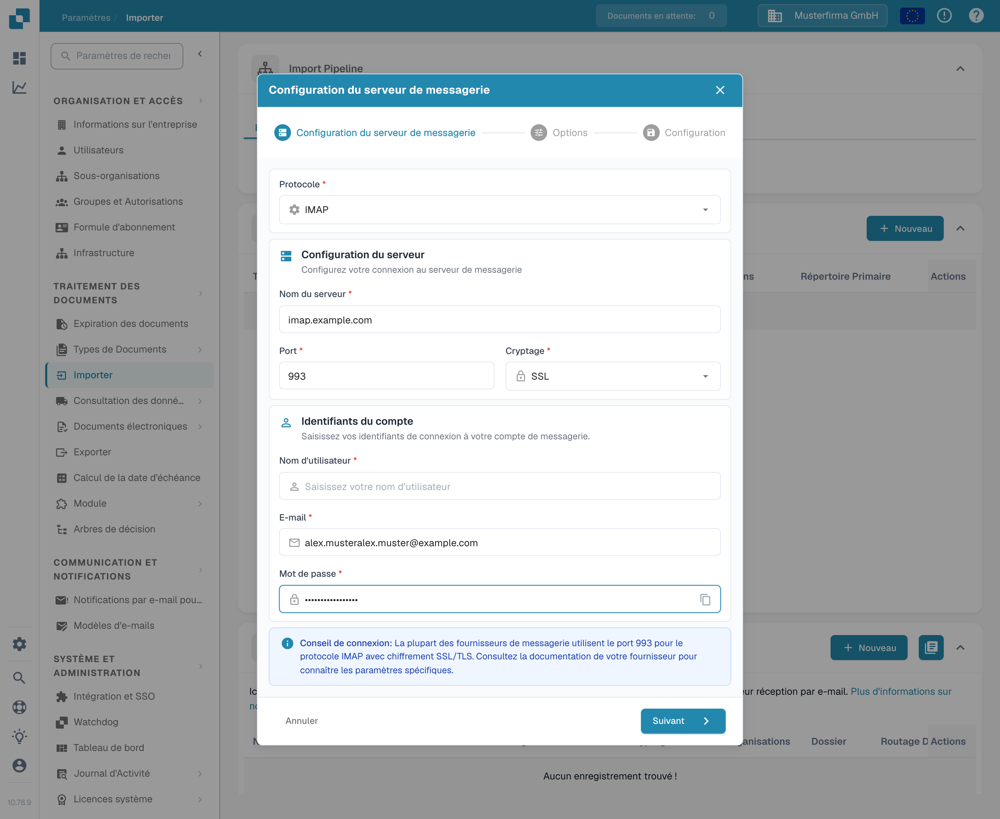

# IMAP



Choisissez IMAP comme protocole et saisissez les informations de votre fournisseur de messagerie : nom du serveur, port, cryptage, nom d’utilisateur, adresse e-mail et mot de passe. Les étapes suivantes permettent de définir les options et le dossier de messagerie.

<figure><figcaption>
Configuration du serveur avec des valeurs d’exemple. Remplacez-les par les informations de votre fournisseur de messagerie.
</figcaption></figure>

À noter

* Saisissez toutes les informations nécessaires dans l’interface. Les autres informations, comme le serveur ou le port, dépendent de l’hébergeur (une recherche rapide sur Internet peut aider).
* Dossier et Déplacer les importés ont ici la même fonction. Le dossier ne peut pas être désactivé ; s’il reste vide, la boîte de réception est utilisée par défaut.
