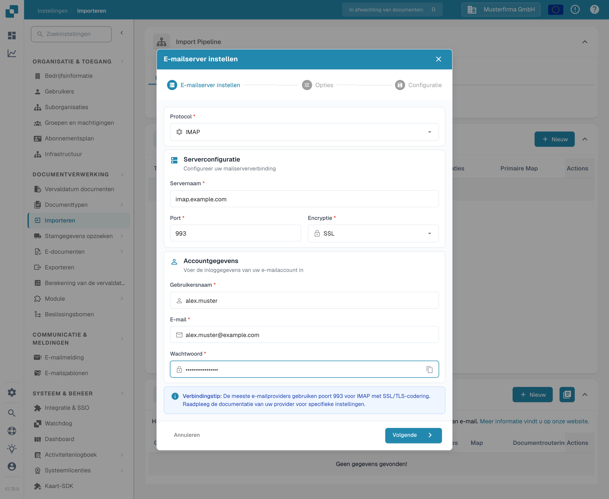

# IMAP



Kies IMAP als protocol en voer de gegevens van uw e-mailprovider in: servernaam, poort, encryptie, gebruikersnaam, e-mailadres en wachtwoord. In de volgende stappen stelt u de opties en de e-mailmap in.

<figure><figcaption>
Serverinstelling met voorbeeldwaarden. Vervang deze door de gegevens van uw e-mailprovider.
</figcaption></figure>

Let op

* Voer alle benodigde informatie in de interface in. Andere gegevens, zoals server en poort, hangen af van de host (een snelle zoekopdracht op internet helpt).
* Map en Geïmporteerde verplaatsen hebben hier dezelfde functie. De map kan niet worden uitgeschakeld; blijft deze leeg, dan wordt standaard de Postvak IN gebruikt.
