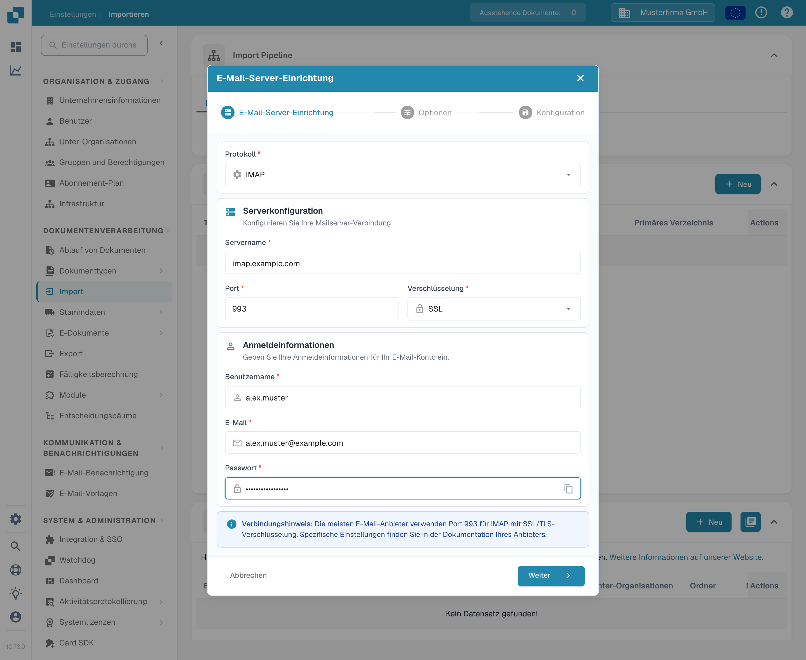

# IMAP



Wählen Sie IMAP als Protokoll und geben Sie die Daten Ihres E-Mail-Anbieters ein: Servername, Port, Verschlüsselung, Benutzername, E-Mail-Adresse und Passwort. In den nächsten Schritten legen Sie die Optionen und den E-Mail-Ordner fest.

<figure><figcaption>
Server-Einrichtung mit Beispielwerten. Ersetzen Sie diese durch die Angaben Ihres E-Mail-Anbieters.
</figcaption></figure>

Zu beachten

* Geben Sie alle benötigten Informationen in der Benutzeroberfläche ein. Angaben wie Server, Port usw. hängen vom Anbieter ab (eine kurze Websuche hilft).
* Ordner und „Importierte verschieben“ haben hier dieselbe Funktion. Der Ordner kann nicht deaktiviert werden, verwendet aber standardmäßig den Posteingang, wenn er leer bleibt.
