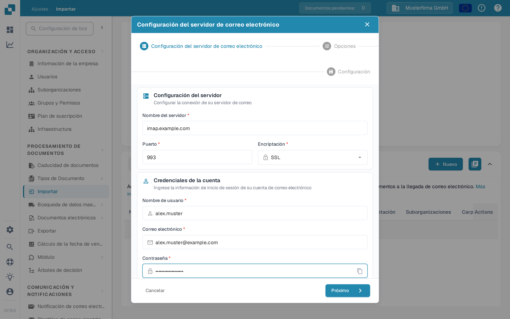

# IMAP



Aquí solo tiene que introducir la información requerida de su proveedor de correo electrónico: protocolo, encriptación, nombre del servidor, puerto, nombre de usuario, dirección de correo electrónico y contraseña, así como la carpeta de correo.

<figure><figcaption>
El diálogo «Configuración del servidor de correo electrónico» con valores de ejemplo: protocolo IMAP, servidor imap.example.com, puerto 993, encriptación SSL.
</figcaption></figure>

## Aspectos a tener en cuenta

* Introduzca toda la información necesaria en la interfaz. La demás información, como el servidor y el puerto, depende del proveedor (una búsqueda rápida en la web debería ayudar).
* Carpeta y Move-Imported tienen aquí la misma función. La carpeta no se puede desactivar; si la deja vacía, se usa Bandeja de entrada de forma predeterminada.
