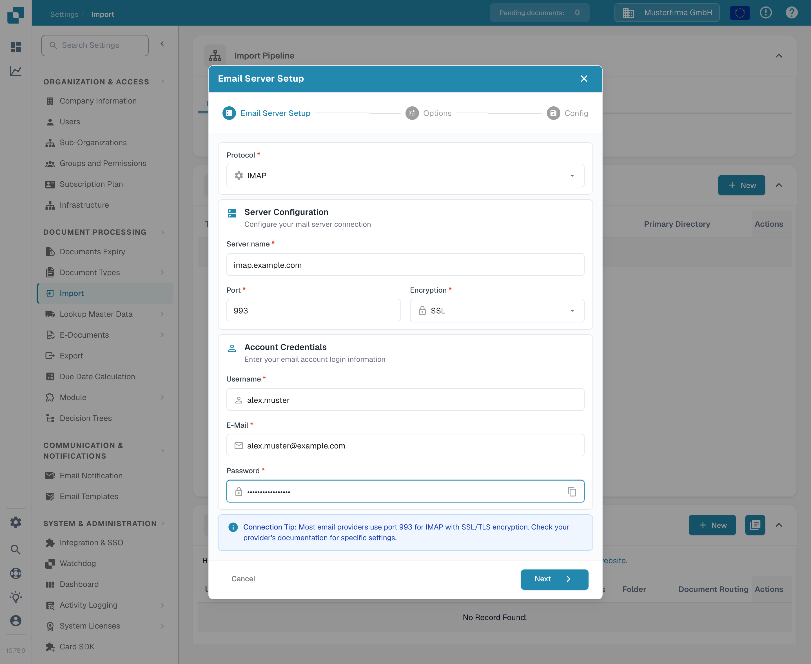

# IMAP



Choose IMAP as the protocol and enter the information for your email provider: server name, port, encryption, username, email address and password. In the next steps you set the options and the email folder.

<figure><figcaption>
Email Server Setup with example values. Replace them with the details of your email provider.
</figcaption></figure>

Things to Note

* Input all needed information into the UI. Other information like the server, port, etc. depends on the host (a quick Google search should help).
* Folder and Move-Imported have the same function here. Folder can not be disabled, but will use Inbox by default if left empty.
