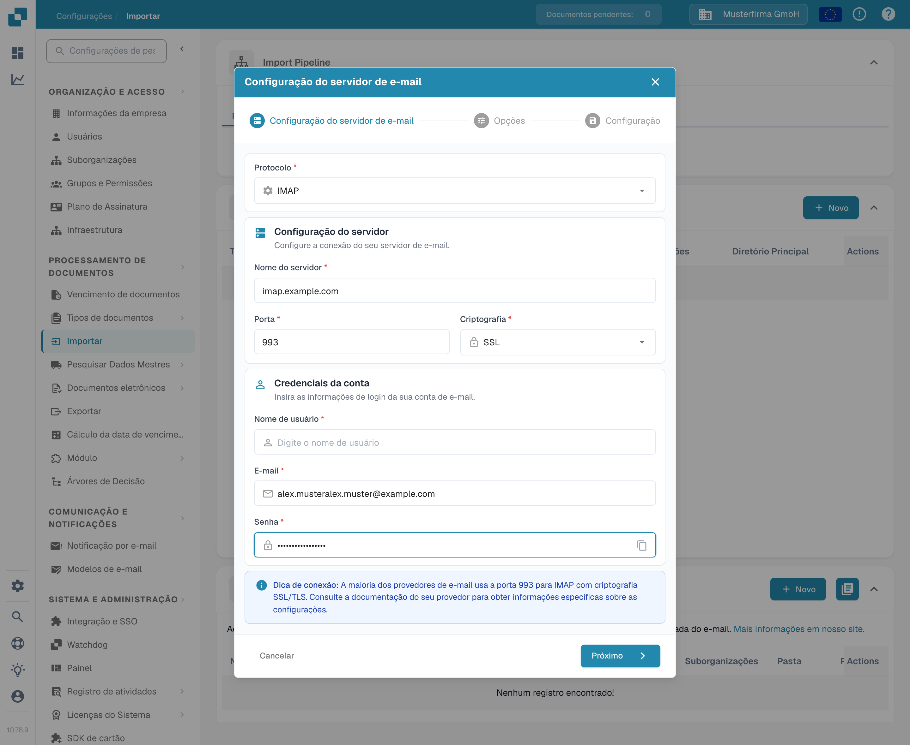

# IMAP



Escolha IMAP como protocolo e introduza os dados do seu fornecedor de e-mail: nome do servidor, porta, criptografia, nome de utilizador, endereço de e-mail e palavra-passe. Nos passos seguintes define as opções e a pasta de e-mail.

<figure><figcaption>
Configuração do servidor com valores de exemplo. Substitua-os pelos dados do seu fornecedor de e-mail.
</figcaption></figure>

A ter em conta

* Introduza todas as informações necessárias na interface. Outras informações, como servidor e porta, dependem do fornecedor (uma pesquisa rápida na internet ajuda).
* Pasta e Mover importados têm aqui a mesma função. A pasta não pode ser desativada, mas se ficar vazia é usada a caixa de entrada por predefinição.
