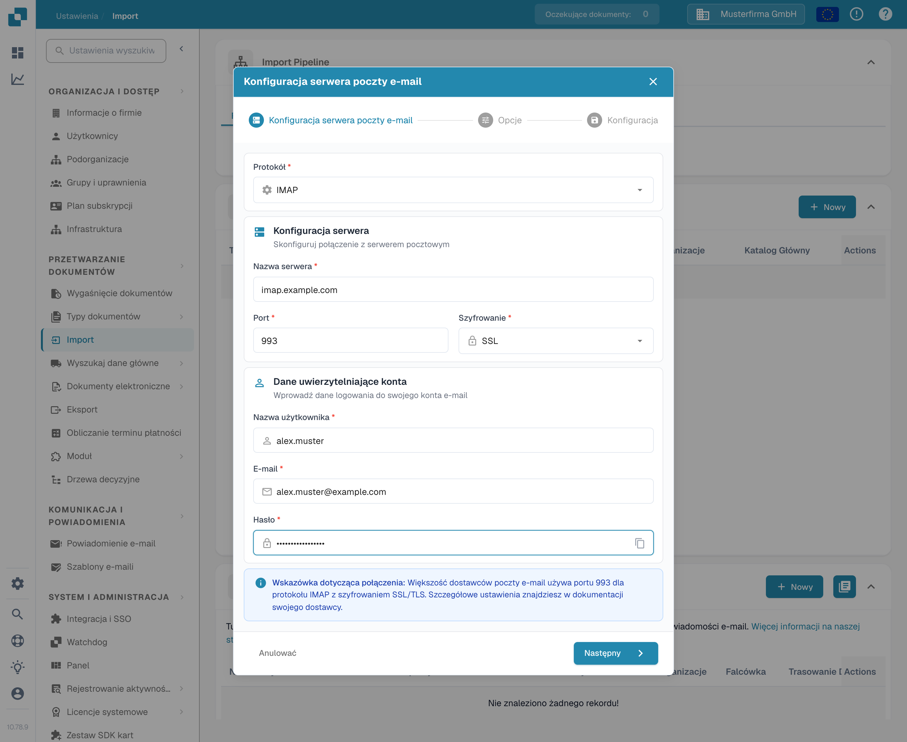

# IMAP



Wybierz IMAP jako protokół i wpisz dane swojego dostawcy poczty: nazwę serwera, port, szyfrowanie, nazwę użytkownika, adres e-mail i hasło. W kolejnych krokach ustawisz opcje i folder poczty.

<figure><figcaption>
Konfiguracja serwera z przykładowymi wartościami. Zastąp je danymi swojego dostawcy poczty.
</figcaption></figure>

Warto pamiętać

* Wprowadź wszystkie potrzebne informacje w interfejsie. Pozostałe dane, takie jak serwer czy port, zależą od dostawcy (pomocne może być szybkie wyszukanie w internecie).
* Folder i Przenieś zaimportowane pełnią tu tę samą funkcję. Folderu nie można wyłączyć, ale jeśli pozostanie pusty, domyślnie używana jest skrzynka odbiorcza.
