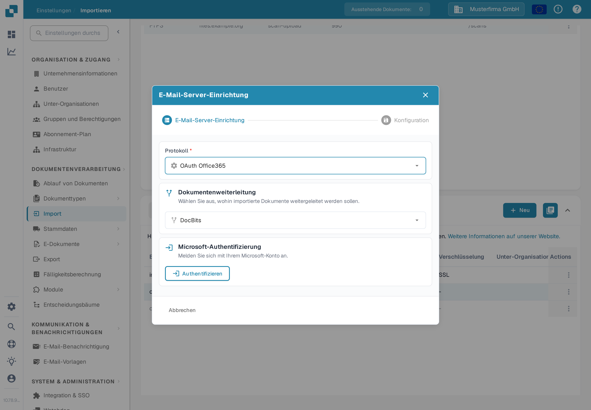
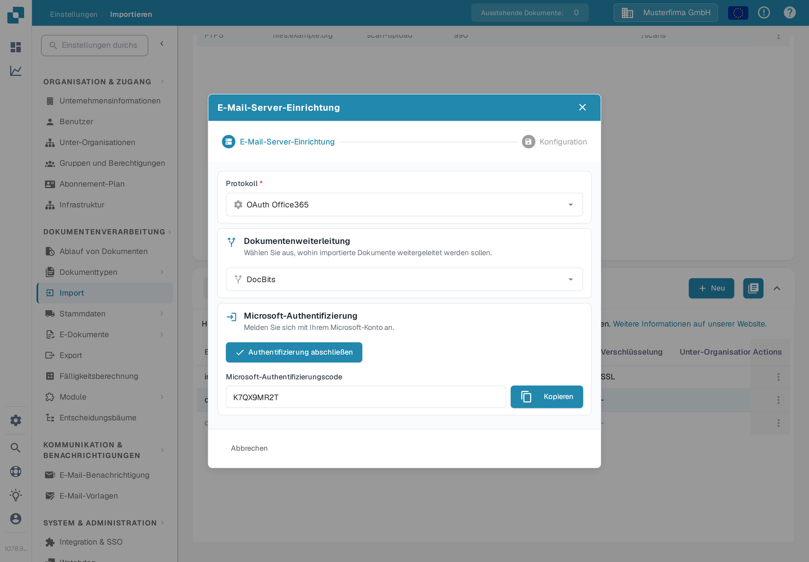

# OAuth Office365



[Dokumentenweiterleitung](../../../../administration-and-setup/settings/document-processing/module/inbound-emails.md) legen Sie fest, wohin Ihre importierten Dokumente gehen, und klicken Sie anschließend auf **Authentifizieren**. Die Unterorganisation wählen Sie im letzten Schritt der Einrichtung.

<figure><figcaption>
Wählen Sie die Weiterleitung und klicken Sie auf „Authentifizieren“.
</figcaption></figure>

Sie werden auf diese Microsoft-Seite weitergeleitet und müssen einen Code eingeben.

Diesen Code finden Sie, indem Sie zu DocBits zurückwechseln; der Code wird dort wie unten dargestellt angezeigt. Kopieren Sie den Code einfach und geben Sie ihn auf der Microsoft-Seite ein. Anschließend müssen Sie Ihre eigenen Microsoft-Anmeldedaten eingeben.

<figure><figcaption>
Der Microsoft-Code wird in DocBits angezeigt.
</figcaption></figure>

Drücken Sie die Schaltfläche „Authentifizierung abschließen“ und Sie werden zu diesem Menü weitergeleitet.

<figure><figcaption>
Optionen nach dem Abschluss der Authentifizierung.
</figcaption></figure>

**Ordner verwenden**

Wenn Sie einen anderen Ordner als Ihren Posteingang verwenden, geben Sie den Ordnernamen ein, nachdem Sie den Schieberegler aktiviert haben.

**Geteiltes Postfach verwenden**

Wenn der E-Mail-Import auf einen Posteingang oder einen Ordner eines gemeinsamen Postfachs zugreifen soll, geben Sie hier die E-Mail-Adresse ein, nachdem Sie den Schieberegler aktiviert haben.

**Importierte E-Mails in den Papierkorb verschieben**

(Im Dialog heißt der Schalter **E-Mails in einen anderen Ordner verschieben**.)

Wenn Sie alle E-Mails importieren möchten, nicht nur die ungelesenen, und diese nach dem Import in einen anderen Ordner (zum Beispiel den Papierkorb) verschieben lassen möchten, aktivieren Sie diese Option. Andernfalls werden nur ungelesene E-Mails geprüft, die Dokumente importiert, die E-Mail auf „gelesen“ gesetzt und an ihrem aktuellen Ort belassen. Die gleiche Option beschreibt die Seite [E-Mails in einen anderen Ordner verschieben](../../../../administration-and-setup/settings/document-processing/import.md).

Falls Sie eine Fehlermeldung erhalten, die darauf hinweist, dass Sie nicht über die Rechte verfügen, eine solche Verbindung herzustellen, müsste jemand mit Administratorrechten innerhalb von Azure diese Verbindung autorisieren. Weitere Informationen finden Sie auf der folgenden Seite: https://learn.microsoft.com/en-us/entra/identity/enterprise-apps/grant-admin-consent?pivots=portal#grant-tenant-wide-admin-consent-in-enterprise-apps
