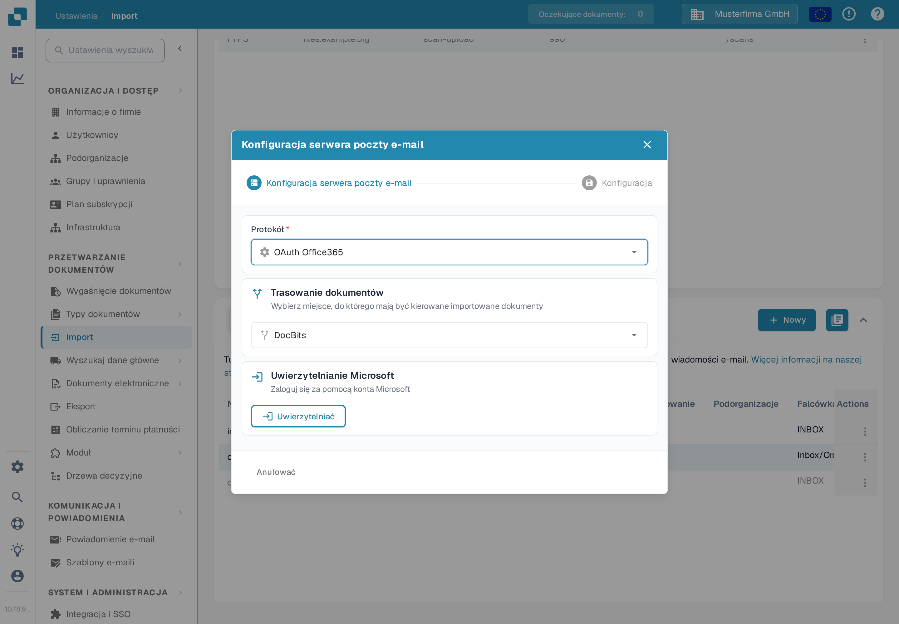
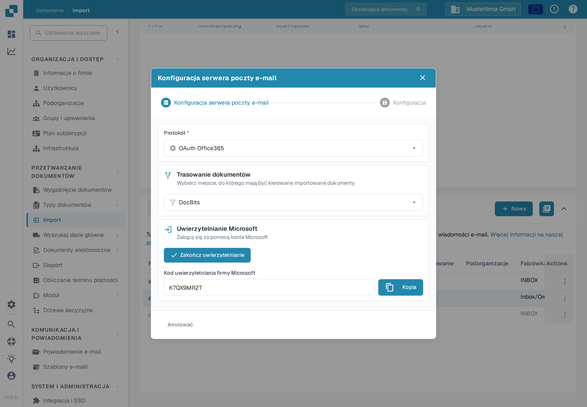

# OAuth Office365



Tutaj wystarczy wpisać swoją podorganizację i nacisnąć **Uwierzytelniać**

<figure><figcaption>
Wybierz trasowanie i naciśnij Uwierzytelniać.
</figcaption></figure>

Zostaniesz przeniesiony na tę stronę Microsoft i będziesz musiał wprowadzić kod.

Ten kod znajdziesz, wracając do DocBits — kod zostanie tam wyświetlony tak jak poniżej. Skopiuj kod i wprowadź go na stronie Microsoft. Następnie musisz podać własne dane logowania Microsoft.

<figure><figcaption>
Kod Microsoft jest wyświetlany w DocBits.
</figcaption></figure>

Naciśnij przycisk **Zakończ uwierzytelnianie**, a zostaniesz przeniesiony do tego menu

<figure><figcaption>
Opcje po zakończeniu uwierzytelniania.
</figcaption></figure>

**Użyj folderu**

Jeśli używasz folderu innego niż skrzynka odbiorcza, wpisz nazwę folderu po włączeniu przełącznika.

**Użyj udostępnionej skrzynki pocztowej**

Jeśli chcesz, aby import e-maili miał dostęp do skrzynki odbiorczej lub folderu udostępnionej skrzynki pocztowej, wpisz tutaj adres e-mail po włączeniu przełącznika.

**Przenieś zaimportowane e-maile do kosza**

(W oknie przełącznik nazywa się **Przenieś wiadomości e-mail do innego folderu**.)

Jeśli chcesz zaimportować wszystkie e-maile, a nie tylko nieprzeczytane, i przenieść je do innego folderu (na przykład do kosza), włącz tę opcję. W przeciwnym razie sprawdzane będą tylko nieprzeczytane e-maile: dokumenty zostaną zaimportowane, e-mail oznaczony jako przeczytany i pozostawiony na swoim miejscu. Ta sama opcja jest opisana na stronie [Importowanie](../../../../administration-and-setup/settings/document-processing/import.md).

W przypadku otrzymania komunikatu o błędzie wskazującego, że nie masz uprawnień do ustanowienia takiego połączenia, ktoś z uprawnieniami administratora w Azure musi autoryzować to połączenie. Aby uzyskać więcej informacji, odwiedź następującą stronę: [https://learn.microsoft.com/en-us/entra/identity/enterprise-apps/grant-admin-consent?pivots=portal#grant-tenant-wide-admin-consent-in-enterprise-apps](https://learn.microsoft.com/en-us/entra/identity/enterprise-apps/grant-admin-consent?pivots=portal#grant-tenant-wide-admin-consent-in-enterprise-apps)
