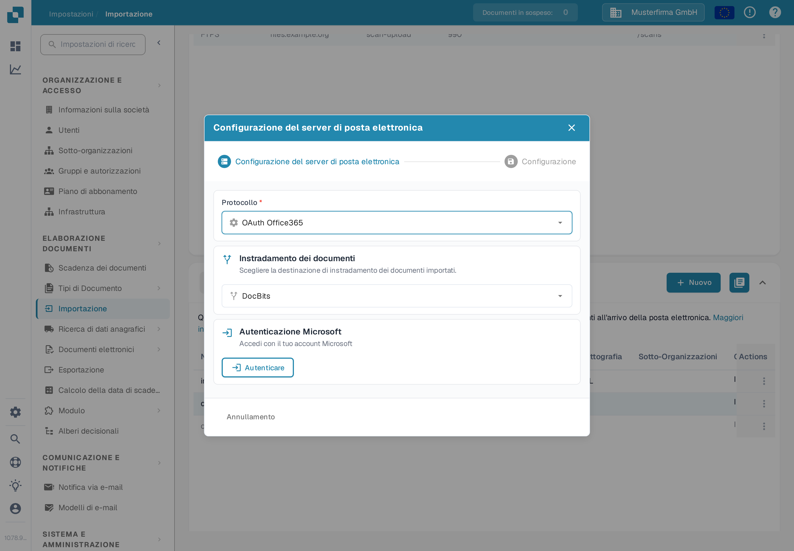
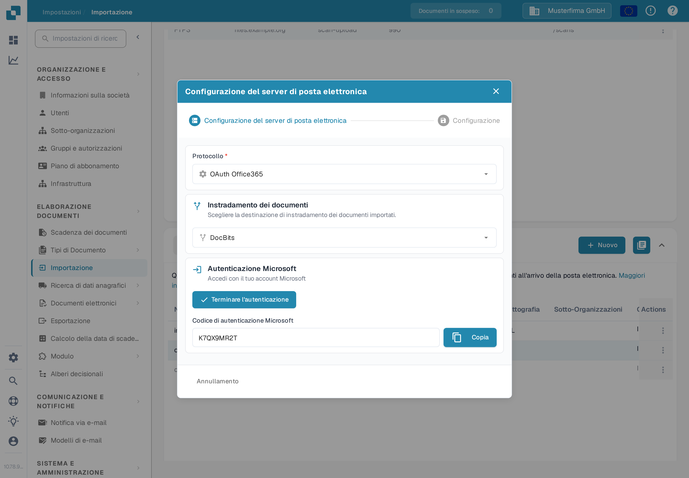
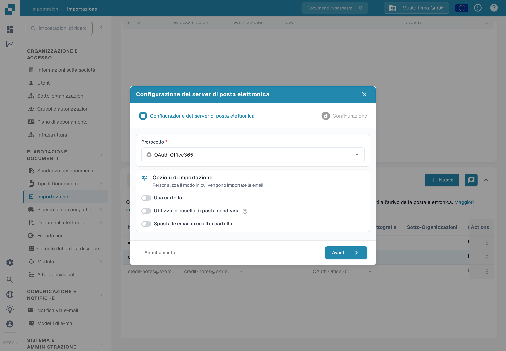

# OAuth Office365



Qui devi solo selezionare la tua sotto-organizzazione desiderata e premere **Autenticare**

<figure><figcaption>
Scegli l'instradamento e premi Autenticare.
</figcaption></figure>

Sarai portato a questa pagina di Microsoft e dovrai inserire un codice.

Puoi trovare questo codice tornando a DocBits: il codice verrà visualizzato lì come mostrato di seguito. Basta copiare il codice e inserirlo nella pagina di Microsoft. Successivamente dovrai inserire le tue credenziali Microsoft.

<figure><figcaption>
Il codice Microsoft viene mostrato in DocBits.
</figcaption></figure>

Premi il pulsante **Terminare l'autenticazione** e verrai portato a questo menu

<figure><figcaption>
Opzioni dopo la fine dell'autenticazione.
</figcaption></figure>

**Usa cartella**

Se utilizzi una cartella diversa dalla tua casella di posta in arrivo, inserisci il nome della cartella dopo aver attivato l'interruttore.

**Utilizza la casella di posta condivisa**

Se desideri che l'importazione delle email acceda alla casella di posta in arrivo o a una cartella di una casella di posta condivisa, inserisci qui l'indirizzo email dopo aver attivato l'interruttore.

**Sposta le email importate nel cestino**

(Nella finestra l'interruttore si chiama **Sposta le email in un'altra cartella**.)

Se desideri importare tutte le email, non solo quelle non lette, e spostarle in un'altra cartella (ad esempio il cestino) dopo l'importazione, attiva questa opzione. In caso contrario, verranno controllate solo le email non lette, verranno importati i documenti, l'email verrà contrassegnata come letta e lasciata nel suo posto attuale. La stessa opzione è descritta nella pagina [Importazione](../../../../administration-and-setup/settings/document-processing/import.md).

Nel caso in cui ricevessi un messaggio di errore che indica che non hai i diritti per stabilire una tale connessione, qualcuno con i diritti di amministratore in Azure dovrà autorizzare questa connessione. Per ulteriori informazioni, visita la seguente pagina: [https://learn.microsoft.com/en-us/entra/identity/enterprise-apps/grant-admin-consent?pivots=portal#grant-tenant-wide-admin-consent-in-enterprise-apps](https://learn.microsoft.com/en-us/entra/identity/enterprise-apps/grant-admin-consent?pivots=portal#grant-tenant-wide-admin-consent-in-enterprise-apps)
