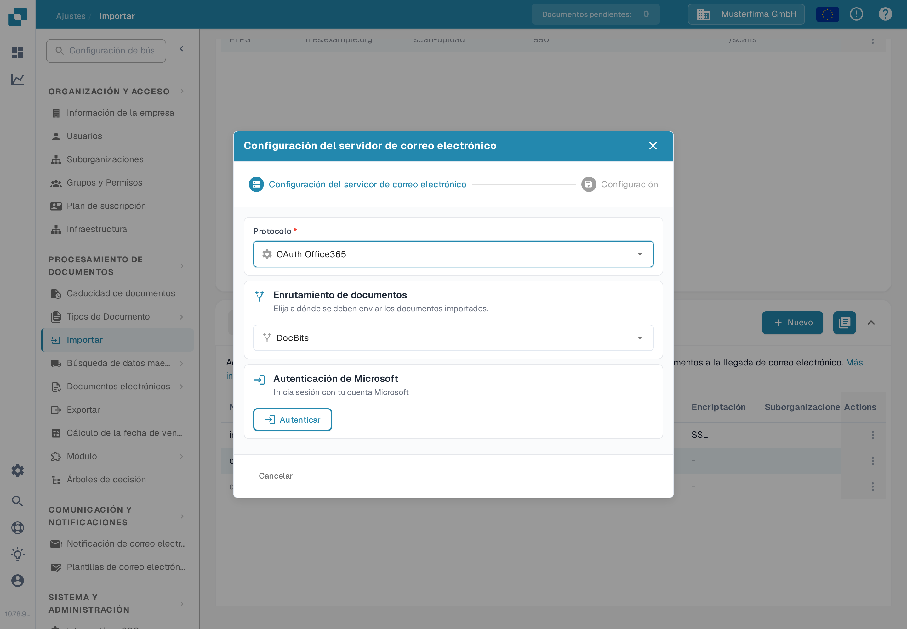
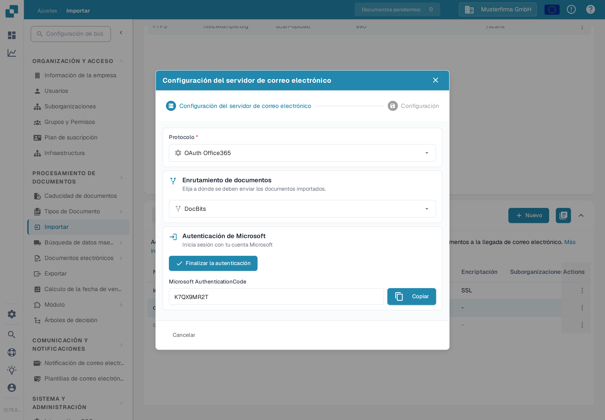

# OAuth Office365



Aquí solo necesitas ingresar la suborganización deseada y presionar 'Autenticar'

<figure><figcaption>
Elige el enrutamiento y presiona Autenticar.
</figcaption></figure>

Serás llevado a esta página de Microsoft y necesitarás ingresar un código.

Este código se puede encontrar haciendo clic en DocBits y el código se mostrará allí como se muestra a continuación, simplemente copia el código e ingrésalo en la página de Microsoft. Después necesitarás ingresar tus propias credenciales de Microsoft.

<figure><figcaption>
El código de Microsoft se muestra en DocBits.
</figcaption></figure>

Presiona el botón **Finalizar la autenticación** y serás llevado a este menú

<figure><figcaption>
Opciones después de finalizar la autenticación.
</figcaption></figure>

**Usar Carpeta**

Si estás usando una carpeta que no sea tu bandeja de entrada, ingresa el nombre de la carpeta después de habilitar el control deslizante.

**Usar Buzón Compartido**

Si deseas que la importación de correos electrónicos acceda a una bandeja de entrada o carpeta de un buzón compartido, ingresa la dirección de correo electrónico aquí después de habilitar el control deslizante.

**Mover correos electrónicos importados a la papelera**

Si deseas importar todos los correos electrónicos, no solo los no leídos, y que se muevan a la papelera, entonces activa esto. De lo contrario, solo revisará los correos electrónicos no leídos, importará los documentos, marcará el correo electrónico como leído y lo dejará en su lugar actual.

En caso de que recibas un mensaje de error que indique que no tienes los derechos para establecer tal conexión, alguien con derechos de administrador dentro de Azure deberá autorizar esta conexión. Para obtener más información, visita la siguiente página: [https://learn.microsoft.com/en-us/entra/identity/enterprise-apps/grant-admin-consent?pivots=portal#grant-tenant-wide-admin-consent-in-enterprise-apps](https://learn.microsoft.com/en-us/entra/identity/enterprise-apps/grant-admin-consent?pivots=portal#grant-tenant-wide-admin-consent-in-enterprise-apps)
