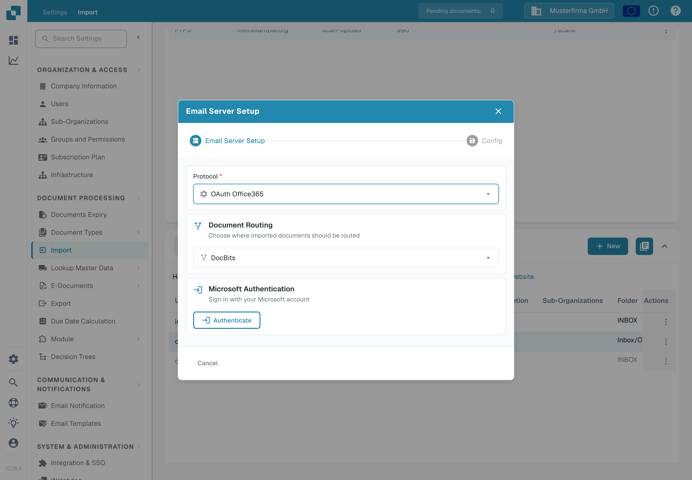
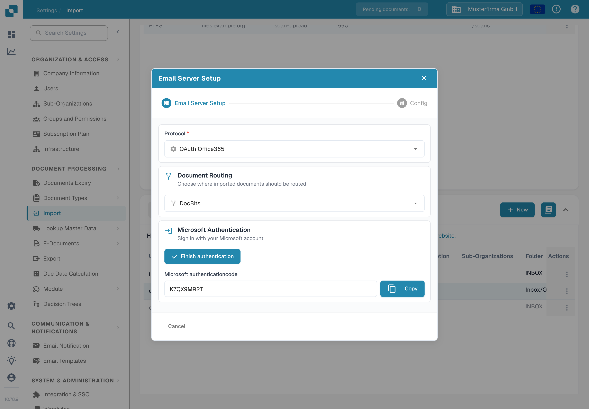
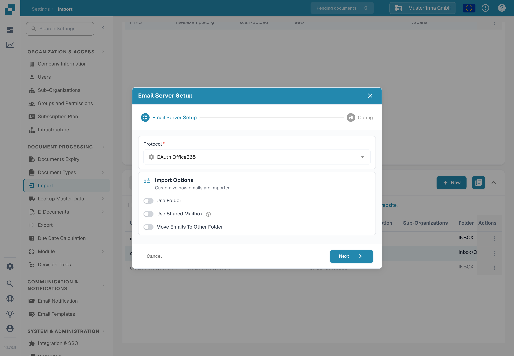

# OAuth Office365



Here you just need to enter your desired sub organization and press ‘Authenticate’

<figure><figcaption>
Choose the routing and press Authenticate.
</figcaption></figure>

You will be taken to this Microsoft page and you will need to enter a code.

This code can be found by clicking back to DocBits and the code will be displayed there like below, simply copy the code and enter it into the Microsoft page. Thereafter you will need to enter your own Microsoft credentials.

<figure><figcaption>
The Microsoft code is displayed in DocBits.
</figcaption></figure>

Press the FINISH AUTHENTICATION button and you will be taken to this menu

<figure><figcaption>
Options after the authentication is finished.
</figcaption></figure>

**Use Folder**

If you are using a folder other than your inbox, enter the folder name after enabling the slider.

**Use Shared Mailbox**

If you want the email import to access an inbox or a folder of a shared mailbox, input the email address here after enabling the slider.

**Move imported emails to trash**

If you want to import all emails, not just the unread ones, and have them moved to trash then activate this. If not, it will only check for unread emails, import the documents, set the email to read and leave it in its current place.

In the event of you receiving an error message indicating you do not have the rights to establish such a connection, someone with admin rights within Azure would need to authorize this connection. For more information, visit the following page: https://learn.microsoft.com/en-us/entra/identity/enterprise-apps/grant-admin-consent?pivots=portal#grant-tenant-wide-admin-consent-in-enterprise-apps
