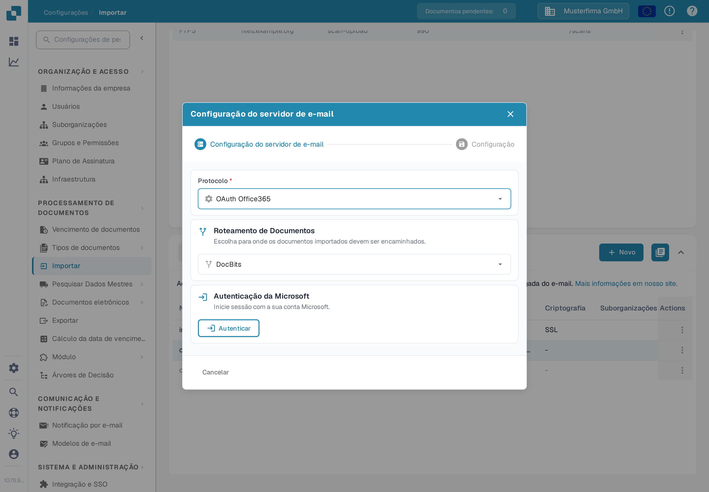
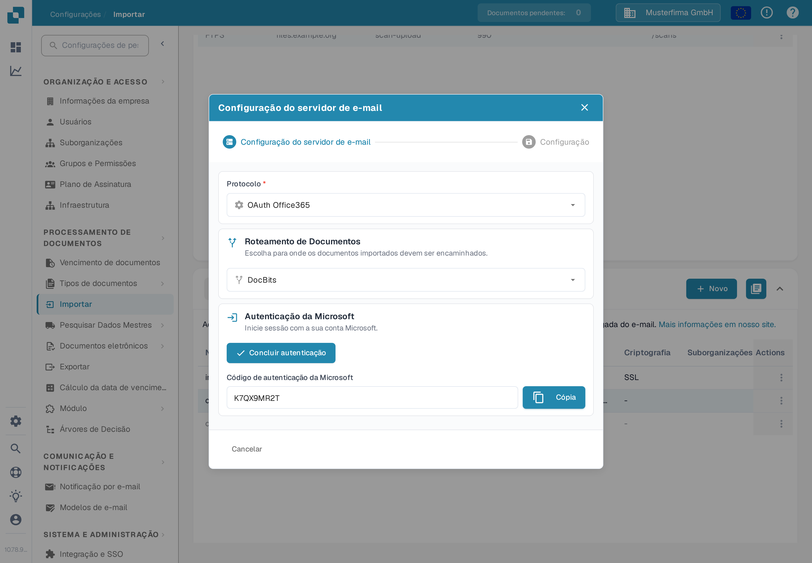

# OAuth Office365



Aqui você só precisa inserir a sub-organização desejada e pressionar **Autenticar**

<figure><figcaption>
Escolha o roteamento e pressione Autenticar.
</figcaption></figure>

Você será levado a esta página da Microsoft e precisará inserir um código.

Este código pode ser encontrado voltando ao DocBits — o código será exibido lá como abaixo. Basta copiar o código e inseri-lo na página da Microsoft. Depois disso, você precisará inserir as suas próprias credenciais da Microsoft.

<figure><figcaption>
O código da Microsoft é exibido no DocBits.
</figcaption></figure>

Pressione o botão **Concluir autenticação** e você será levado a este menu

<figure><figcaption>
Opções após a conclusão da autenticação.
</figcaption></figure>

**Usar pasta**

Se você estiver usando uma pasta diferente da sua caixa de entrada, insira o nome da pasta após ativar a opção.

**Usar caixa de correio compartilhada**

Se você quiser que a importação de e-mails acesse uma caixa de entrada ou uma pasta de uma caixa de correio compartilhada, insira aqui o endereço de e-mail após ativar a opção.

**Mover e-mails importados para a lixeira**

(Na janela, a opção chama-se **Mover e-mails para outra pasta**.)

Se você quiser importar todos os e-mails — e não apenas os não lidos — e movê-los para outra pasta (por exemplo, a lixeira), ative esta opção. Caso contrário, serão verificados apenas os e-mails não lidos: os documentos são importados, o e-mail é marcado como lido e permanece no seu local. Essa mesma opção é descrita na página [Importar](../../../../administration-and-setup/settings/document-processing/import.md).

Caso você receba uma mensagem de erro indicando que não tem permissões para estabelecer essa conexão, alguém com permissões de administrador no Azure precisará autorizar essa conexão. Para mais informações, visite a seguinte página: [https://learn.microsoft.com/en-us/entra/identity/enterprise-apps/grant-admin-consent?pivots=portal#grant-tenant-wide-admin-consent-in-enterprise-apps](https://learn.microsoft.com/en-us/entra/identity/enterprise-apps/grant-admin-consent?pivots=portal#grant-tenant-wide-admin-consent-in-enterprise-apps)
