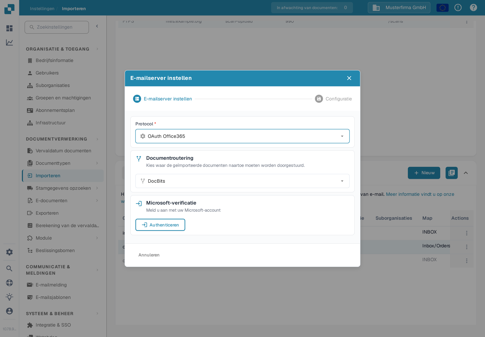
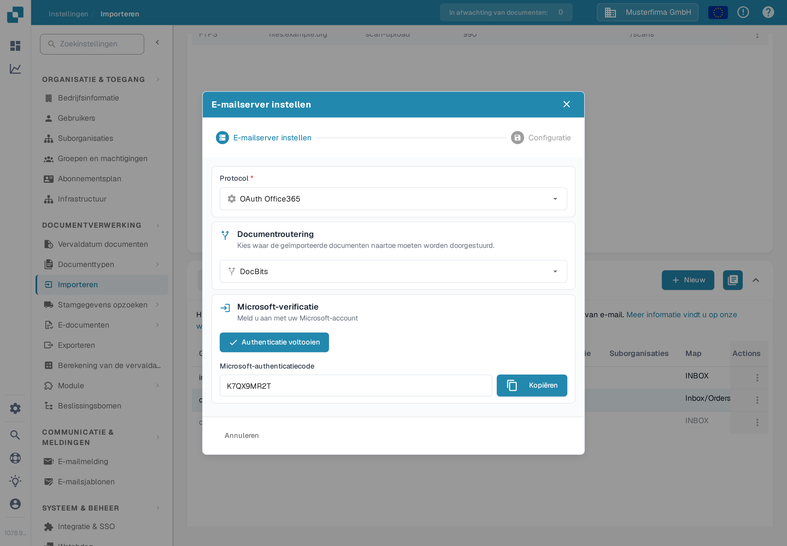

# OAuth Office365



Hier hoef je alleen je gewenste suborganisatie in te voeren en op **Authenticeren** te drukken

<figure><figcaption>
Kies de routering en druk op Authenticeren.
</figcaption></figure>

Je wordt naar deze Microsoft-pagina gebracht en je moet een code invoeren.

Deze code kan worden gevonden door terug te klikken naar DocBits en de code wordt daar weergegeven zoals hieronder, kopieer eenvoudig de code en voer deze in op de Microsoft-pagina. Daarna moet je je eigen Microsoft-gegevens invoeren.

<figure><figcaption>
De Microsoft-code wordt in DocBits weergegeven.
</figcaption></figure>

Druk op de knop **Authenticatie voltooien** en je wordt naar dit menu gebracht

<figure><figcaption>
Opties nadat de verificatie is voltooid.
</figcaption></figure>

**Gebruik map**

Als je een andere map dan je inbox gebruikt, voer dan de mapnaam in nadat je de schuifregelaar hebt ingeschakeld.

**Gedeelde mailbox gebruiken**

Als je wilt dat de e-mailimport toegang krijgt tot een inbox of een map van een gedeeld postvak, voer dan hier het e-mailadres in nadat je de schuifregelaar hebt ingeschakeld.

**Verplaats geïmporteerde e-mails naar prullenbak**

(In het venster heet de schakelaar **E-mails naar een andere map verplaatsen**.)

Als je alle e-mails wilt importeren, niet alleen de ongelezen, en ze naar de prullenbak wilt verplaatsen, activeer dit dan. Zo niet, dan controleert het alleen op ongelezen e-mails, importeert de documenten, stelt de e-mail in op gelezen en laat het op de huidige plaats. Dezelfde optie wordt beschreven op de pagina [Importeren](../../../../administration-and-setup/settings/document-processing/import.md).

In het geval dat je een foutmelding ontvangt die aangeeft dat je niet de rechten hebt om zo'n verbinding tot stand te brengen, moet iemand met beheerdersrechten binnen Azure deze verbinding autoriseren. Voor meer informatie, bezoek de volgende pagina: [https://learn.microsoft.com/en-us/entra/identity/enterprise-apps/grant-admin-consent?pivots=portal#grant-tenant-wide-admin-consent-in-enterprise-apps](https://learn.microsoft.com/en-us/entra/identity/enterprise-apps/grant-admin-consent?pivots=portal#grant-tenant-wide-admin-consent-in-enterprise-apps)
