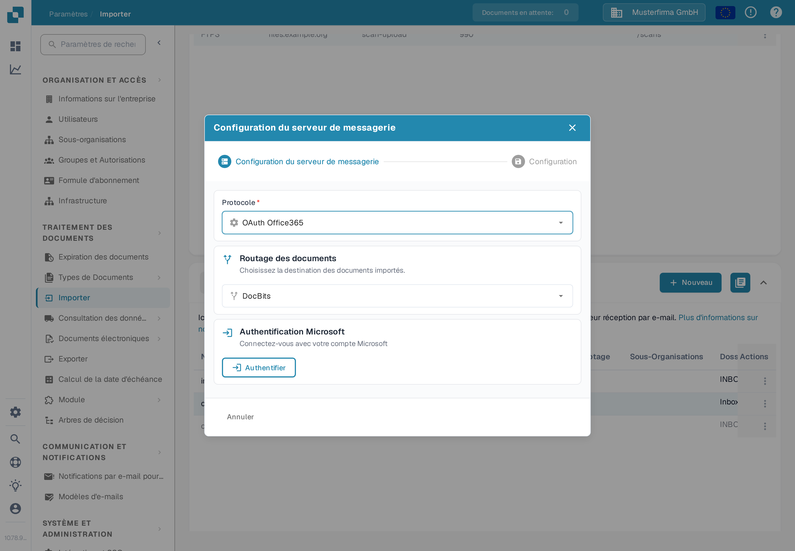
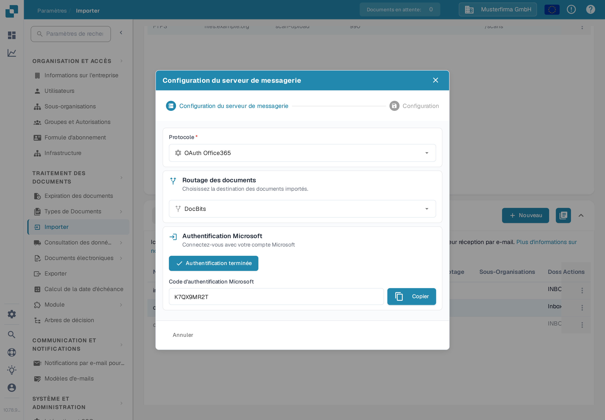
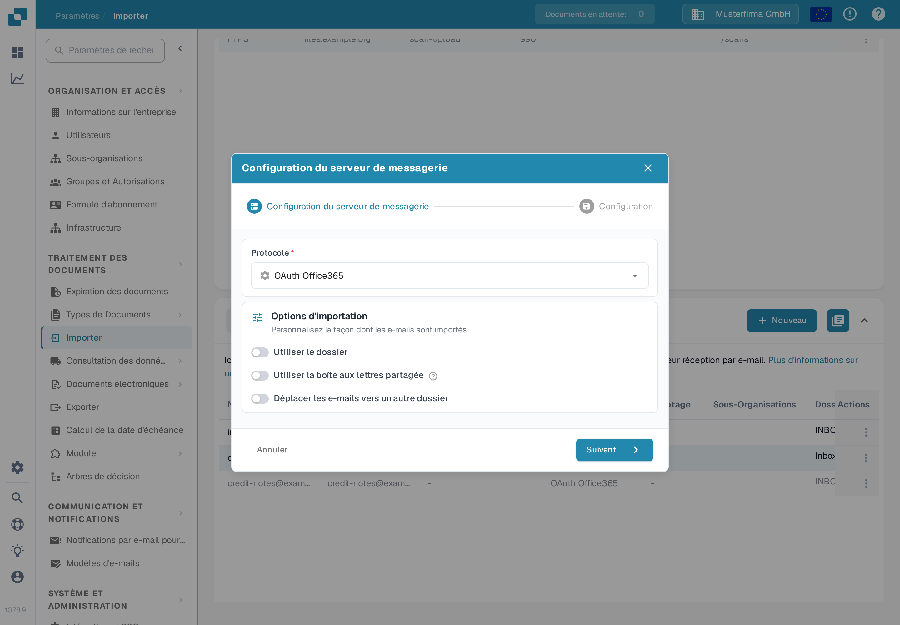

# OAuth Office365



Vous trouverez ici les étapes pour connecter une boîte aux lettres Office 365 à DocBits en utilisant OAuth. La configuration complète de l'importation d'e-mails est décrite dans le guide [E-mails entrants — connecter une boîte aux lettres](../../../../administration-and-setup/settings/document-processing/module/inbound-emails.md).

Saisissez la sous-organisation souhaitée et appuyez sur « Authentifier ».

<figure><figcaption>
Choisissez le routage des documents et appuyez sur Authentifier.
</figcaption></figure>

Vous serez redirigé vers une page Microsoft où un code vous sera demandé.

Ce code peut être récupéré en retournant sur DocBits : il y sera affiché comme ci-dessous. Copiez simplement le code et saisissez-le sur la page Microsoft. Ensuite, vous devrez entrer vos propres identifiants Microsoft.

<figure><figcaption>
Le code Microsoft est affiché dans DocBits.
</figcaption></figure>

Appuyez sur le bouton « Authentification terminée » et vous accéderez à ce menu d'options d'importation.

<figure><figcaption>
Options d'importation une fois l'authentification terminée.
</figcaption></figure>

**Utiliser le dossier**

Si vous utilisez un dossier autre que votre boîte de réception, saisissez le nom du dossier après avoir activé le commutateur.

**Utiliser la boîte aux lettres partagée**

Si vous souhaitez que l'importation d'e-mails accède à la boîte de réception ou à un dossier d'une boîte aux lettres partagée, saisissez ici l'adresse e-mail après avoir activé le commutateur.

**Déplacer les e-mails vers un autre dossier**

Si vous souhaitez importer tous les e-mails, et pas seulement les non lus, et les déplacer vers un autre dossier, activez cette option. Sinon, seuls les e-mails non lus seront vérifiés : les documents seront importés, l'e-mail sera marqué comme lu et restera à son emplacement actuel.

Pour enregistrer et activer la connexion après l'avoir configurée, puis consulter ses journaux, suivez la section « Ajouter une nouvelle connexion OAuth Office365 » et « Actions pour OAuth Office365 » du guide [Importer — Importation d'e-mails](../../../../administration-and-setup/settings/document-processing/import/README.md).

Si vous recevez un message d'erreur indiquant que vous ne disposez pas des droits nécessaires pour établir une telle connexion, une personne disposant de droits d'administrateur dans Azure devra autoriser cette connexion. Pour plus d'informations, consultez la page suivante : https://learn.microsoft.com/en-us/entra/identity/enterprise-apps/grant-admin-consent?pivots=portal#grant-tenant-wide-admin-consent-in-enterprise-apps
