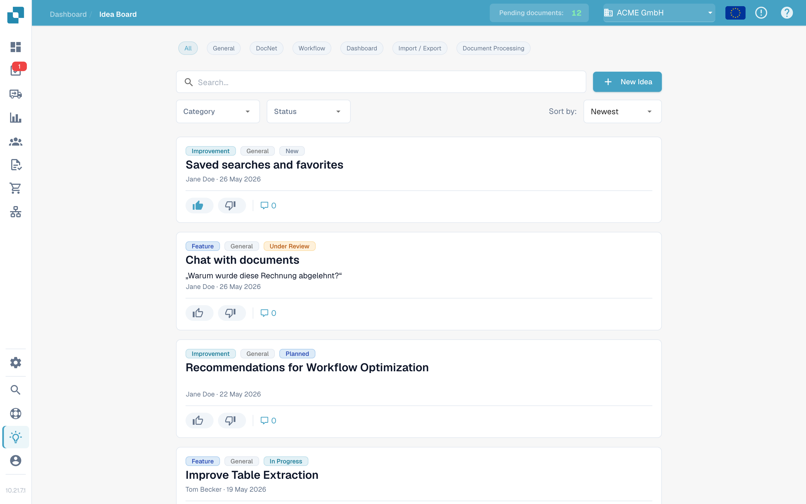
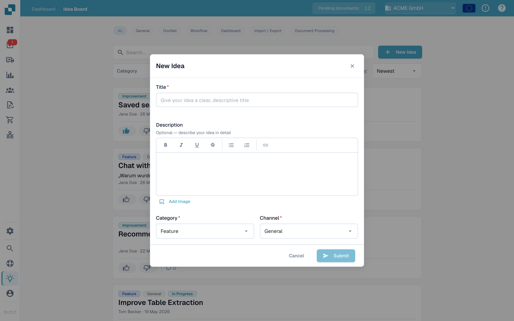

# Tablero de Ideas

El Tablero de Ideas es el lugar para enviar solicitudes de funciones, informar de funcionalidades que faltan y votar lo que el equipo de producto debería construir a continuación. Las ideas están organizadas por canal y son visibles para todos los miembros de su organización, con comentarios y votación.

## Cómo acceder

Abra la barra lateral y haga clic en **Ideas**, o navegue directamente a `/ideas`.

<figure><figcaption>
El Tablero de Ideas, con chips de canal, filtros y tarjetas de ideas.
</figcaption></figure>

## Canales

En la parte superior del tablero hay una fila de chips de canal: **Todas**, **General**, **DocNet**, **Flujo de trabajo**, **Panel**, **Importación / Exportación** y **Procesamiento de documentos**. Haga clic en un chip para mostrar solo las ideas de esa área de producto; **Todas** quita el filtro de canal. Cada idea pertenece a un único canal, que se muestra como una insignia en su tarjeta.

## Explorar ideas

Cada idea se muestra como una tarjeta con:

* El título y una descripción en formato enriquecido, que puede incluir imágenes.
* Botones separados de **voto a favor** y **voto en contra**, cada uno con su propio recuento.
* Una insignia de categoría — Función, Mejora, Error, Integración u Otros.
* Una insignia de canal — General, DocNet, Flujo de trabajo, Panel, Importación / Exportación o Procesamiento de documentos.
* Una etiqueta de estado — Nueva, En revisión, Planificada, En curso, Hecha o Rechazada.
* Nombre y organización de quien la envió, además de una marca de tiempo relativa.
* Un conmutador de comentarios que expande el hilo debajo de la tarjeta.

La paginación al final de la lista permite moverse entre páginas.

## Enviar una idea nueva

Haga clic en **Nueva idea** en la cabecera. El diálogo pide:

* **Título** — un nombre corto y descriptivo para la idea.
* **Descripción** — un editor de texto enriquecido opcional con negrita, cursiva, subrayado, tachado, listas y enlaces. También puede añadir imágenes: péguelas directamente o use el botón **Agregar imagen** para insertar una en la descripción.
* **Categoría** — elija la más adecuada. El equipo de producto la usa para organizar las ideas.
* **Canal** — el área de producto a la que pertenece la idea.

Pulse **Enviar** para publicar. La idea aparece en la lista con el estado **Nueva**.

<figure><figcaption>
El diálogo de Nueva idea, con los selectores de categoría y canal.
</figcaption></figure>

## Votar

Cada idea tiene botones separados de **voto a favor** y **voto en contra**, cada uno con su propio recuento. Haga clic en un botón para emitir su voto, vuelva a hacer clic en el mismo para retirarlo, o haga clic en el opuesto para cambiarlo. Los votos dan al equipo de producto una señal de demanda y alimentan los órdenes **Caliente** y **Mejor valoradas**.

## Comentar

Abra el hilo de comentarios de una idea para hacer preguntas, añadir contexto o compartir soluciones alternativas. Puede votar a favor o en contra de los comentarios (pero no de los suyos) y borrar los comentarios que usted publicó. La persona que envió la idea y los administradores también pueden borrar comentarios para mantener los hilos centrados.

## Filtrar y ordenar

Sobre la lista puede combinar:

* Los chips de **canal**.
* Un cuadro de búsqueda que filtra por título y descripción.
* Un desplegable de categoría.
* Un desplegable de estado.
* Un selector de orden — **Más recientes**, **Caliente** o **Mejor valoradas**.

Los filtros se combinan, por lo que puede acotar, por ejemplo, a "Mejoras Mejor valoradas que estén En revisión" en unos pocos clics.

## Editar o borrar su propia idea

El menú de la tarjeta (botón de tres puntos) permite editar o borrar una idea que usted envió.

<mark>El Tablero de Ideas sirve para retroalimentación de producto, no para reportar incidencias. Use un ticket de soporte para problemas que bloquean su trabajo hoy.</mark>
