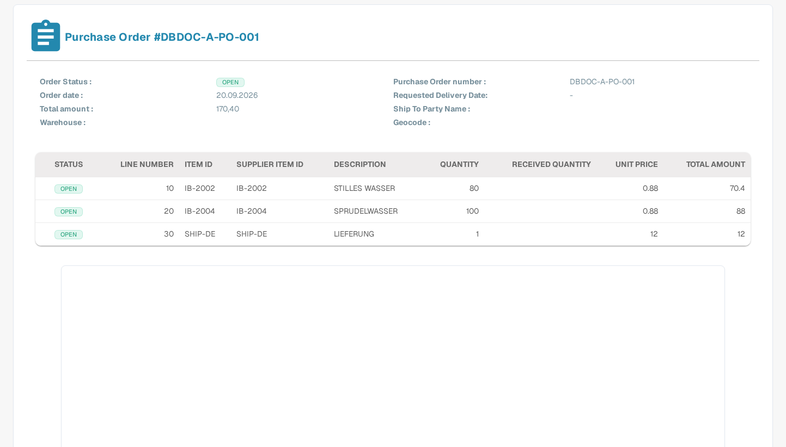

# Purchase Order Detail

The Purchase Order Detail page gives you a complete view of a single purchase order. You can use it to check the order data, review each ordered line item, and see the original purchase order document without opening another system.

## How to open the Purchase Order Detail page

1. In the main menu, select **Purchase Order** to open the Purchase Order Dashboard.
2. Find the purchase order you want to review, for example by using the search bar or the filters.
3. Click the **view** action (eye icon) in the row of the purchase order.

The Purchase Order Detail page opens and shows the purchase order number in the heading, for example **Purchase Order #DBDOC-A-PO-001**.

The image above shows the English interface with the synthetic Sandbox purchase order `DBDOC-A-PO-001`. The charges icon of a line is only visible when charges exist for that line; in this example none of the lines has charges.

## Order data

The upper section of the page shows the general data of the purchase order:

| Field | Description |
| :-- | :-- |
| **Order Status** | Current status of the purchase order, for example `OPEN`. |
| **Purchase Order number** | The unique number of the purchase order. |
| **Order date** | The date on which the order was placed. |
| **Requested Delivery Date** | The delivery date requested in the purchase order. |
| **Total amount** | The total value of the purchase order. |
| **Ship To Party Name** | The party the goods are shipped to. |
| **Warehouse** | The warehouse the goods are ordered for. |
| **Geocode** | The location code of the warehouse. |

## Line items

The table below the order data lists one row per ordered line item:

| Column | Description |
| :-- | :-- |
| **Status** | Status of the line, for example `OPEN`. A green check mark next to the received quantity shows that the full ordered quantity has been received. |
| **Line Number** | Number of the line in the purchase order. |
| **Item ID** | Internal item number of the ordered article. |
| **Supplier Item ID** | Item number used by the supplier. |
| **Description** | Description of the ordered article or service. |
| **Quantity** | Ordered quantity. |
| **Received Quantity** | Quantity received so far. |
| **Unit Price** | Price per unit. |
| **Total Amount** | Total value of the line. |

### Charges of a line

If additional charges (for example freight or handling charges) are distributed to a line, a charges icon appears in the first column of that line. Click the icon to open or hide a sub-table with the charges of the line. The sub-table shows the **Charge ID**, the **Amount**, the **Charge Type**, and the **Purchase Order number** the charge belongs to. Charges are extracted from the purchase order document; how they are compared with invoice charges is described in the [Purchase Order Matching Tools](purchase-order-matching/purchase-order-matching-tools.md) and in [Compare Total Charges](../../administration-and-setup/workflow/and/compare-with-purchase-order/compare-total-charges.md).

## Document preview

Below the line items, the page shows a PDF preview of the original purchase order document, so you can compare the extracted data with the source at any time.

## Purchase order not found

If the purchase order number in the address of the page does not exist in your organization, the page shows **NO DATA FOUND** instead of order data. Go back to the [Purchase Order Dashboard](purchase-order-dashboard.md) and open a purchase order from the list.

## Related pages

- [Purchase Order Dashboard](purchase-order-dashboard.md) — find and filter purchase orders.
- [Purchase Order Matching Screen](purchase-order-matching/README.md) — compare an invoice with a purchase order.
