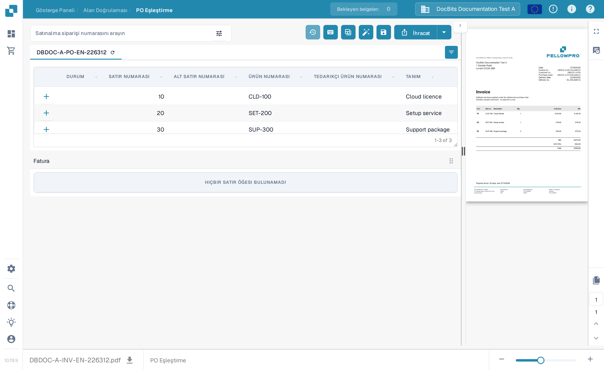
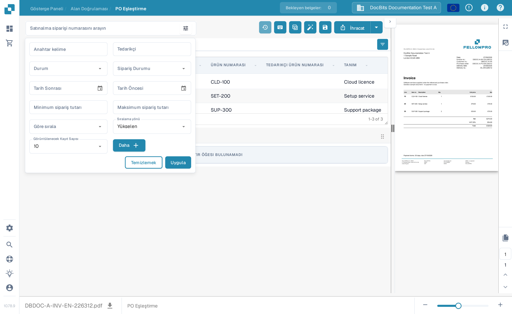
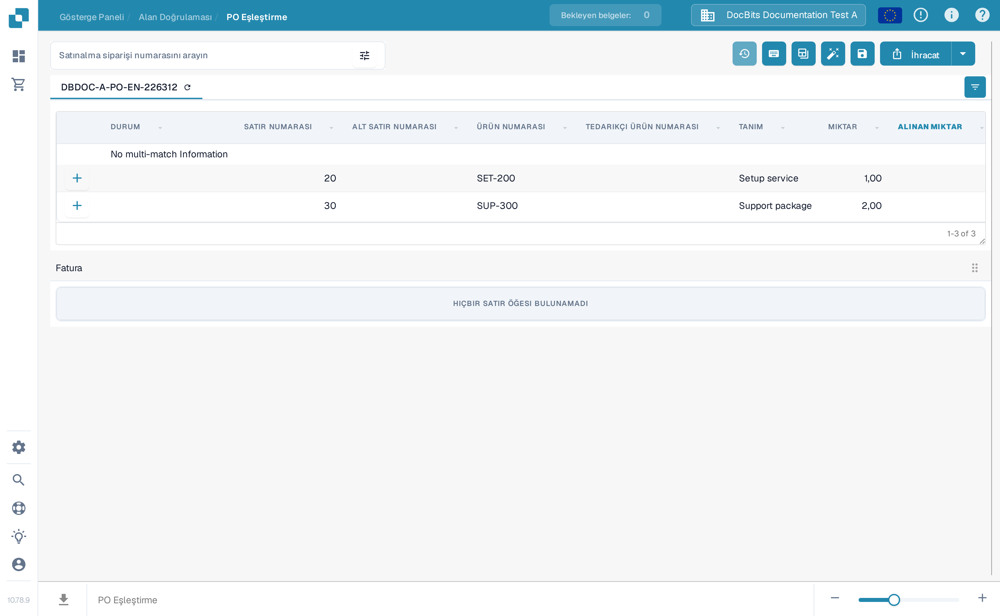

# Satın Alma Siparişi Eşleştirme Ekranı

**PO Eşleştirme** ekranı, bir belge için yüklenmiş satın alma siparişi satırlarını belgeden çıkarılan fatura satırlarıyla karşılaştırmak için kullanılır. Satın alma siparişi verileri bir ERP entegrasyonundan veya başka bir yapılandırılmış içe aktarma yönteminden gelebilir. Ekran, kaydetmeden veya dışa aktarmadan önce numaraları, miktarları, fiyatları ve farkları kontrol edebilmeniz için belgeyi iki tablonun yanında gösterir.


Aşağıdaki örnek, **DocBits Documentation Test A** kuruluşunda sentetik bir FellowPro faturası ve satın alma siparişi kullanır. Örnek faturanın tablosu şu anda **HIÇBİR SATIR ÖĞESİ BULUNAMADI** gösterir. Bu örnek gezinmeyi ve aramayı gösterir, ancak başarılı bir satır eşleşmesini gösteremez. Bu örneği eşleşmiş bir fatura olarak dışa aktarmayın.


<figure><figcaption>
Satın alma siparişi yüklenmiştir; örnek faturada bağlanacak çıkarılmış satır yoktur.
</figcaption></figure>

## Bir satın alma siparişi bulma ve inceleme

1. Bir faturayı **PO Eşleştirme** ekranında açın. Kuruluşunuzda birden fazla satın alma siparişi varsa, **Satınalma siparişi numarasını arayın** alanına bir numara girin.
2. Arama kutusunun yanındaki filtre simgesini seçerek **Anahtar Sözcük**, **Tedarikçi**, **Durum**, **Sipariş Durumu**, tarihler, tutar aralığı, sıralama ve gösterilen kayıt sayısını ayarlayın. Ek ölçütler için **Daha Fazla** seçeneğini seçin. Aramak için **Uygula**, filtreleri sıfırlamak için **Temizle** seçeneğini seçin.
3. Satırlarını incelemek için tablonun üzerindeki bir satın alma siparişi numarasını seçin. Numaranın yanındaki yenileme simgesi o siparişin verilerini yeniden yükler. Yeniden yükleme, yapılandırılmış entegrasyona bağlı olabilir.
4. Her satın alma siparişi satırını fatura ve çıkarılan tablosuyla karşılaştırın. Bir satırdaki **+** işareti eşleştirme ayrıntılarını genişletir; satırı faturaya kendisi bağlamaz. Örnekte böyle bir eşleşme olmadığı için **No multi-match Information** görüntülenir.

<figure><figcaption>
Gösterilen satın alma siparişlerini daraltmak için filtre panelini kullanın.
</figcaption></figure>

<figure><figcaption>
Genişletilmiş satır, varsa eşleştirme ayrıntılarını gösterir.
</figcaption></figure>

## Satırları eşleştirme ve sonucu inceleme

Her iki tabloda satır olduğunda, bir fatura satırını sürükleyerek karşılık gelen satın alma siparişi satırına bağlayın veya satır bağ menüsündeki eşleştirme eylemlerini kullanın. **Otomatik Eşleştirme**, kuruluşunuzun kurallarını kullanarak uygun satırları bağlamayı dener. Kaydetmeden önce sonucu kontrol edin: eşleşen bir ürün numarası tek başına miktar, fiyat veya teslim koşullarının uyumlu olduğunu kanıtlamaz. Araç çubuğu, sütun kontrolleri ve manuel eylemler için [Satın Alma Siparişi Eşleştirme Araçları](purchase-order-matching-tools.md), klavye eylemleri için [Klavye Kısayolları](keyboard-shortcuts.md) konularına bakın.

Bir belge eşleşmediyse, satın alma siparişi alanının üzerinde gösterilen nedeni okuyun. PO numarasının eksik olduğunu, siparişin bulunamadığını, satırlarının kullanılamadığını veya faturanın çıkarılmış satırı olmadığını belirtiyor olabilir. Gösterilen belgeyi veya yapılandırmayı düzeltin. Bir yönetici, fatura satırları görünmediğinde [eşleştirme kurallarını](../../../administration-and-setup/settings/global-settings/document-types/more-settings/purchase-order/purchase-order-matching-rules.md) ve [tablo çıkarmayı](../../../administration-and-setup/settings/document-processing/classification-and-extraction/README.md) inceleyebilir.

Yaygın mesajlar ve sonraki adımlar:

| Gördüğünüz | Kontrol edilecek |
| --- | --- |
| Satın alma siparişi numarası yok | Belgedeki PO numarasını girin veya düzeltin, ardından kaydedin. |
| Satın alma siparişi bulunamadı | Numarayı ve siparişin bu kuruluş içine aktarılıp aktarılmadığını kontrol edin. |
| Sipariş bulundu ama bağlanmadı | **Otomatik Eşleştirme**'yi deneyin veya her iki tabloyu kontrol ettikten sonra satırları manuel olarak bağlayın. |
| Eşleşen sipariş satırı yok | Fatura değerlerini siparişle karşılaştırın ve eşleştirme geçmişini kontrol edin. |
| Fatura satır öğesi yok | Eşleştirmeyi denemeden önce [tablo çıkarmayı](../../../administration-and-setup/settings/document-processing/classification-and-extraction/README.md) kontrol edin. |
| Açık sipariş satırı yok | [Tüketilen satır durumlarını](../../../administration-and-setup/settings/global-settings/document-types/more-settings/purchase-order/consumed-po-line-status.md) ve hariç tutulan durumları kontrol edin. |


Değişmiş veya yeni algılanmış bir PO numarasından sonra kaydetme eşleştirmeyi yeniden tetikleyebilir. Kaydettikten sonra gösterilen sonucu kontrol edin. Bir eşleştirme kaydedilemiyorsa ekranda gösterilen hatayı okuyun ve bir yöneticiden [dönüşümü](../../../administration-and-setup/settings/global-settings/document-types/transformation-rules.md) ve [eşleştirme kurallarını](../../../administration-and-setup/settings/global-settings/document-types/more-settings/purchase-order/purchase-order-matching-rules.md) kontrol etmesini isteyin.


Geçmiş bir eşleştirmenin nasıl kararlaştırıldığını incelemek için, izinlerinizin izin verdiği yerde **Eşleştirme geçmişi** (saat simgesi) özelliğini kullanın. Bu salt okunur bir görünümdür. Hangi kuralların çalıştığını ve bir adayın neden eşleşmediğini gözden geçirebilirsiniz; geçmişi açmak belgeyi dışa aktarmaz.

### Eşleştirme başına birden fazla satır

Eşleştirme kurallarınız izin verdiğinde, tek bir fatura satırı birkaç sipariş satırına ya da bunun tersi karşılık gelebilir. Var olan bir çoklu eşleştirmeyi incelemek için bir satırdaki **+** ayrıntılarını açın. Yalnızca tek bir satırı değil, birleşik miktarı ve fiyatı kontrol edin. Yukarıdaki sentetik örnekteki gibi boş bir ayrıntı paneli, incelenecek bir çoklu eşleştirme olmadığı anlamına gelir. Bağlantıları değiştirmek için [Satın Alma Siparişi Eşleştirme Araçları](purchase-order-matching-tools.md) konusuna bakın.

### Miktarlar, farklar ve indirimler

Yapılandırmaya bağlı olarak eşleştirme; sipariş edilen, alınan veya kalan teslim miktarını ayrıca birim fiyatı, ürün numarasını ve diğer eşlenmiş alanları karşılaştırabilir. Belge türü yapılandırılmış bir toleransa sahipse bir fark kabul edilebilir. Kabul etmeden önce gösterilen uyuşmazlığı kontrol edin. [Tolerans ayarları](../../../administration-and-setup/settings/global-settings/document-types/more-settings/purchase-order/purchase-order-tolerance-settings-additional-purchase-order-tolerance.md) ve [indirim rehberi](discounts.md) bu durumları açıklar.

Mevcut olduğunda toplamlar alanı, faturadaki net tutarı eşleşen satırlar ve masraflarla uzlaştırmaya yardımcı olur. **Kapalı olmayan tutar** kalırsa, dışa aktarmadan önce tekil satır değerlerini ve varsa [maliyet unsurunu](../../../administration-and-setup/settings/document-processing/classification-and-extraction/table-extraction-for-costing-element.md) inceleyin.

## Toplamları kontrol etme ve kaydetme

Sağdaki fatura önizlemesini gözden geçirin ve satır toplamlarını ile varsa masrafları karşılaştırın. Üst araç çubuğundaki eylemlerin tam açıklaması için [Satın Alma Siparişi Eşleştirme Araçları](purchase-order-matching-tools.md) konusuna bakın. Eşleştirmeleri değiştirdikten sonra **Kaydet** seçeneğini seçin. **Dışa Aktar** seçeneğini yalnızca belgeyi ve eşleştirme sonucunu kontrol ettikten sonra seçin; Dışa Aktar'ın yanındaki ok, ek yapılandırılmış dışa aktarma seçeneklerini gösterir. Kuruluşunuzda farklı dışa aktarma eylemleri olabilir.

Önizleme araç çubuğu belge sayfaları arasında gezinmenize, yakınlaştırmanıza, orijinali indirmenize ve daha büyük bir görünüm açmanıza olanak tanır. Satın alma siparişi numarasının ve satır değerlerinin faturada gerçekten göründüğünü doğrulamak için bunu kullanın. Kaydedilmemiş eşleştirme değişiklikleriyle ekrandan ayrılırsanız bu değişiklikler kaybolabilir.

Kullanılabilir karşılaştırmalar ve tolerans değerleri belge türü ayarlarınıza bağlıdır. Yönetici ayarları için [PO Eşleştirme Kuralları](../../../administration-and-setup/settings/global-settings/document-types/more-settings/purchase-order/purchase-order-matching-rules.md), [Tolerans Ayarları](../../../administration-and-setup/settings/global-settings/document-types/more-settings/purchase-order/purchase-order-tolerance-settings-additional-purchase-order-tolerance.md), [Devre Dışı Bırakılmış Durumlar](../../../administration-and-setup/settings/global-settings/document-types/more-settings/purchase-order/purchase-order-disable-statuses.md) ve [Tüketilmiş PO Satırı Durumu](../../../administration-and-setup/settings/global-settings/document-types/more-settings/purchase-order/consumed-po-line-status.md) konularını okuyun. Birçok-satır-tek-satır durumları için [İndirimler](discounts.md) ve [Eşleştirme Araçları](purchase-order-matching-tools.md) konularına bakın.
