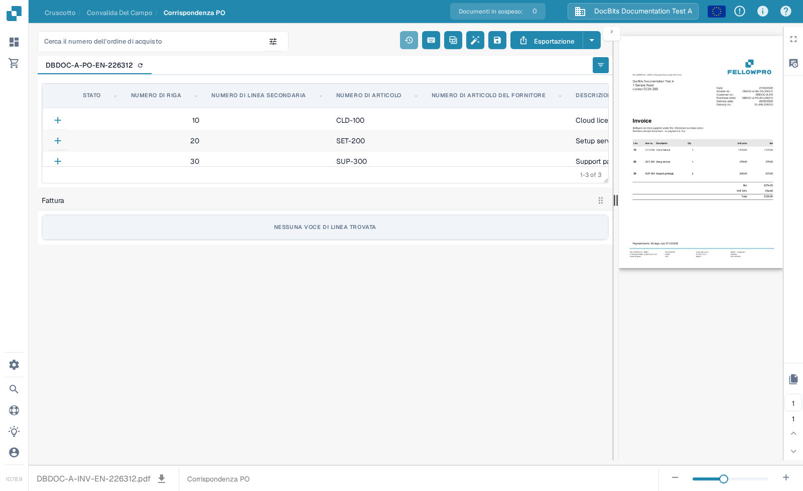
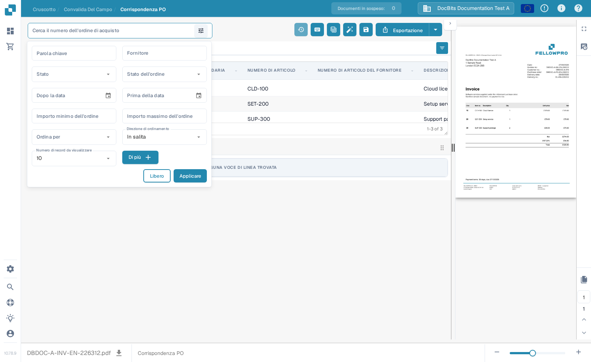
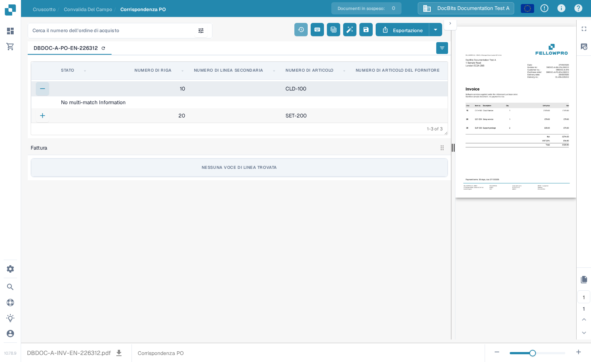

# Schermata di Abbinamento Ordini di Acquisto

Usa **Corrispondenza PO** per confrontare le righe dell'ordine di acquisto caricate per un documento con le righe di fattura estratte. I dati dell'ordine di acquisto possono provenire da un'integrazione ERP o da un altro import configurato. La schermata mostra il documento accanto alle due tabelle, così puoi controllare numeri, quantità, prezzi e differenze prima di salvare o esportare.


L'esempio seguente usa una fattura e un ordine di acquisto sintetici FellowPro in **DocBits Documentation Test A**. La sua tabella della fattura attualmente indica **NESSUNA VOCE DI LINEA TROVATA**. Questo dimostra la navigazione e la ricerca, ma non può dimostrare un abbinamento riuscito tra righe. Non esportare questo esempio come fattura abbinata.


<figure><figcaption>
L'ordine di acquisto è caricato; la fattura di esempio non ha righe estratte da collegare.
</figcaption></figure>

## Trovare e ispezionare un ordine di acquisto

1. Apri una fattura in **Corrispondenza PO**. Se la tua organizzazione ha più ordini di acquisto, inserisci un numero in **Cerca il numero dell'ordine di acquisto**.
2. Seleziona l'icona del filtro accanto alla casella di ricerca per **Parola chiave**, **Fornitore**, **Stato**, **Stato ordine**, date, intervallo di importo, ordinamento e numero di record mostrati. Seleziona **Più** per criteri aggiuntivi. Seleziona **Applica** per cercare o **Elimina** per ripristinare i filtri.
3. Seleziona un numero di ordine di acquisto sopra la tabella per ispezionarne le righe. L'icona di aggiornamento accanto al numero ricarica i dati di quell'ordine. Un ricaricamento può dipendere dall'integrazione configurata.
4. Confronta ogni riga dell'ordine di acquisto con la fattura e la sua tabella estratta. Il **+** su una riga espande i dettagli di abbinamento; di per sé non collega la riga alla fattura. Nell'esempio mostra **No multi-match Information** perché non esiste alcun abbinamento di quel tipo.

<figure><figcaption>
Usa il pannello dei filtri per ridurre gli ordini di acquisto mostrati.
</figcaption></figure>

<figure><figcaption>
La riga espansa mostra i dettagli di abbinamento quando disponibili.
</figcaption></figure>

## Abbinare le righe e verificare il risultato

Quando entrambe le tabelle contengono righe, collega una riga di fattura alla riga corrispondente dell'ordine di acquisto trascinandola, oppure usa le azioni di abbinamento nel menu contestuale della riga. **Auto Match** tenta di collegare le righe idonee usando le regole della tua organizzazione. Verifica il risultato prima di salvare: il solo numero di articolo corrispondente non dimostra che quantità, prezzo o condizioni di consegna coincidano. Vedi [Strumenti di Abbinamento Ordine di Acquisto](purchase-order-matching-tools.md) per la barra degli strumenti, i controlli delle colonne e le azioni manuali, e [Scorciatoie da Tastiera](keyboard-shortcuts.md) per le azioni da tastiera.

Se un documento non è abbinato, leggi il motivo mostrato sopra l'area dell'ordine di acquisto. Può indicare che il numero PO è mancante, che l'ordine non è stato trovato, che le sue righe non sono disponibili o che la fattura non ha righe estratte. Correggi il documento o la configurazione indicata da quel motivo. Un amministratore può ispezionare le [regole di abbinamento](../../../administration-and-setup/settings/global-settings/document-types/more-settings/purchase-order/purchase-order-matching-rules.md) e l'[estrazione della tabella](../../../administration-and-setup/settings/document-processing/classification-and-extraction/README.md) quando non compaiono righe di fattura.

Messaggi comuni e passi successivi:

| Cosa vedi | Cosa controllare |
| --- | --- |
| Nessun numero di ordine di acquisto | Inserisci o correggi il numero PO sul documento, poi salva. |
| Nessun ordine di acquisto trovato | Controlla il numero e verifica che l'ordine sia stato importato in questa organizzazione. |
| L'ordine è stato trovato ma non è collegato | Prova **Auto Match**, oppure collega le righe manualmente dopo aver controllato entrambe le tabelle. |
| Nessuna riga dell'ordine corrisponde | Confronta i valori della fattura con l'ordine e controlla la cronologia dell'abbinamento. |
| Nessuna voce di linea nella fattura | Controlla l'[estrazione della tabella](../../../administration-and-setup/settings/document-processing/classification-and-extraction/README.md) prima di provare ad abbinare. |
| Nessuna riga aperta dell'ordine | Controlla gli [stati delle righe consumate](../../../administration-and-setup/settings/global-settings/document-types/more-settings/purchase-order/consumed-po-line-status.md) e gli stati esclusi. |


Il salvataggio può innescare di nuovo l'abbinamento dopo un numero PO cambiato o rilevato per la prima volta. Controlla il risultato mostrato dopo il salvataggio. Se un abbinamento non può essere salvato, leggi l'errore mostrato sullo schermo e chiedi a un amministratore di verificare la [regola di trasformazione](../../../administration-and-setup/settings/global-settings/document-types/transformation-rules.md) e le [regole di abbinamento](../../../administration-and-setup/settings/global-settings/document-types/more-settings/purchase-order/purchase-order-matching-rules.md).


Usa **Cronologia dell'abbinamento** (icona dell'orologio, dove i tuoi permessi lo consentono) per ispezionare come è stato deciso un abbinamento precedente. È una vista in sola lettura. Puoi rivedere quali regole sono state eseguite e perché un candidato non ha trovato corrispondenza; aprire la cronologia non esporta il documento.

### Più di una riga per abbinamento

Una singola riga di fattura può corrispondere a diverse righe dell'ordine, o viceversa, dove le tue regole di abbinamento lo consentono. Apri i dettagli **+** su una riga per ispezionare un eventuale abbinamento multiplo esistente. Controlla la quantità e il prezzo combinati, non solo una riga. Un pannello di dettagli vuoto come l'esempio sintetico qui sopra significa che non c'è alcun abbinamento multiplo da ispezionare. Vedi [Strumenti di Abbinamento Ordine di Acquisto](purchase-order-matching-tools.md) per modificare i collegamenti.

### Quantità, differenze e sconti

A seconda della configurazione, l'abbinamento può confrontare la quantità ordinata, ricevuta o di consegna rimanente, oltre al prezzo unitario, al numero di articolo e ad altri campi mappati. Una differenza può essere accettata se il tipo di documento ha una tolleranza configurata. Controlla la discrepanza mostrata prima di accettarla. Le [impostazioni di tolleranza](../../../administration-and-setup/settings/global-settings/document-types/more-settings/purchase-order/purchase-order-tolerance-settings-additional-purchase-order-tolerance.md) e la [guida sugli sconti](discounts.md) spiegano questi casi.

L'area dei totali, quando disponibile, aiuta a riconciliare l'importo netto della fattura con le righe abbinate e le spese. Se rimane un **Importo non regolato**, ispeziona i valori delle singole righe e ogni [costing element](../../../administration-and-setup/settings/document-processing/classification-and-extraction/table-extraction-for-costing-element.md) prima dell'esportazione.

## Controllare i totali e salvare

Rivedi l'anteprima della fattura a destra e confronta i totali di riga e le eventuali spese. Per una spiegazione completa delle azioni nella barra degli strumenti superiore, vedi [Strumenti di Abbinamento Ordine di Acquisto](purchase-order-matching-tools.md). Seleziona **Salva** dopo aver modificato gli abbinamenti. Seleziona **Esportazione** solo dopo aver controllato il documento e il risultato dell'abbinamento; la freccia accanto a Esportazione mostra scelte di esportazione aggiuntive configurate. La tua organizzazione potrebbe avere azioni di esportazione diverse.

La barra degli strumenti dell'anteprima permette di spostarsi tra le pagine del documento, zoomare, scaricare l'originale e aprire una vista più grande. Usala per verificare che il numero dell'ordine di acquisto e i valori delle righe compaiano davvero sulla fattura. Se esci con modifiche di abbinamento non salvate, potrebbero andare perse.

I confronti disponibili e i valori di tolleranza dipendono dalle impostazioni del tuo tipo di documento. Leggi [Regole di Abbinamento PO](../../../administration-and-setup/settings/global-settings/document-types/more-settings/purchase-order/purchase-order-matching-rules.md), [Impostazioni di Tolleranza](../../../administration-and-setup/settings/global-settings/document-types/more-settings/purchase-order/purchase-order-tolerance-settings-additional-purchase-order-tolerance.md), [Stati di Disabilitazione](../../../administration-and-setup/settings/global-settings/document-types/more-settings/purchase-order/purchase-order-disable-statuses.md) e [Stato della Riga dell'Ordine Consumata](../../../administration-and-setup/settings/global-settings/document-types/more-settings/purchase-order/consumed-po-line-status.md) per le impostazioni dell'amministratore. Per righe da molti-a-uno, vedi [Sconti](discounts.md) e gli [Strumenti di Abbinamento](purchase-order-matching-tools.md).
