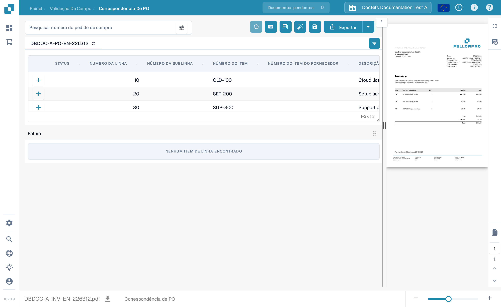
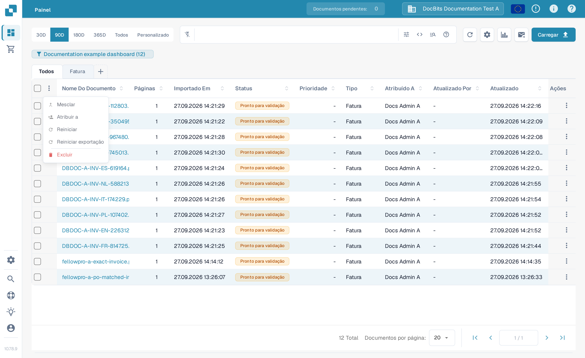

# Tela de Correspondência de Ordem de Compra

Use a **Correspondência de PO** para comparar as linhas da ordem de compra carregadas para um documento com as linhas da fatura extraídas dele. Os dados da ordem de compra podem vir de uma integração com ERP ou de outra importação configurada. A tela mostra o documento ao lado das duas tabelas para que você confira números, quantidades, preços e diferenças antes de salvar ou exportar.


O exemplo abaixo usa uma fatura e uma ordem de compra sintéticas da FellowPro na organização de testes **DocBits Documentation Test A**. A tabela da fatura mostra atualmente **NENHUM ITEM DE LINHA ENCONTRADO**. Isso demonstra a navegação e a pesquisa, mas não demonstra uma correspondência bem-sucedida de linhas. Não exporte este exemplo como uma fatura correspondida.


<figure><figcaption>
A ordem de compra está carregada; a fatura de exemplo não tem linhas extraídas para conectar.
</figcaption></figure>

## Encontrar e inspecionar uma ordem de compra

1. Abra uma fatura na **Correspondência de PO**. Se a sua organização tiver várias ordens de compra, digite um número em **Pesquisar número do pedido de compra**.
2. Selecione o ícone de filtro ao lado da caixa de pesquisa para **Palavra-chave**, **Fornecedor**, **Status**, **Status do pedido**, datas, faixa de valor, ordenação e o número de registros exibidos. Selecione **Mais** para critérios adicionais. Selecione **Aplicar** para pesquisar ou **Claro** para redefinir os filtros.
3. Selecione um número de ordem de compra acima da tabela para inspecionar suas linhas. O ícone de atualização ao lado do número recarrega os dados dessa ordem. Uma recarga pode depender da integração configurada.
4. Compare cada linha da ordem de compra com a fatura e sua tabela extraída. O **+** em uma linha expande os detalhes de correspondência; ele próprio não conecta a linha à fatura. No exemplo, ele exibe **No multi-match Information** porque não existe essa correspondência.

<figure><figcaption>
Use o painel de filtros para reduzir as ordens de compra exibidas.
</figcaption></figure>

<figure><figcaption>
A linha expandida mostra os detalhes de correspondência quando disponíveis.
</figcaption></figure>

## Corresponder linhas e revisar o resultado

Quando as duas tabelas contiverem linhas, conecte uma linha da fatura à linha correspondente da ordem de compra arrastando-a, ou use as ações de correspondência no menu de contexto da linha. **Correspondência Automática** tenta conectar as linhas elegíveis usando as regras da sua organização. Verifique o resultado antes de salvar: um número de item correspondente sozinho não prova que quantidade, preço ou condições de entrega concordam. Veja [Ferramentas de Correspondência de Ordem de Compra](purchase-order-matching-tools.md) para a barra de ferramentas, os controles de colunas e as ações manuais, e [Atalhos de Teclado](keyboard-shortcuts.md) para as ações por teclado.

Se um documento não for correspondido, leia o motivo exibido acima da área da ordem de compra. Ele pode dizer que o número da PO está ausente, que a ordem não foi encontrada, que suas linhas não estão disponíveis ou que a fatura não tem linhas extraídas. Corrija o documento ou a configuração indicada por esse motivo. Um administrador pode inspecionar as [regras de correspondência](../../../administration-and-setup/settings/global-settings/document-types/more-settings/purchase-order/purchase-order-matching-rules.md) e a [extração de tabelas](../../../administration-and-setup/settings/document-processing/classification-and-extraction/README.md) quando nenhuma linha de fatura aparecer.

Mensagens comuns e próximos passos:

| O que você vê | O que verificar |
| --- | --- |
| Nenhum número de ordem de compra | Digite ou corrija o número da PO no documento e salve. |
| Nenhuma ordem de compra foi encontrada | Verifique o número e se a ordem foi importada para esta organização. |
| A ordem foi encontrada, mas não está conectada | Tente a **Correspondência Automática** ou conecte as linhas manualmente depois de conferir as duas tabelas. |
| Nenhuma linha da ordem corresponde | Compare os valores da fatura com os da ordem e verifique o histórico de correspondência. |
| Nenhum item de linha da fatura | Verifique a [extração de tabelas](../../../administration-and-setup/settings/document-processing/classification-and-extraction/README.md) antes de tentar corresponder. |
| Nenhuma linha de ordem aberta | Verifique os [status de linha consumida](../../../administration-and-setup/settings/global-settings/document-types/more-settings/purchase-order/consumed-po-line-status.md) e os status excluídos. |


Salvar pode acionar a correspondência novamente após um número de PO alterado ou recém-detectado. Verifique o resultado exibido após salvar. Se uma correspondência não puder ser salva, leia o erro exibido na tela e peça a um administrador para verificar a [transformação](../../../administration-and-setup/settings/global-settings/document-types/transformation-rules.md) e as [regras de correspondência](../../../administration-and-setup/settings/global-settings/document-types/more-settings/purchase-order/purchase-order-matching-rules.md).


Use o **Histórico de correspondência** (ícone de relógio, onde suas permissões permitirem) para inspecionar como uma correspondência anterior foi decidida. É uma visão somente leitura. Você pode revisar quais regras foram executadas e por que um candidato não correspondeu; abrir o histórico não exporta o documento.

### Mais de uma linha por correspondência

Uma única linha da fatura pode corresponder a várias linhas da ordem, ou o contrário, quando suas regras de correspondência permitirem. Abra os detalhes do **+** em uma linha para inspecionar qualquer correspondência múltipla existente. Verifique a quantidade e o preço combinados, não apenas uma linha. Um painel de detalhes vazio, como o exemplo sintético acima, significa que não há correspondência múltipla para inspecionar. Veja [Ferramentas de Correspondência de Ordem de Compra](purchase-order-matching-tools.md) para alterar conexões.

### Quantidades, diferenças e descontos

Dependendo da configuração, a correspondência pode comparar a quantidade de entrega pedida, recebida ou restante, além do preço unitário, número do item e outros campos mapeados. Uma diferença pode ser aceita se o tipo de documento tiver uma tolerância configurada. Verifique a divergência exibida antes de aceitá-la. As [configurações de tolerância](../../../administration-and-setup/settings/global-settings/document-types/more-settings/purchase-order/purchase-order-tolerance-settings-additional-purchase-order-tolerance.md) e o [guia de descontos](discounts.md) explicam esses casos.

A área de totais, quando disponível, ajuda a conciliar o valor líquido da fatura com as linhas correspondidas e os encargos. Se permanecer um **Valor não liquidado**, inspecione os valores individuais das linhas e qualquer [elemento de custo](../../../administration-and-setup/settings/document-processing/classification-and-extraction/table-extraction-for-costing-element.md) antes de exportar.

## Conferir os totais e salvar

Revise a pré-visualização da fatura à direita e compare os totais das linhas e quaisquer encargos. Para uma explicação completa das ações na barra de ferramentas superior, veja [Ferramentas de Correspondência de Ordem de Compra](purchase-order-matching-tools.md). Selecione **Salvar** após alterar correspondências. Selecione **Exportar** somente depois de conferir o documento e o resultado da correspondência; a seta ao lado de Exportar mostra opções de exportação adicionais configuradas. Sua organização pode ter ações de exportação diferentes.

A barra de ferramentas da pré-visualização permite navegar entre as páginas do documento, aplicar zoom, baixar o original e abrir uma visão ampliada. Use-a para verificar se o número da ordem de compra e os valores das linhas realmente aparecem na fatura. Se você sair com alterações de correspondência não salvas, elas poderão ser perdidas.

As comparações disponíveis e os valores de tolerância dependem das configurações do seu tipo de documento. Leia [Regras de Correspondência de PO](../../../administration-and-setup/settings/global-settings/document-types/more-settings/purchase-order/purchase-order-matching-rules.md), [Configurações de Tolerância](../../../administration-and-setup/settings/global-settings/document-types/more-settings/purchase-order/purchase-order-tolerance-settings-additional-purchase-order-tolerance.md), [Status Desativados](../../../administration-and-setup/settings/global-settings/document-types/more-settings/purchase-order/purchase-order-disable-statuses.md) e [Status de Linha de PO Consumida](../../../administration-and-setup/settings/global-settings/document-types/more-settings/purchase-order/consumed-po-line-status.md) para as configurações de administrador. Para linhas de muitos para um, veja [Descontos](discounts.md) e as [Ferramentas de Correspondência](purchase-order-matching-tools.md).
