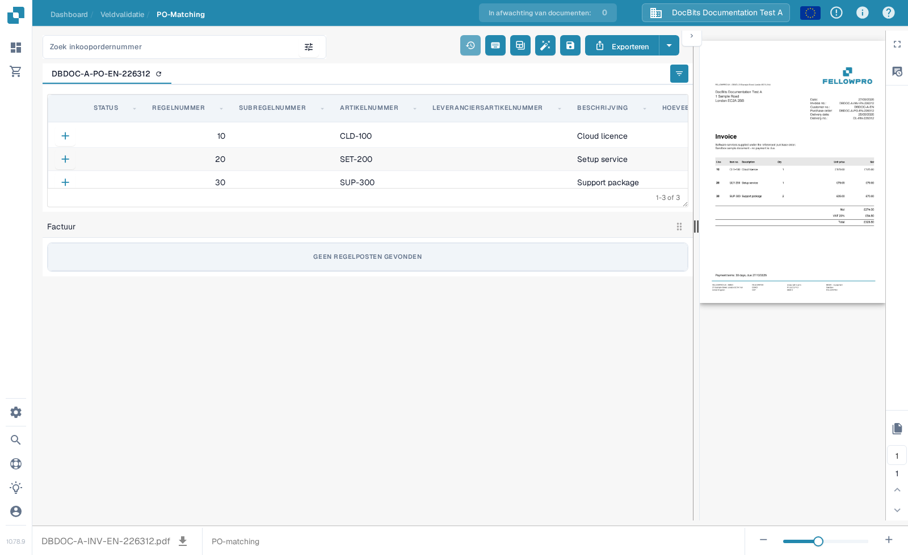
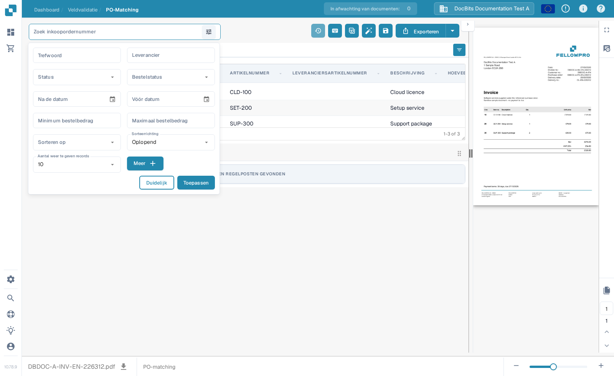
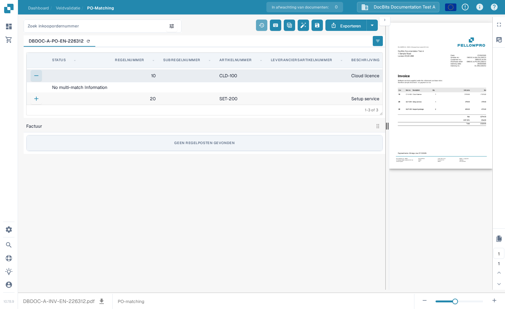

# Scherm voor het matchen van inkooporders

Gebruik **PO-matching** om de inkooporderregels die voor een document zijn geladen te vergelijken met de geëxtraheerde factuurregels. De inkoopordergegevens kunnen afkomstig zijn uit een ERP-integratie of een andere geconfigureerde import. Het scherm toont het document naast de twee tabellen, zodat u aantallen, hoeveelheden, prijzen en verschillen kunt controleren voordat u opslaat of exporteert.


Het voorbeeld hieronder gebruikt een synthetische FellowPro-factuur en -inkooporder in **DocBits Documentation Test A**. De factuurtabel geeft momenteel **GEEN REGELPOSTEN GEVONDEN** weer. Dit demonstreert navigatie en zoeken, maar kan geen geslaagde regelmatch demonstreren. Exporteer dit voorbeeld niet als een gematchte factuur.


<figure><figcaption>
De inkooporder is geladen; de voorbeeldfactuur heeft geen geëxtraheerde regels om mee te verbinden.
</figcaption></figure>

## Een inkooporder zoeken en inspecteren

1. Open een factuur in **PO-matching**. Als uw organisatie meerdere inkooporders heeft, voert u een nummer in bij **Zoek inkoopordernummer**.
2. Selecteer het filterpictogram naast het zoekveld voor **Trefwoord**, **Leverancier**, **Status**, **Bestelstatus**, datums, bedragbereik, sortering en het aantal weer te geven records. Selecteer **Meer** voor aanvullende criteria. Selecteer **Toepassen** om te zoeken of **Duidelijk** om de filters te resetten.
3. Selecteer een inkoopordernummer boven de tabel om de regels te inspecteren. Het ververspictogram naast het nummer herlaadt de gegevens van die order. Een herlading kan afhangen van de geconfigureerde integratie.
4. Vergelijk elke inkooporderregel met de factuur en de geëxtraheerde tabel. De **+** op een regel opent de matchgegevens; hierdoor wordt de regel zelf nog niet met de factuur verbonden. In het voorbeeld verschijnt **No multi-match Information** omdat een dergelijke match niet bestaat.

<figure><figcaption>
Gebruik het filterpaneel om de getoonde inkooporders te beperken.
</figcaption></figure>

<figure><figcaption>
De uitgeklapte regel toont matchgegevens wanneer die beschikbaar zijn.
</figcaption></figure>

## Regels matchen en het resultaat controleren

Wanneer beide tabellen regels bevatten, verbindt u een factuurregel met de bijbehorende inkooporderregel door deze te slepen, of gebruikt u de matchacties in het contextmenu van de regel. **Auto Match** probeert geschikte regels te verbinden met de regels van uw organisatie. Controleer het resultaat voordat u opslaat: een gelijk artikelnummer alleen bewijst niet dat hoeveelheid, prijs of leveringsvoorwaarden overeenkomen. Zie [Hulpmiddelen voor PO-matching](purchase-order-matching-tools.md) voor de werkbalk, kolombediening en handmatige acties, en [Sneltoetsen](keyboard-shortcuts.md) voor toetsenbordacties.

Als een document niet is gematcht, leest u de reden boven het inkoopordervak. Er kan staan dat het PO-nummer ontbreekt, de order niet is gevonden, de regels niet beschikbaar zijn of de factuur geen geëxtraheerde regels heeft. Corrigeer het document of de configuratie die bij die reden hoort. Een beheerder kan de [matchregels](../../../administration-and-setup/settings/global-settings/document-types/more-settings/purchase-order/purchase-order-matching-rules.md) en de [tabelextractie](../../../administration-and-setup/settings/document-processing/classification-and-extraction/README.md) inspecteren wanneer er geen factuurregels verschijnen.

Veelvoorkomende meldingen en vervolgstappen:

| Wat u ziet | Wat u controleert |
| --- | --- |
| Geen inkoopordernummer | Voer het PO-nummer in op het document of corrigeer het, en sla op. |
| Er is geen inkooporder gevonden | Controleer het nummer en of de order in deze organisatie is geïmporteerd. |
| De order is gevonden maar niet verbonden | Probeer **Auto Match**, of verbind de regels handmatig nadat u beide tabellen hebt gecontroleerd. |
| Geen enkele orderregel komt overeen | Vergelijk de factuurwaarden met de order en open de matchgeschiedenis. |
| Geen factuurregelposten | Controleer de [tabelextractie](../../../administration-and-setup/settings/document-processing/classification-and-extraction/README.md) voordat u probeert te matchen. |
| Geen openstaande orderregels | Controleer de [statussen van geconsumeerde regels](../../../administration-and-setup/settings/global-settings/document-types/more-settings/purchase-order/consumed-po-line-status.md) en de uitgesloten statussen. |


Opslaan kan het matchen opnieuw starten na een gewijzigd of nieuw gedetecteerd PO-nummer. Controleer het getoonde resultaat na het opslaan. Als een match niet kan worden opgeslagen, leest u de foutmelding op het scherm en vraagt u een beheerder de [transformatieregel](../../../administration-and-setup/settings/global-settings/document-types/transformation-rules.md) en de [matchregels](../../../administration-and-setup/settings/global-settings/document-types/more-settings/purchase-order/purchase-order-matching-rules.md) te controleren.


Gebruik **Matchgeschiedenis** (klokpictogram, voor zover uw rechten dat toestaan) om te inspecteren hoe een eerdere match is bepaald. Dit is een alleen-lezen weergave. U kunt bekijken welke regels zijn uitgevoerd en waarom een kandidaat niet matchte; het openen van de geschiedenis exporteert het document niet.

### Meerdere regels per match

Eén factuurregel kan aan meerdere orderregels corresponderen, of omgekeerd, wanneer uw matchregels dat toestaan. Open de **+**-details op een regel om een bestaande multi-match te inspecteren. Controleer de gecombineerde hoeveelheid en prijs, niet slechts één regel. Een leeg detailpaneel zoals het synthetische voorbeeld hierboven betekent dat er geen multi-match te inspecteren is. Zie [Hulpmiddelen voor PO-matching](purchase-order-matching-tools.md) voor het wijzigen van verbindingen.

### Hoeveelheden, verschillen en kortingen

Afhankelijk van de configuratie kan het matchen de bestelde, ontvangen of resterende leveringshoeveelheid vergelijken, naast de eenheidsprijs, het artikelnummer en andere in kaart gebrachte velden. Een verschil kan worden geaccepteerd als het documenttype een geconfigureerde tolerantie heeft. Controleer het getoonde verschil voordat u het accepteert. De [tolerantie-instellingen](../../../administration-and-setup/settings/global-settings/document-types/more-settings/purchase-order/purchase-order-tolerance-settings-additional-purchase-order-tolerance.md) en de [kortinghandleiding](discounts.md) leggen deze gevallen uit.

Het totaalengebied helpt, wanneer beschikbaar, het nettobedrag van de factuur te verhouden tot de gematchte regels en kosten. Als er een **Onvereffend bedrag** overblijft, inspecteert u de individuele regelwaarden en elk [kostenelement](../../../administration-and-setup/settings/document-processing/classification-and-extraction/table-extraction-for-costing-element.md) vóór de export.

## Totalen controleren en opslaan

Bekijk het factuurvoorbeeld rechts en vergelijk de regeltotalen en eventuele kosten. Voor een volledige uitleg van de acties in de bovenste werkbalk, zie [Hulpmiddelen voor PO-matching](purchase-order-matching-tools.md). Selecteer **Opslaan** nadat u matches hebt gewijzigd. Selecteer **Exporteren** pas nadat u het document en het matchresultaat hebt gecontroleerd; de pijl naast Exporteren toont aanvullende geconfigureerde exportopties. Uw organisatie kan andere exportacties hebben.

De werkbalk van het voorbeeld laat u door de documentpagina's bladeren, zoomen, het origineel downloaden en een grotere weergave openen. Gebruik het om te controleren of het inkoopordernummer en de regelwaarden echt op de factuur staan. Als u het scherm verlaat met niet-opgeslagen matchwijzigingen, kunnen ze verloren gaan.

De beschikbare vergelijkingen en tolerantiewaarden hangen af van de instellingen van uw documenttype. Lees [PO-matchregels](../../../administration-and-setup/settings/global-settings/document-types/more-settings/purchase-order/purchase-order-matching-rules.md), [Tolerantie-instellingen](../../../administration-and-setup/settings/global-settings/document-types/more-settings/purchase-order/purchase-order-tolerance-settings-additional-purchase-order-tolerance.md), [Uitgeschakelde statussen](../../../administration-and-setup/settings/global-settings/document-types/more-settings/purchase-order/purchase-order-disable-statuses.md) en [Status van geconsumeerde PO-regel](../../../administration-and-setup/settings/global-settings/document-types/more-settings/purchase-order/consumed-po-line-status.md) voor de beheerdersinstellingen. Voor veel-aan-één-regels, zie [Kortingen](discounts.md) en de [Matchhulpmiddelen](purchase-order-matching-tools.md).
