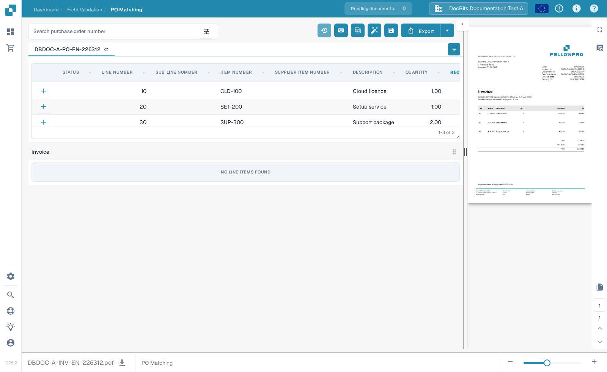
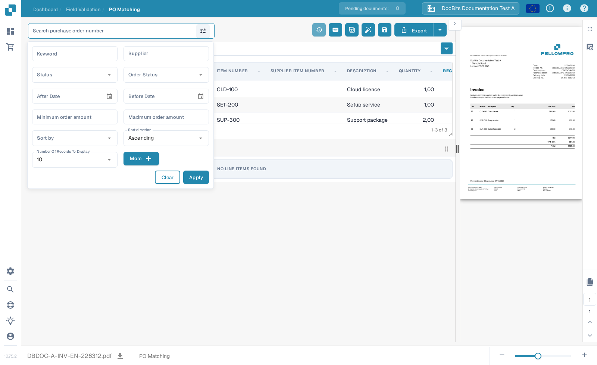
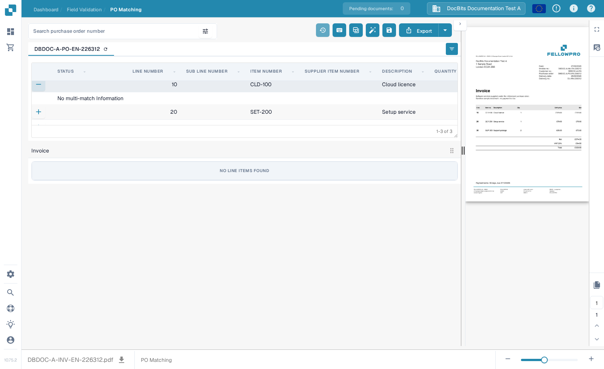

# Purchase Order Matching Screen

Use **PO Matching** to compare the purchase order lines loaded for a document with its extracted invoice lines. The purchase order data may come from an ERP integration or another configured import. The screen shows the document alongside the two tables so you can check numbers, quantities, prices, and differences before saving or exporting.


The example below uses a synthetic FellowPro invoice and purchase order in **DocBits Documentation Test A**. Its invoice table currently says **No line items found**. This demonstrates navigation and search, but it cannot demonstrate a successful line match. Do not export this example as a matched invoice.


<figure><figcaption>
The purchase order is loaded; the example invoice has no extracted lines to connect.
</figcaption></figure>

## Find and inspect a purchase order

1. Open an invoice in **PO Matching**. If your organization has several purchase orders, enter a number in **Search purchase order number**.
2. Select the filter icon beside the search box for **Keyword**, **Supplier**, **Status**, **Order Status**, dates, amount range, sorting, and the number of records shown. Select **More** for additional criteria. Select **Apply** to search or **Clear** to reset the filters.
3. Select a purchase order number above the table to inspect its lines. The refresh icon beside the number reloads that order's data. A reload may depend on the configured integration.
4. Compare each purchase order line with the invoice and its extracted table. The **+** on a line expands matching details; it does not itself connect the line to the invoice. In the example it displays **No multi-match Information** because no such match exists.

<figure><figcaption>
Use the filter panel to narrow the purchase orders shown.
</figcaption></figure>

<figure><figcaption>
The expanded line shows matching details when available.
</figcaption></figure>

## Match lines and review the result

When both tables contain lines, connect an invoice line to the corresponding purchase order line by dragging it, or use the line context menu's matching actions. **Auto Match** attempts to connect eligible lines using your organization's rules. Check the result before saving: a matching item number alone does not prove that quantity, price, or delivery terms agree. See [Purchase Order Matching Tools](purchase-order-matching-tools.md) for the toolbar, column controls, and manual actions, and [Keyboard Shortcuts](keyboard-shortcuts.md) for keyboard actions.

If a document is not matched, read the reason shown above the purchase order area. It may say that the PO number is missing, the order was not found, its lines are unavailable, or the invoice has no extracted lines. Correct the document or configuration indicated by that reason. An administrator can inspect [matching rules](../../../administration-and-setup/settings/global-settings/document-types/more-settings/purchase-order/purchase-order-matching-rules.md) and [table extraction](../../../administration-and-setup/settings/document-processing/classification-and-extraction/README.md) when no invoice lines appear.

Common messages and next steps:

| What you see | What to check |
| --- | --- |
| No purchase order number | Enter or correct the PO number on the document, then save. |
| No purchase order was found | Check the number and whether the order was imported into this organization. |
| The order was found but is not connected | Try **Auto Match**, or connect the lines manually after checking both tables. |
| No order lines match | Compare the invoice values with the order and check the matching history. |
| No invoice line items | Check [table extraction](../../../administration-and-setup/settings/document-processing/classification-and-extraction/README.md) before trying to match. |
| No open order lines | Check the [consumed-line statuses](../../../administration-and-setup/settings/global-settings/document-types/more-settings/purchase-order/consumed-po-line-status.md) and excluded statuses. |


Saving can trigger matching again after a changed or newly detected PO number. Check the displayed result after saving. If a match cannot be saved, read the error shown on the screen and ask an administrator to check the [transformation](../../../administration-and-setup/settings/global-settings/document-types/transformation-rules.md) and [matching rules](../../../administration-and-setup/settings/global-settings/document-types/more-settings/purchase-order/purchase-order-matching-rules.md).


Use **Matching history** (clock icon, where your permissions allow it) to inspect how a previous match was decided. It is a read-only view. You can review which rules ran and why a candidate did not match; opening history does not export the document.

### More than one line per match

A single invoice line may correspond to several order lines, or the other way around, where your matching rules allow it. Open the **+** details on a line to inspect any existing multi-match. Check the combined quantity and price, not just one line. An empty detail panel like the synthetic example above means there is no multi-match to inspect. See [Purchase Order Matching Tools](purchase-order-matching-tools.md) for changing connections.

### Quantities, differences, and discounts

Depending on configuration, matching can compare ordered, received, or remaining delivery quantity, as well as unit price, item number, and other mapped fields. A difference may be accepted if the document type has a configured tolerance. Check the displayed mismatch before accepting it. The [tolerance settings](../../../administration-and-setup/settings/global-settings/document-types/more-settings/purchase-order/purchase-order-tolerance-settings-additional-purchase-order-tolerance.md) and [discount guidance](discounts.md) explain these cases.

The totals area, when available, helps reconcile the net amount from the invoice with matched lines and charges. If **Unsettled amount** remains, inspect the individual line values and any [costing element](../../../administration-and-setup/settings/document-processing/classification-and-extraction/table-extraction-for-costing-element.md) before export.

## Check totals and save

Review the invoice preview on the right and compare the line totals and any charges. For a full explanation of the actions in the top toolbar, see [Purchase Order Matching Tools](purchase-order-matching-tools.md). Select **Save** after changing matches. Select **Export** only after you have checked the document and the matching result; the arrow beside Export shows additional configured export choices. Your organization may have different export actions.

The preview toolbar lets you move between document pages, zoom, download the original, and open a larger view. Use it to verify that the purchase order number and line values really appear on the invoice. If you leave with unsaved matching changes, they may be lost.

The available comparisons and tolerance values depend on your document-type settings. Read [PO Matching Rules](../../../administration-and-setup/settings/global-settings/document-types/more-settings/purchase-order/purchase-order-matching-rules.md), [Tolerance Settings](../../../administration-and-setup/settings/global-settings/document-types/more-settings/purchase-order/purchase-order-tolerance-settings-additional-purchase-order-tolerance.md), [Disabled Statuses](../../../administration-and-setup/settings/global-settings/document-types/more-settings/purchase-order/purchase-order-disable-statuses.md), and [Consumed PO Line Status](../../../administration-and-setup/settings/global-settings/document-types/more-settings/purchase-order/consumed-po-line-status.md) for administrator settings. For many-to-one lines, see [Discounts](discounts.md) and the [Matching Tools](purchase-order-matching-tools.md).
