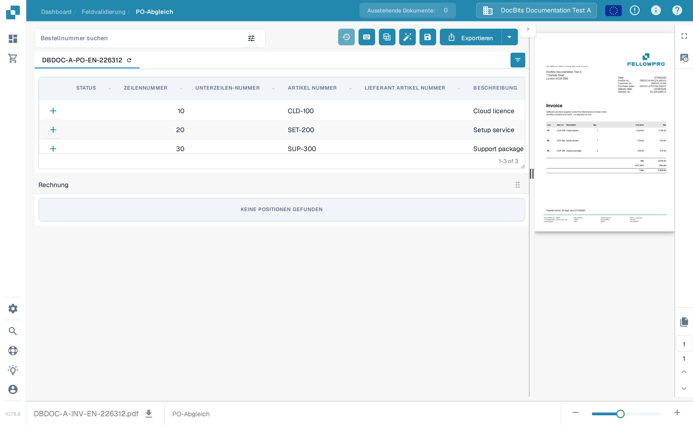
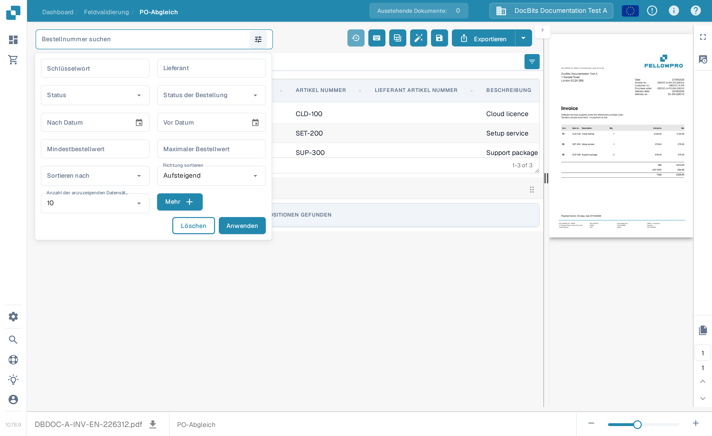
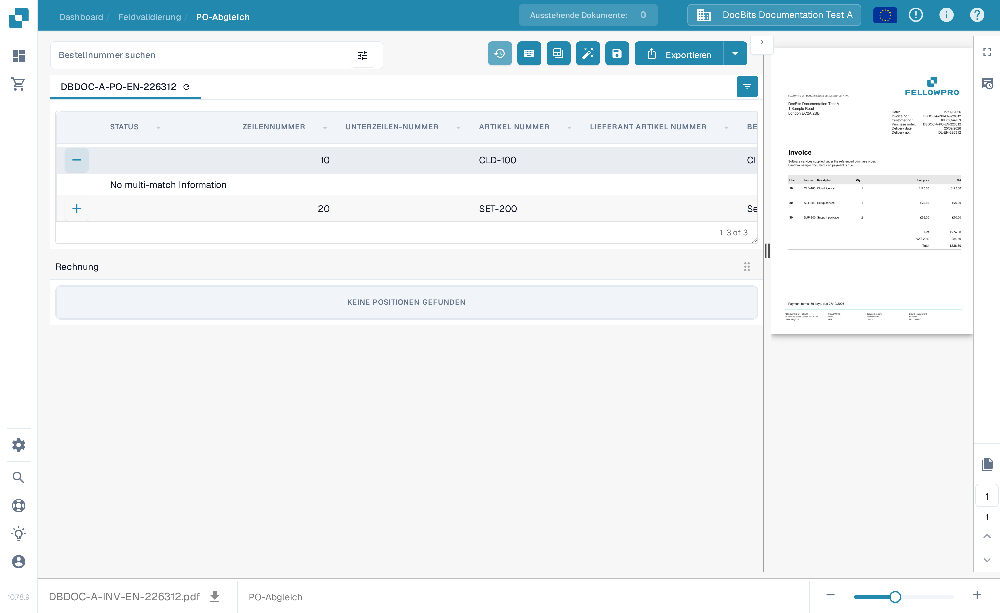

# Bildschirm „Purchase Order Matching“

Mit **PO-Abgleich** vergleichen Sie die für ein Dokument hinterlegten Bestellpositionen mit den extrahierten Rechnungspositionen. Die Bestelldaten können aus einer ERP-Integration oder einem anderen konfigurierten Import stammen. Der Bildschirm zeigt das Dokument neben den beiden Tabellen an, damit Sie Nummern, Mengen, Preise und Abweichungen prüfen können, bevor Sie speichern oder exportieren.


Das Beispiel unten nutzt eine synthetische FellowPro-Rechnung und -Bestellung in **DocBits Documentation Test A**. Die Rechnungstabelle zeigt derzeit **Keine Positionen gefunden**. Das demonstriert die Navigation und Suche, kann aber keinen erfolgreichen Positionsabgleich zeigen. Exportieren Sie dieses Beispiel nicht als abgeglichene Rechnung.


<figure><figcaption>
Die Bestellung ist geladen; die Beispielrechnung hat keine extrahierten Positionen, die verbunden werden könnten.
</figcaption></figure>

## Bestellung finden und prüfen

1. Öffnen Sie eine Rechnung im **PO-Abgleich**. Wenn Ihre Organisation mehrere Bestellungen hat, geben Sie eine Nummer in **Bestellnummer suchen** ein.
2. Wählen Sie das Filtersymbol neben dem Suchfeld für **Schlüsselwort**, **Lieferant**, **Status**, **Status der Bestellung**, Daten, Betragsbereich, Sortierung und die Anzahl der angezeigten Datensätze. Wählen Sie **Mehr** für zusätzliche Kriterien. Wählen Sie **Anwenden**, um zu suchen, oder **Löschen**, um die Filter zurückzusetzen.
3. Wählen Sie eine Bestellnummer oberhalb der Tabelle aus, um deren Positionen zu prüfen. Das Aktualisierungssymbol neben der Nummer lädt die Daten dieser Bestellung neu. Ein Neuladen kann von der konfigurierten Integration abhängen.
4. Vergleichen Sie jede Bestellposition mit der Rechnung und ihrer extrahierten Tabelle. Das **+** auf einer Position klappt Abgleich-Details auf; es verbindet die Position nicht selbst mit der Rechnung. Im Beispiel erscheint **No multi-match Information**, weil keine solche Übereinstimmung existiert.

<figure><figcaption>
Nutzen Sie das Filterpanel, um die angezeigten Bestellungen einzugrenzen.
</figcaption></figure>

<figure><figcaption>
Die aufgeklappte Position zeigt Abgleich-Details, wenn solche vorhanden sind.
</figcaption></figure>

## Positionen abgleichen und das Ergebnis prüfen

Wenn beide Tabellen Positionen enthalten, verbinden Sie eine Rechnungsposition per Drag & Drop mit der passenden Bestellposition oder nutzen Sie die Abgleich-Aktionen im Kontextmenü der Position. **Auto Match** versucht, geeignete Positionen nach den Regeln Ihrer Organisation zu verbinden. Prüfen Sie das Ergebnis vor dem Speichern: Eine gleiche Artikelnummer allein belegt nicht, dass Menge, Preis oder Lieferbedingungen übereinstimmen. Siehe [Bestellnummer-Abgleich-Tools](purchase-order-matching-tools.md) für die Symbolleiste, Spaltensteuerung und manuelle Aktionen sowie [Tastenkombinationen](keyboard-shortcuts.md) für Tastaturaktionen.

Wenn ein Dokument nicht abgeglichen wird, lesen Sie den Grund oberhalb des Bestellbereichs. Er kann melden, dass die Bestellnummer fehlt, die Bestellung nicht gefunden wurde, ihre Positionen nicht verfügbar sind oder die Rechnung keine extrahierten Positionen hat. Korrigieren Sie das Dokument oder die Konfiguration, die dieser Grund angibt. Administratoren können die [Abgleichregeln](../../../administration-and-setup/settings/global-settings/document-types/more-settings/purchase-order/purchase-order-matching-rules.md) und die [Tabellenerkennung](../../../administration-and-setup/settings/document-processing/classification-and-extraction/README.md) prüfen, wenn keine Rechnungspositionen erscheinen.

Häufige Meldungen und nächste Schritte:

| Was Sie sehen | Was Sie prüfen sollten |
| --- | --- |
| Keine Bestellnummer | Geben Sie die Bestellnummer im Dokument ein oder korrigieren Sie sie, und speichern Sie. |
| Keine Bestellung gefunden | Prüfen Sie die Nummer und ob die Bestellung in diese Organisation importiert wurde. |
| Die Bestellung wurde gefunden, aber nicht verbunden | Versuchen Sie **Auto Match**, oder verbinden Sie die Positionen manuell, nachdem Sie beide Tabellen geprüft haben. |
| Keine Bestellposition passt | Vergleichen Sie die Rechnungswerte mit der Bestellung und prüfen Sie die Abgleich-Historie. |
| Keine Rechnungspositionen | Prüfen Sie die [Tabellenerkennung](../../../administration-and-setup/settings/document-processing/classification-and-extraction/README.md), bevor Sie abzugleichen versuchen. |
| Keine offenen Bestellpositionen | Prüfen Sie die [Status verbrauchter Bestellpositionen](../../../administration-and-setup/settings/global-settings/document-types/more-settings/purchase-order/consumed-po-line-status.md) und die ausgeschlossenen Status. |


Speichern kann den Abgleich nach einer geänderten oder neu erkannten Bestellnummer erneut auslösen. Prüfen Sie das angezeigte Ergebnis nach dem Speichern. Wenn ein Abgleich nicht gespeichert werden kann, lesen Sie den angezeigten Fehler auf dem Bildschirm und bitten Sie einen Administrator, die [Transformation](../../../administration-and-setup/settings/global-settings/document-types/transformation-rules.md) und die [Abgleichregeln](../../../administration-and-setup/settings/global-settings/document-types/more-settings/purchase-order/purchase-order-matching-rules.md) zu prüfen.


Nutzen Sie die **Abgleich-Historie** (Uhr-Symbol, soweit Ihre Berechtigungen es erlauben), um nachzuvollziehen, wie ein früherer Abgleich entschieden wurde. Sie ist eine schreibgeschützte Ansicht. Sie können prüfen, welche Regeln liefen und warum ein Kandidat nicht passte; das Öffnen der Historie exportiert das Dokument nicht.

### Mehr als eine Position pro Abgleich

Eine einzelne Rechnungsposition kann mehreren Bestellpositionen entsprechen – oder umgekehrt –, soweit Ihre Abgleichregeln das erlauben. Öffnen Sie die **+**-Details einer Position, um einen vorhandenen Multi-Match zu prüfen. Prüfen Sie die kombinierte Menge und den kombinierten Preis, nicht nur eine einzelne Position. Ein leeres Detailpanel wie im obigen synthetischen Beispiel bedeutet, dass kein Multi-Match zu prüfen ist. Siehe [Bestellnummer-Abgleich-Tools](purchase-order-matching-tools.md) zum Ändern von Verbindungen.

### Mengen, Abweichungen und Rabatte

Abhängig von der Konfiguration kann der Abgleich bestellte, empfangene oder verbleibende Liefermengen sowie Einzelpreis, Artikelnummer und andere zugeordnete Felder vergleichen. Eine Abweichung kann akzeptiert werden, wenn der Dokumenttyp eine konfigurierte Toleranz hat. Prüfen Sie die angezeigte Abweichung, bevor Sie sie akzeptieren. Die [Toleranzeinstellungen](../../../administration-and-setup/settings/global-settings/document-types/more-settings/purchase-order/purchase-order-tolerance-settings-additional-purchase-order-tolerance.md) und die [Rabatt-Hinweise](discounts.md) erläutern diese Fälle.

Der Summenbereich hilft, soweit verfügbar, den Nettobetrag der Rechnung mit abgeglichenen Positionen und Gebühren abzustimmen. Wenn ein **Offener Betrag** bleibt, prüfen Sie die einzelnen Positionswerte und etwaige [Kostenelemente](../../../administration-and-setup/settings/document-processing/classification-and-extraction/table-extraction-for-costing-element.md) vor dem Export.

## Summen prüfen und speichern

Prüfen Sie die Rechnungs-Vorschau rechts und vergleichen Sie die Positionssummen und etwaige Gebühren. Eine vollständige Erklärung der Aktionen in der oberen Symbolleiste finden Sie in den [Bestellnummer-Abgleich-Tools](purchase-order-matching-tools.md). Wählen Sie **Speichern** nach dem Ändern von Abgleichen. Wählen Sie **Exportieren** erst, nachdem Sie das Dokument und das Abgleichergebnis geprüft haben; der Pfeil neben „Exportieren“ zeigt zusätzliche konfigurierte Exportoptionen. Ihre Organisation kann andere Exportaktionen haben.

Die Symbolleiste der Vorschau erlaubt es, durch Dokumentseiten zu blättern, zu zoomen, das Original herunterzuladen und eine größere Ansicht zu öffnen. Nutzen Sie sie, um zu prüfen, dass Bestellnummer und Positionswerte wirklich auf der Rechnung erscheinen. Wenn Sie mit ungespeicherten Abgleich-Änderungen die Seite verlassen, können diese verloren gehen.

Die verfügbaren Vergleiche und Toleranzwerte hängen von Ihren Dokumenttyp-Einstellungen ab. Lesen Sie [Regeln für die Übereinstimmung von Bestellungen](../../../administration-and-setup/settings/global-settings/document-types/more-settings/purchase-order/purchase-order-matching-rules.md), [Einstellungen zur Toleranz von Bestellungen](../../../administration-and-setup/settings/global-settings/document-types/more-settings/purchase-order/purchase-order-tolerance-settings-additional-purchase-order-tolerance.md), [PO-Deaktivierungsstatus](../../../administration-and-setup/settings/global-settings/document-types/more-settings/purchase-order/purchase-order-disable-statuses.md) und [Verbrauchter PO-Zeilenstatus](../../../administration-and-setup/settings/global-settings/document-types/more-settings/purchase-order/consumed-po-line-status.md) für Administratoreneinstellungen. Für Viele-zu-eins-Positionen siehe [Rabatte](discounts.md) und die [Abgleich-Tools](purchase-order-matching-tools.md).
