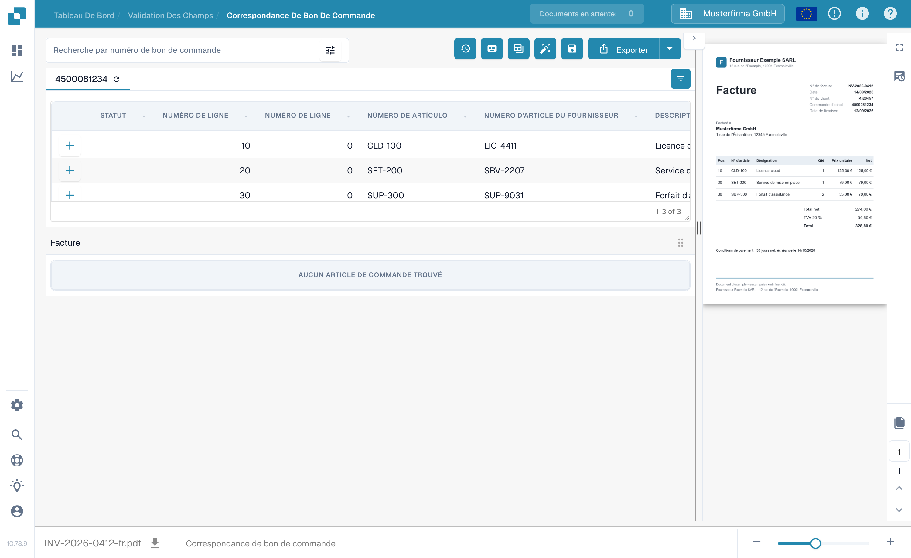
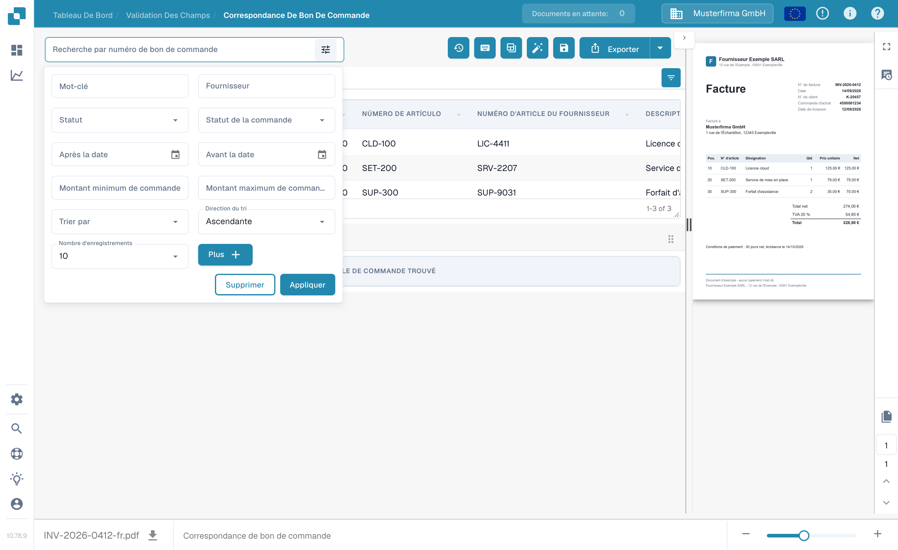
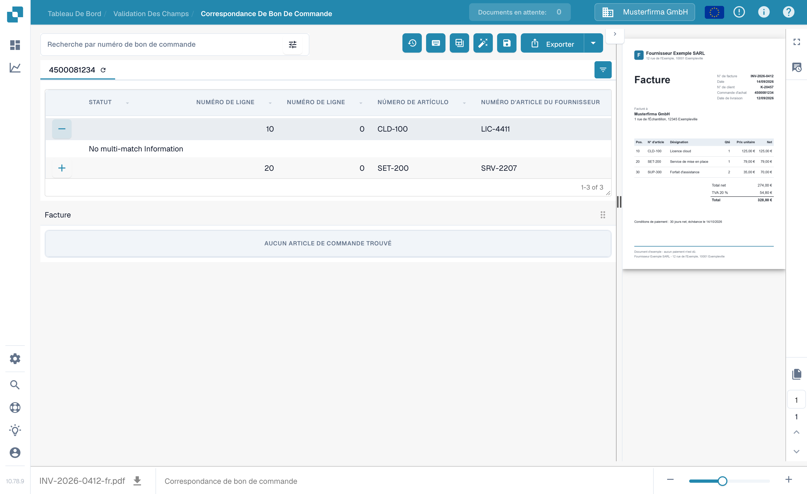

# Écran de Correspondance des Bons de Commande

Utilisez la **Correspondance des Bons de Commande** pour comparer les lignes du bon de commande chargées pour un document avec les lignes de facture extraites. Les données du bon de commande peuvent provenir d'une intégration ERP ou d'un autre import configuré. L'écran affiche le document à côté des deux tableaux afin que vous puissiez vérifier les montants, les quantités, les prix et les écarts avant d'enregistrer ou d'exporter.


L'exemple ci-dessous utilise une facture et un bon de commande synthétiques FellowPro dans l'organisation **DocBits Documentation Test A**. Son tableau de facture indique actuellement **AUCUN ARTICLE DE COMMANDE TROUVÉ**. Cela permet de montrer la navigation et la recherche, mais pas une correspondance de lignes réussie. N'exportez pas cet exemple comme une facture appariée.


<figure><figcaption>
Le bon de commande est chargé ; la facture d'exemple n'a aucune ligne extraite à connecter.
</figcaption></figure>

## Rechercher et inspecter un bon de commande

1. Ouvrez une facture dans la **Correspondance des Bons de Commande**. Si votre organisation comporte plusieurs bons de commande, saisissez un numéro dans **Recherche par numéro de bon de commande**.
2. Sélectionnez l'icône de filtre à côté de la zone de recherche pour définir **Mot-clé**, **Fournisseur**, **Statut**, **Statut de la commande**, les dates, la plage de montants, le tri et le nombre d'enregistrements affichés. Sélectionnez **Plus** pour des critères supplémentaires. Sélectionnez **Appliquer** pour lancer la recherche ou **Supprimer** pour réinitialiser les filtres.
3. Sélectionnez un numéro de bon de commande au-dessus du tableau pour inspecter ses lignes. L'icône de rafraîchissement à côté du numéro recharge les données de ce bon de commande. Ce rechargement peut dépendre de l'intégration configurée.
4. Comparez chaque ligne du bon de commande avec la facture et son tableau extrait. Le **+** sur une ligne développe les détails de correspondance ; il ne connecte pas lui-même la ligne à la facture. Dans l'exemple, il affiche **No multi-match Information** car aucune correspondance multiple n'existe.

<figure><figcaption>
Utilisez le panneau de filtres pour restreindre les bons de commande affichés.
</figcaption></figure>

<figure><figcaption>
La ligne dépliée affiche les détails de correspondance lorsqu'ils existent.
</figcaption></figure>

## Apparier les lignes et vérifier le résultat

Lorsque les deux tableaux contiennent des lignes, connectez une ligne de facture à la ligne de bon de commande correspondante en la faisant glisser, ou utilisez les actions de correspondance du menu contextuel de la ligne. **Appariement automatique** tente de connecter les lignes éligibles selon les règles de votre organisation. Vérifiez le résultat avant d'enregistrer : un numéro d'article identique à lui seul ne prouve pas que la quantité, le prix ou les conditions de livraison concordent. Consultez [Outils de Correspondance des Bons de Commande](purchase-order-matching-tools.md) pour la barre d'outils, les contrôles de colonnes et les actions manuelles, et [Raccourcis clavier](keyboard-shortcuts.md) pour les actions au clavier.

Si un document n'est pas apparié, lisez le motif affiché au-dessus de la zone du bon de commande. Il peut indiquer que le numéro de bon de commande est absent, que le bon de commande est introuvable, que ses lignes ne sont pas disponibles, ou que la facture n'a aucune ligne extraite. Corrigez le document ou la configuration indiqués par ce motif. Un administrateur peut inspecter les [règles d'appariement](../../../administration-and-setup/settings/global-settings/document-types/more-settings/purchase-order/purchase-order-matching-rules.md) et l'[extraction de tableaux](../../../administration-and-setup/settings/document-processing/classification-and-extraction/README.md) lorsque aucune ligne de facture n'apparaît.

Messages courants et étapes suivantes :

| Ce que vous voyez | Ce qu'il faut vérifier |
| --- | --- |
| Aucun numéro de bon de commande | Saisissez ou corrigez le numéro de bon de commande sur le document, puis enregistrez. |
| Aucun bon de commande trouvé | Vérifiez le numéro et contrôlez si le bon de commande a été importé dans cette organisation. |
| Le bon de commande est trouvé mais non connecté | Essayez l'**Appariement automatique**, ou connectez les lignes manuellement après avoir vérifié les deux tableaux. |
| Aucune ligne du bon de commande ne correspond | Comparez les valeurs de la facture avec le bon de commande et consultez l'historique d'appariement. |
| Aucun article de commande trouvé | Vérifiez l'[extraction de tableaux](../../../administration-and-setup/settings/document-processing/classification-and-extraction/README.md) avant toute tentative d'appariement. |
| Aucune ligne ouverte du bon de commande | Vérifiez les [statuts des lignes consommées](../../../administration-and-setup/settings/global-settings/document-types/more-settings/purchase-order/consumed-po-line-status.md) et les statuts exclus. |


L'enregistrement peut relancer l'appariement après un numéro de bon de commande modifié ou nouvellement détecté. Vérifiez le résultat affiché après l'enregistrement. Si un appariement ne peut pas être enregistré, lisez l'erreur affichée à l'écran et demandez à un administrateur de vérifier la [règle de transformation](../../../administration-and-setup/settings/global-settings/document-types/transformation-rules.md) et les [règles d'appariement](../../../administration-and-setup/settings/global-settings/document-types/more-settings/purchase-order/purchase-order-matching-rules.md).


Utilisez l'**Historique d'appariement** (icône horloge, selon vos permissions) pour inspecter la façon dont un appariement précédent a été décidé. C'est une vue en lecture seule. Vous pouvez consulter quelles règles ont été exécutées et pourquoi un candidat n'a pas été apparié ; ouvrir l'historique n'exporte pas le document.

### Plusieurs lignes pour une correspondance

Une seule ligne de facture peut correspondre à plusieurs lignes de bon de commande, ou l'inverse, lorsque vos règles d'appariement le permettent. Ouvrez les détails **+** d'une ligne pour inspecter une éventuelle correspondance multiple. Vérifiez la quantité et le prix combinés, pas seulement une ligne. Un panneau de détails vide comme dans l'exemple synthétique ci-dessus signifie qu'aucune correspondance multiple n'est à inspecter. Consultez [Outils de Correspondance des Bons de Commande](purchase-order-matching-tools.md) pour modifier les connexions.

### Quantités, écarts et remises

Selon la configuration, l'appariement peut comparer la quantité commandée, reçue ou restante, ainsi que le prix unitaire, le numéro d'article et d'autres champs mappés. Un écart peut être accepté si le type de document comporte une tolérance configurée. Vérifiez l'écart affiché avant de l'accepter. Les [paramètres de tolérance](../../../administration-and-setup/settings/global-settings/document-types/more-settings/purchase-order/purchase-order-tolerance-settings-additional-purchase-order-tolerance.md) et le [guide des remises](discounts.md) expliquent ces cas.

La zone des totaux, lorsqu'elle est disponible, aide à rapprocher le montant net de la facture des lignes appariées et des frais. Si un **Montant non réglé** subsiste, inspectez les valeurs individuelles des lignes et tout [élément de coût](../../../administration-and-setup/settings/document-processing/classification-and-extraction/table-extraction-for-costing-element.md) avant l'export.

## Vérifier les totaux et enregistrer

Contrôlez l'aperçu du document à droite et comparez les totaux des lignes et les éventuels frais. Pour une explication complète des actions de la barre d'outils supérieure, consultez [Outils de Correspondance des Bons de Commande](purchase-order-matching-tools.md). Sélectionnez **Enregistrer** après avoir modifié les appariements. Sélectionnez **Exporter** seulement après avoir vérifié le document et le résultat de l'appariement ; la flèche à côté d'Exporter montre d'autres choix d'export configurés. Votre organisation peut proposer des actions d'export différentes.

La barre d'outils de l'aperçu permet de naviguer entre les pages du document, de zoomer, de télécharger l'original et d'ouvrir une vue plus grande. Utilisez-la pour vérifier que le numéro de bon de commande et les valeurs des lignes figurent bien sur la facture. Si vous quittez la page avec des modifications d'appariement non enregistrées, elles peuvent être perdues.

Les comparaisons disponibles et les valeurs de tolérance dépendent des paramètres de votre type de document. Lisez [Règles d'appariement des bons de commande](../../../administration-and-setup/settings/global-settings/document-types/more-settings/purchase-order/purchase-order-matching-rules.md), [Paramètres de tolérance](../../../administration-and-setup/settings/global-settings/document-types/more-settings/purchase-order/purchase-order-tolerance-settings-additional-purchase-order-tolerance.md), [Statuts désactivés](../../../administration-and-setup/settings/global-settings/document-types/more-settings/purchase-order/purchase-order-disable-statuses.md) et [Statut des lignes de bon de commande consommées](../../../administration-and-setup/settings/global-settings/document-types/more-settings/purchase-order/consumed-po-line-status.md) pour les paramètres d'administrateur. Pour les lignes plusieurs-à-un, consultez [Remises](discounts.md) et les [Outils de Correspondance](purchase-order-matching-tools.md).
