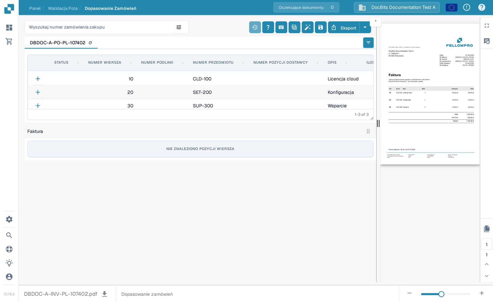
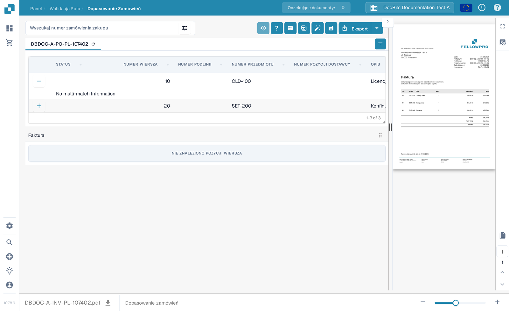

# Ekran dopasowywania zamówień zakupu

**Dopasowywanie zamówień zakupu (PO Matching)** służy do porównania pozycji zamówienia załadowanych dla dokumentu z wyodrębnionymi pozycjami faktury. Dane zamówienia mogą pochodzić z integracji z systemem ERP lub z innego skonfigurowanego importu. Ekran wyświetla dokument obok obu tabel, dzięki czemu przed zapisaniem lub eksportem możesz sprawdzić numery, ilości, ceny i różnice.


Poniższy przykład używa syntetycznej faktury i zamówienia FellowPro w organizacji **DocBits Documentation Test A**. W tabeli tej faktury wyświetla się obecnie komunikat **Nie znaleziono pozycji**. Pokazuje on nawigację i wyszukiwanie, ale nie może pokazać pomyślnego dopasowania pozycji. Nie eksportuj tego przykładu jako dopasowanej faktury.


<figure><figcaption>
Zamówienie jest załadowane; przykładowa faktura nie ma wyodrębnionych pozycji do połączenia.
</figcaption></figure>

## Znajdź i sprawdź zamówienie

1. Otwórz fakturę w **Dopasowywaniu zamówień zakupu**. Jeśli Twoja organizacja ma kilka zamówień, wpisz numer w polu **Wyszukaj numer zamówienia zakupu**.
2. Wybierz ikonę filtra obok pola wyszukiwania, aby ustawić kryteria: **Słowo kluczowe**, **Dostawca**, **Status**, **Status zamówienia**, daty, zakres kwot, sortowanie i liczbę wyświetlanych rekordów. Wybierz **Więcej**, aby dodać kolejne kryteria. Wybierz **Stosować**, aby wyszukać, lub **Jasne**, aby zresetować filtry.
3. Wybierz numer zamówienia nad tabelą, aby sprawdzić jego pozycje. Ikona odświeżenia obok numeru ponownie ładuje dane tego zamówienia. Ponowne ładowanie może zależeć od skonfigurowanej integracji.
4. Porównaj każdą pozycję zamówienia z fakturą i jej wyodrębnioną tabelą. Znak **+** przy pozycji rozwija szczegóły dopasowania; sam w sobie nie łączy pozycji z fakturą. W przykładzie wyświetla się **No multi-match Information**, ponieważ takie dopasowanie nie istnieje.

<figure><figcaption>
Panel filtrów służy do zawężania listy wyświetlanych zamówień.
</figcaption></figure>

<figure><figcaption>
Rozwinięta pozycja pokazuje szczegóły dopasowania, jeśli są dostępne.
</figcaption></figure>

## Dopasuj pozycje i sprawdź wynik

Gdy obie tabele zawierają pozycje, połącz pozycję faktury z odpowiadającą jej pozycją zamówienia przez przeciągnięcie albo użyj akcji dopasowania w menu kontekstowym pozycji. **Automatyczne dopasowanie** próbuje połączyć kwalifikujące się pozycje według reguł Twojej organizacji. Sprawdź wynik przed zapisaniem: sama zgodność numeru przedmiotu nie dowodzi, że ilość, cena lub warunki dostawy są zgodne. Zobacz [Narzędzia dopasowywania zamówień zakupu](purchase-order-matching-tools.md) — opis paska narzędzi, sterowania kolumnami i akcji ręcznych — oraz [Skróty klawiaturowe](keyboard-shortcuts.md) — akcje klawiaturowe.

Jeśli dokument nie został dopasowany, odczytaj powód wyświetlony nad obszarem zamówienia. Może on mówić, że brakuje numeru zamówienia, zamówienie nie zostało znalezione, jego pozycje są niedostępne albo faktura nie ma wyodrębnionych pozycji. Popraw dokument lub konfigurację wskazaną przez ten powód. Administrator może sprawdzić [reguły dopasowywania](../../../administration-and-setup/settings/global-settings/document-types/more-settings/purchase-order/purchase-order-matching-rules.md) i [wyodrębnianie tabel](../../../administration-and-setup/settings/document-processing/classification-and-extraction/README.md), gdy nie pojawiają się pozycje faktury.

Typowe komunikaty i kolejne kroki:

| Co widzisz | Co sprawdzić |
| --- | --- |
| Brak numeru zamówienia | Wpisz lub popraw numer zamówienia na dokumencie, następnie zapisz. |
| Nie znaleziono zamówienia | Sprawdź numer i to, czy zamówienie zostało zaimportowane do tej organizacji. |
| Zamówienie znalezione, ale niepołączone | Spróbuj użyć **Automatycznego dopasowania** albo połącz pozycje ręcznie po sprawdzeniu obu tabel. |
| Żadna pozycja zamówienia nie pasuje | Porównaj wartości z faktury z zamówieniem i sprawdź historię dopasowań. |
| Brak pozycji faktury | Sprawdź [wyodrębnianie tabel](../../../administration-and-setup/settings/document-processing/classification-and-extraction/README.md), zanim spróbujesz dopasować. |
| Brak otwartych pozycji zamówienia | Sprawdź [statusy zużytych pozycji](../../../administration-and-setup/settings/global-settings/document-types/more-settings/purchase-order/consumed-po-line-status.md) i wykluczone statusy. |


Zapisanie może ponownie uruchomić dopasowywanie po zmienionym lub nowo wykrytym numerze zamówienia. Sprawdź wyświetlony wynik po zapisaniu. Jeśli dopasowania nie da się zapisać, odczytaj błąd wyświetlony na ekranie i poproś administratora o sprawdzenie [przekształceń](../../../administration-and-setup/settings/global-settings/document-types/transformation-rules.md) i [reguł dopasowywania](../../../administration-and-setup/settings/global-settings/document-types/more-settings/purchase-order/purchase-order-matching-rules.md).


Użyj **Historii dopasowań** (ikona zegara, jeśli pozwalają na to Twoje uprawnienia), aby sprawdzić, jak rozstrzygnięto wcześniejsze dopasowanie. Jest to widok tylko do odczytu. Możesz przeanalizować, które reguły zostały uruchomione i dlaczego kandydat nie został dopasowany; otwarcie historii nie eksportuje dokumentu.

### Więcej niż jedna pozycja na dopasowanie

Pojedyncza pozycja faktury może odpowiadać kilku pozycjom zamówienia lub odwrotnie, jeśli pozwalają na to Twoje reguły dopasowywania. Otwórz szczegóły **+** przy pozycji, aby sprawdzić istniejące dopasowanie wielokrotne. Sprawdzaj łączną ilość i cenę, a nie tylko jedną pozycję. Pusty panel szczegółów, jak w syntetycznym przykładzie powyżej, oznacza brak dopasowania wielokrotnego do sprawdzenia. Zobacz [Narzędzia dopasowywania zamówień zakupu](purchase-order-matching-tools.md) w sprawie zmiany połączeń.

### Ilości, różnice i rabaty

W zależności od konfiguracji dopasowywanie może porównywać ilość zamówioną, otrzymaną lub pozostałą do dostawy, a także cenę jednostkową, numer przedmiotu i inne zmapowane pola. Różnica może zostać zaakceptowana, jeśli typ dokumentu ma skonfigurowaną tolerancję. Sprawdź wyświetloną rozbieżność przed jej akceptacją. [Ustawienia tolerancji](../../../administration-and-setup/settings/global-settings/document-types/more-settings/purchase-order/purchase-order-tolerance-settings-additional-purchase-order-tolerance.md) i [poradnik rabatów](discounts.md) wyjaśniają te przypadki.

Obszar sum, gdy jest dostępny, pomaga zestawić kwotę netto z faktury z dopasowanymi pozycjami i dodatkowymi kosztami. Jeśli pozostaje **Kwota nierozliczona**, sprawdź poszczególne wartości pozycji i ewentualne [elementy kosztowe](../../../administration-and-setup/settings/document-processing/classification-and-extraction/table-extraction-for-costing-element.md) przed eksportem.

## Sprawdź sumy i zapisz

Sprawdź podgląd faktury po prawej i porównaj sumy pozycji oraz ewentualne dodatkowe koszty. Pełny opis akcji na górnym pasku narzędzi znajdziesz w [Narzędziach dopasowywania zamówień zakupu](purchase-order-matching-tools.md). Wybierz **Zapisz** po zmianie dopasowań. Wybierz **Eksport** dopiero po sprawdzeniu dokumentu i wyniku dopasowania; strzałka obok Eksportu pokazuje dodatkowe skonfigurowane opcje eksportu. Twoja organizacja może mieć inne akcje eksportu.

Pasek narzędzi podglądu pozwala przechodzić między stronami dokumentu, powiększać, pobierać oryginał i otwierać większy widok. Użyj go, aby zweryfikować, że numer zamówienia i wartości pozycji naprawdę występują na fakturze. Jeśli opuścisz ekran z niezapisanymi zmianami dopasowań, mogą one zostać utracone.

Dostępne porównania i wartości tolerancji zależą od ustawień typu dokumentu. Przeczytaj [Reguły dopasowywania zamówień](../../../administration-and-setup/settings/global-settings/document-types/more-settings/purchase-order/purchase-order-matching-rules.md), [Ustawienia tolerancji](../../../administration-and-setup/settings/global-settings/document-types/more-settings/purchase-order/purchase-order-tolerance-settings-additional-purchase-order-tolerance.md), [Wyłączone statusy](../../../administration-and-setup/settings/global-settings/document-types/more-settings/purchase-order/purchase-order-disable-statuses.md) i [Status zużytej pozycji zamówienia](../../../administration-and-setup/settings/global-settings/document-types/more-settings/purchase-order/consumed-po-line-status.md) — ustawienia administracyjne. W sprawie pozycji wiele-do-jednej zobacz [Rabaty](discounts.md) i [Narzędzia dopasowywania](purchase-order-matching-tools.md).
