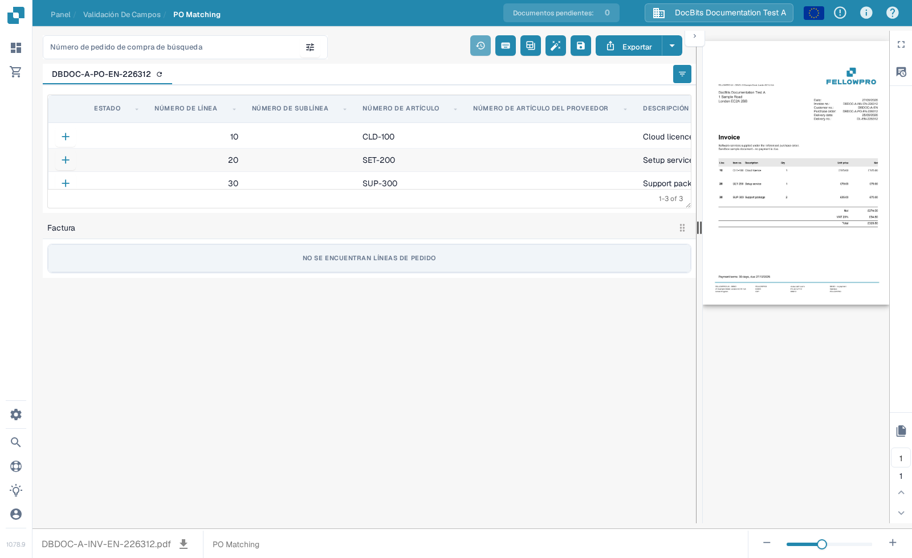
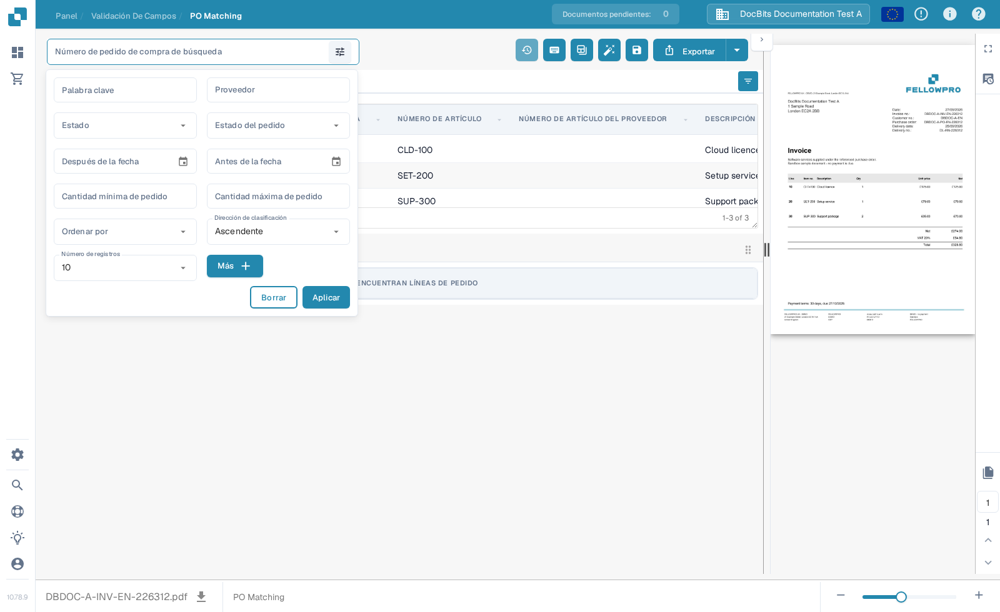
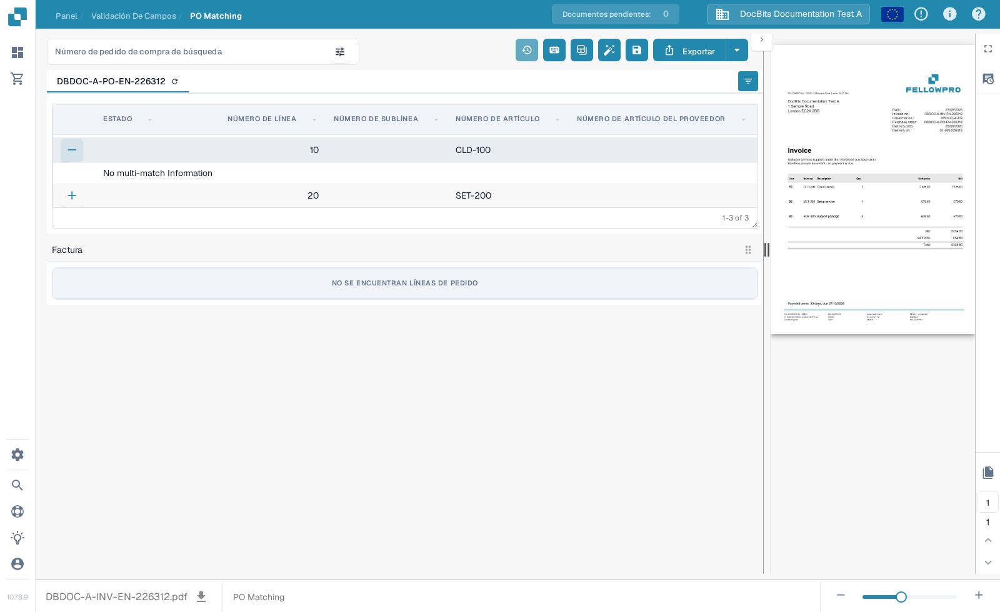

# Pantalla de coincidencia de órdenes de compra

Use **PO Matching** (Coincidencia de OC) para comparar las líneas de la orden de compra cargadas para un documento con las líneas de factura extraídas. Los datos de la orden de compra pueden provenir de una integración con el ERP o de otra importación configurada. La pantalla muestra el documento junto a las dos tablas para que pueda comprobar números, cantidades, precios y diferencias antes de guardar o exportar.


El ejemplo siguiente usa una factura y una orden de compra sintéticas de FellowPro en **DocBits Documentation Test A**. Su tabla de facturas muestra actualmente **No se encuentran líneas de pedido**. Esto demuestra la navegación y la búsqueda, pero no puede demostrar una coincidencia de líneas correcta. No exporte este ejemplo como una factura coincidente.


<figure><figcaption>
La orden de compra está cargada; la factura de ejemplo no tiene líneas extraídas que conectar.
</figcaption></figure>

## Buscar e inspeccionar una orden de compra

1. Abra una factura en **PO Matching**. Si su organización tiene varias órdenes de compra, introduzca un número en **Número de pedido de compra de búsqueda**.
2. Seleccione el icono de filtros junto al cuadro de búsqueda para **Palabra clave**, **Proveedor**, **Estado**, **Estado del pedido**, fechas, rango de importes, ordenación y número de registros mostrados. Seleccione **Más** para criterios adicionales. Seleccione **Aplicar** para buscar o **Borrar** para restablecer los filtros.
3. Seleccione un número de orden de compra sobre la tabla para inspeccionar sus líneas. El icono de actualización junto al número vuelve a cargar los datos de ese pedido. Una recarga puede depender de la integración configurada.
4. Compare cada línea de la orden de compra con la factura y su tabla extraída. El **+** de una línea amplía los detalles de coincidencia; por sí solo no conecta la línea con la factura. En el ejemplo muestra **No multi-match Information** porque no existe dicha coincidencia.

<figure><figcaption>
Use el panel de filtros para reducir las órdenes de compra mostradas.
</figcaption></figure>

<figure><figcaption>
La línea expandida muestra los detalles de coincidencia cuando están disponibles.
</figcaption></figure>

## Coincidir líneas y revisar el resultado

Cuando ambas tablas contengan líneas, conecte una línea de factura con la línea correspondiente de la orden de compra arrastrándola, o use las acciones de coincidencia del menú contextual de la línea. **Auto Match** (Coincidencia automática) intenta conectar las líneas elegibles según las reglas de su organización. Compruebe el resultado antes de guardar: un número de artículo coincidente por sí solo no demuestra que la cantidad, el precio o las condiciones de entrega coincidan. Consulte [Herramientas de coincidencia de órdenes de compra](purchase-order-matching-tools.md) para la barra de herramientas, los controles de columnas y las acciones manuales, y [Atajos de teclado](keyboard-shortcuts.md) para las acciones con teclado.

Si un documento no coincide, lea el motivo mostrado sobre el área de la orden de compra. Puede indicar que falta el número de OC, que el pedido no se encontró, que sus líneas no están disponibles o que la factura no tiene líneas extraídas. Corrija el documento o la configuración indicada por ese motivo. Un administrador puede inspeccionar las [reglas de coincidencia](../../../administration-and-setup/settings/global-settings/document-types/more-settings/purchase-order/purchase-order-matching-rules.md) y la [extracción de tablas](../../../administration-and-setup/settings/document-processing/classification-and-extraction/README.md) cuando no aparezcan líneas de factura.

Mensajes habituales y pasos siguientes:

| Lo que ve | Qué comprobar |
| --- | --- |
| Sin número de orden de compra | Introduzca o corrija el número de OC en el documento y guarde. |
| No se encontró la orden de compra | Compruebe el número y si el pedido se importó a esta organización. |
| El pedido se encontró pero no está conectado | Pruebe **Auto Match** o conecte las líneas manualmente tras comprobar ambas tablas. |
| Ninguna línea del pedido coincide | Compare los valores de la factura con el pedido y revise el historial de coincidencias. |
| Sin líneas de factura | Compruebe la [extracción de tablas](../../../administration-and-setup/settings/document-processing/classification-and-extraction/README.md) antes de intentar coincidir. |
| Sin líneas de pedido abiertas | Compruebe los [estados de línea consumida](../../../administration-and-setup/settings/global-settings/document-types/more-settings/purchase-order/consumed-po-line-status.md) y los estados excluidos. |


Guardar puede volver a activar la coincidencia tras un número de OC cambiado o recién detectado. Compruebe el resultado mostrado después de guardar. Si una coincidencia no se puede guardar, lea el error mostrado en pantalla y pida a un administrador que revise la [transformación](../../../administration-and-setup/settings/global-settings/document-types/transformation-rules.md) y las [reglas de coincidencia](../../../administration-and-setup/settings/global-settings/document-types/more-settings/purchase-order/purchase-order-matching-rules.md).


Use **Historial de coincidencias** (icono de reloj, si sus permisos lo permiten) para inspeccionar cómo se decidió una coincidencia anterior. Es una vista de solo lectura. Puede revisar qué reglas se ejecutaron y por qué un candidato no coincidió; abrir el historial no exporta el documento.

### Más de una línea por coincidencia

Una sola línea de factura puede corresponder a varias líneas de pedido, o al revés, donde sus reglas de coincidencia lo permitan. Abra los detalles **+** de una línea para inspeccionar cualquier coincidencia múltiple existente. Compruebe la cantidad y el precio combinados, no solo una línea. Un panel de detalles vacío como el ejemplo sintético anterior significa que no hay ninguna coincidencia múltiple que inspeccionar. Consulte [Herramientas de coincidencia de órdenes de compra](purchase-order-matching-tools.md) para cambiar las conexiones.

### Cantidades, diferencias y descuentos

Según la configuración, la coincidencia puede comparar la cantidad de pedido, recibida o de entrega restante, así como el precio unitario, el número de artículo y otros campos mapeados. Una diferencia puede aceptarse si el tipo de documento tiene una tolerancia configurada. Compruebe la diferencia mostrada antes de aceptarla. La [configuración de tolerancia](../../../administration-and-setup/settings/global-settings/document-types/more-settings/purchase-order/purchase-order-tolerance-settings-additional-purchase-order-tolerance.md) y la [guía de descuentos](discounts.md) explican estos casos.

El área de totales, cuando está disponible, ayuda a conciliar el importe neto de la factura con las líneas coincidentes y los cargos. Si queda un **Importe pendiente**, inspeccione los valores de las líneas individuales y cualquier [elemento de coste](../../../administration-and-setup/settings/document-processing/classification-and-extraction/table-extraction-for-costing-element.md) antes de exportar.

## Comprobar totales y guardar

Revise la vista previa de la factura a la derecha y compare los totales de las líneas y los cargos. Para una explicación completa de las acciones de la barra de herramientas superior, consulte [Herramientas de coincidencia de órdenes de compra](purchase-order-matching-tools.md). Seleccione **Guardar** tras cambiar las coincidencias. Seleccione **Exportar** solo después de haber comprobado el documento y el resultado de la coincidencia; la flecha junto a Exportar muestra opciones de exportación adicionales configuradas. Su organización puede tener acciones de exportación diferentes.

La barra de herramientas de la vista previa permite moverse entre las páginas del documento, ampliar, descargar el original y abrir una vista más grande. Úsela para verificar que el número de orden de compra y los valores de las líneas aparecen realmente en la factura. Si sale con cambios de coincidencia sin guardar, pueden perderse.

Las comparaciones disponibles y los valores de tolerancia dependen de la configuración de su tipo de documento. Lea [Reglas de coincidencia de OC](../../../administration-and-setup/settings/global-settings/document-types/more-settings/purchase-order/purchase-order-matching-rules.md), [Configuración de tolerancia](../../../administration-and-setup/settings/global-settings/document-types/more-settings/purchase-order/purchase-order-tolerance-settings-additional-purchase-order-tolerance.md), [Estados deshabilitados](../../../administration-and-setup/settings/global-settings/document-types/more-settings/purchase-order/purchase-order-disable-statuses.md) y [Estado de línea de OC consumida](../../../administration-and-setup/settings/global-settings/document-types/more-settings/purchase-order/consumed-po-line-status.md) para la configuración de administradores. Para líneas de muchos a uno, consulte [Descuentos](discounts.md) y las [Herramientas de coincidencia](purchase-order-matching-tools.md).
