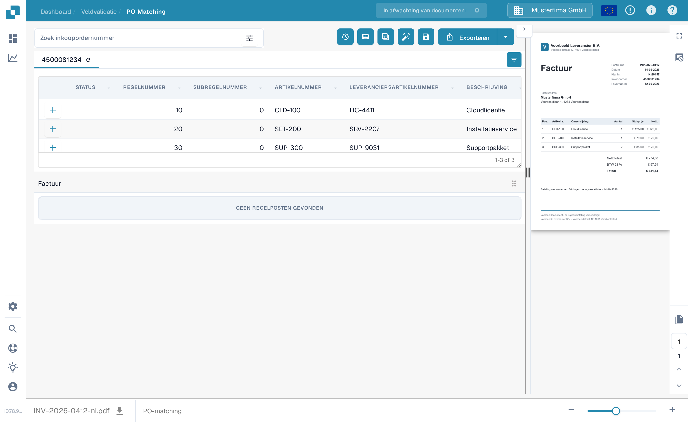
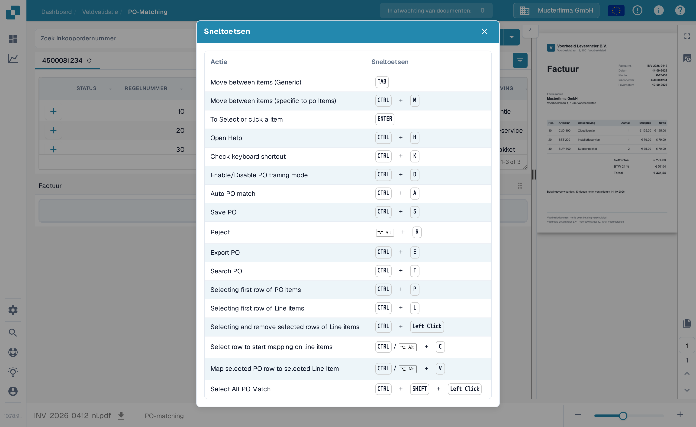

# Inkooporder Matching Tools

Het PO-matching scherm plaatst het zoeken naar inkooporders en de hulpmiddelen boven de inkooporderregels. Het factuurvoorbeeld blijft aan de rechterkant. De beschikbare acties kunnen verschillen per machtiging, documentgegevens en de instellingen van uw organisatie.

<figure><figcaption>
Het zoekveld en de actiewerkbalk staan boven de inkooporderregels.
</figcaption></figure>

## De juiste inkooporder vinden

Voer een inkoopordernummer in bij **Zoek inkoopordernummer** en selecteer een resultaat. Het filterpictogram naast het veld opent extra zoekopties: trefwoord, leverancier, status, bestelstatus, datumbereik, bestelbedrag, sorteervolgorde en aantal records. Kies **Toepassen** om de filters te gebruiken of **Duidelijk** om ze te wissen. Het filteren van de lijst matcht of exporteert de factuur niet.

<figure><figcaption>
Open het filterpictogram naast het zoekveld voor meer zoekopties.
</figcaption></figure>

## Acties in de werkbalk

Lees de tooltip van een pictogram voordat u het selecteert. De werkbalk kan het volgende tonen:

| Actie | Wat het doet |
| --- | --- |
| **Matchgeschiedenis** (klok) | Opent eerdere matchingactiviteit voor dit document. Er wordt geen nieuwe match gestart. |
| **Help** (?) | Opent de helppagina van PO-matching in een nieuw browsertabblad. |
| **Sneltoetsen** (toetsenbord) | Toont de sneltoetsen die op dit scherm beschikbaar zijn. Zie [Toetsenbord Sneltoetsen](keyboard-shortcuts.md). |
| **Trainingsmodus** (tabel) | Schakelt het slepen van inkooporderregels naar de factuurtabel in of uit. Dit is alleen nuttig wanneer het document factuurregelposten heeft; het voorbeeldscherm hieronder heeft die niet. |
| **Taken / Taak maken** | Opent documenttaken of maakt een taak aan wanneer deze acties beschikbaar zijn voor uw document en rol. Zie [Taken](../tasks.md). |
| **Automatische boekhouding** | Opent de boekhouding voor dit document wanneer boekhoudgegevens aanwezig zijn. |
| **Automatische PO-match** (toverstaf) | Voert automatische matching uit. Als de organisatie automatische export heeft ingeschakeld en de resulterende match aan de voorwaarden voldoet, kan deze actie ook exporteren. Controleer het document voordat u deze gebruikt. Zie [Automatische Afstemming van Inkoopordergegevens](automatic-purchase-order-data-matching.md). |
| **Opslaan** (diskette) | Slaat de PO-matchingwijzigingen op in het document. |
| **Gegevens synchroniseren** | Alleen beschikbaar bij de overeenkomstige instelling voor inkooporderhoeveelheid; ververst geselecteerde inkoopordergegevens uit het gekoppelde systeem. Gebruik het weergegeven inkoopordernummer en de beschikbare synchronisatieopties. |
| **Exporteren** | Exporteert het document na het matchen. Als uw organisatie meerdere exportdoelen biedt, gebruikt u de pijl naast **Exporteren** om er een te selecteren. |

Het tabblad van de inkooporder heeft ook een vernieuwingspictogram om die inkooporder opnieuw te laden. Het pictogram voor kolominstellingen rechts van de tabelkop bepaalt welke inkoopordekolommen zichtbaar zijn. Deze wijzigen de weergave van de inkoopordertabel, niet de geëxtraheerde waarden van de factuur.

## Sneltoetsen

Selecteer het toetsenbordpictogram om de actuele lijst met sneltoetsen te zien. Veelvoorkomende voorbeelden zijn **Ctrl+F** om het zoeken naar inkooporders te activeren, **Ctrl+K** om het sneltoetsvenster opnieuw te openen, **Ctrl+S** om op te slaan en **Ctrl+E** om te exporteren. Het venster is de bron voor de volledige lijst op uw huidige scherm.

<figure><figcaption>
Open het toetsenbordpictogram om de sneltoetsen te zien die dit scherm ondersteunt.
</figcaption></figure>


Deze schermafbeelding gebruikt een synthetische factuur en inkooporder in een synthetische sandbox-organisatie van DocBits. De factuur heeft geen geëxtraheerde regelposten, dus een geslaagde match kan niet worden getoond. De acties matchen, opslaan, synchroniseren en exporteren zijn voor deze schermafbeeldingen niet uitgevoerd.

