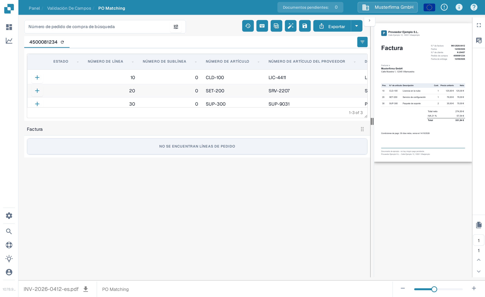
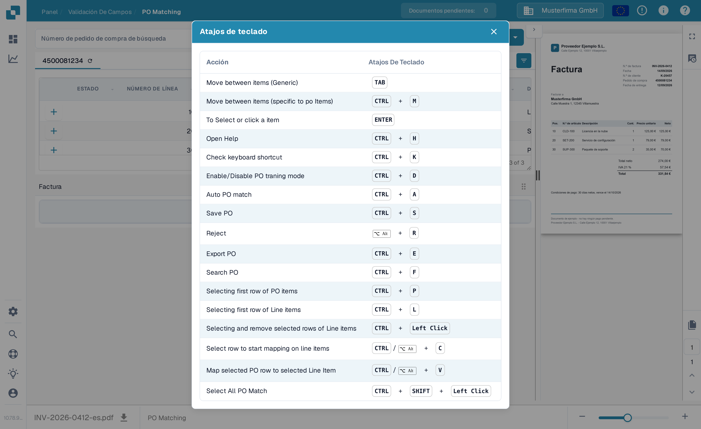

# Herramientas de coincidencia de órdenes de compra

La pantalla Coincidencia de PO coloca la búsqueda de órdenes de compra y las herramientas encima de las líneas del pedido. La vista previa de la factura permanece a la derecha. Las acciones disponibles pueden variar según tus permisos, los datos del documento y la configuración de tu organización.

<figure><figcaption>
Encuentra el campo de búsqueda y la barra de herramientas encima de las líneas del pedido de compra.
</figcaption></figure>

## Encontrar la orden de compra correcta

Introduce un número de pedido de compra en **Número de pedido de compra de búsqueda** y selecciona un resultado. El icono de filtro junto al campo abre opciones de búsqueda adicionales: palabra clave, proveedor, estado, estado del pedido, rango de fechas, importe del pedido, orden de clasificación y número de registros. Elige **Aplicar** para usar los filtros o **Borrar** para restablecerlos. Filtrar la lista no iguala ni exporta la factura.

<figure><figcaption>
Abre el icono de filtro junto al campo de búsqueda de PO para ver más opciones de búsqueda.
</figcaption></figure>

## Acciones de la barra de herramientas

Lee la información sobre herramientas de un icono antes de seleccionarlo. La barra de herramientas puede mostrar:

| Acción | Qué hace |
| --- | --- |
| **Historial de coincidencias** (reloj) | Abre la actividad de coincidencia anterior de este documento. No inicia una nueva coincidencia. |
| **Ayuda** (?) | Abre la página de ayuda de Coincidencia de PO en una nueva pestaña del navegador. |
| **Atajos de teclado** (teclado) | Muestra los atajos disponibles en esta pantalla. Consulta [Atajos de Teclado](keyboard-shortcuts.md). |
| **Modo de entrenamiento** (tabla) | Activa o desactiva el arrastre de filas del pedido a la tabla de la factura. Solo es útil cuando el documento tiene líneas de factura; la pantalla de ejemplo siguiente no tiene ninguna. |
| **Tareas / Crear tarea** | Abre las tareas del documento o crea una tarea cuando estas acciones están disponibles para tu documento y tu rol. Consulta [Tareas](../tasks.md). |
| **Contabilidad automática** | Abre la contabilidad de este documento cuando hay datos contables. |
| **Coincidencia automática de PO** (varita) | Ejecuta la coincidencia automática. Si la organización ha activado la exportación automática y la coincidencia resultante cumple sus condiciones, esta acción también puede exportar. Revisa el documento antes de usarla. Consulta [Conciliación Automática de Datos de Órdenes de Compra](automatic-purchase-order-data-matching.md). |
| **Guardar** (disco) | Guarda los cambios de coincidencia de PO en el documento. |
| **Sincronizar Data** | Solo está disponible para el ajuste correspondiente de cantidad del pedido; actualiza desde el sistema conectado los datos seleccionados del pedido. Usa el número de pedido mostrado y las opciones de sincronización disponibles. |
| **Exportar** | Exporta el documento después de la coincidencia. Si tu organización ofrece varios destinos de exportación, usa la flecha junto a **Exportar** para seleccionar uno. |

La pestaña PO también tiene un icono de actualización para volver a cargar ese pedido de compra. El icono de configuración de columnas a la derecha del encabezado de la tabla controla qué columnas del pedido son visibles. Estos cambian la vista de la tabla del pedido, no los valores extraídos de la factura.

## Atajos de teclado

Selecciona el icono de teclado para ver la lista actual de atajos. Algunos ejemplos comunes son **Ctrl+F** para centrar la búsqueda de PO, **Ctrl+K** para volver a abrir el diálogo de atajos, **Ctrl+S** para guardar y **Ctrl+E** para exportar. El diálogo es la fuente de la lista completa en tu pantalla actual.

<figure><figcaption>
Abre el icono de teclado para ver los atajos compatibles con esta pantalla.
</figcaption></figure>


Esta captura de pantalla usa una factura y una orden de compra sintéticas en el sandbox DocBits Documentation Test A. Su factura no tiene líneas extraídas, por lo que no puede demostrar una coincidencia correcta. Las acciones de coincidir, guardar, sincronizar y exportar no se ejecutaron para estas capturas.

