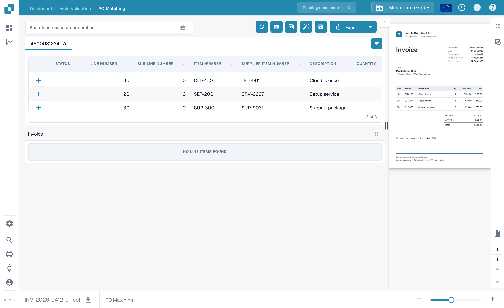
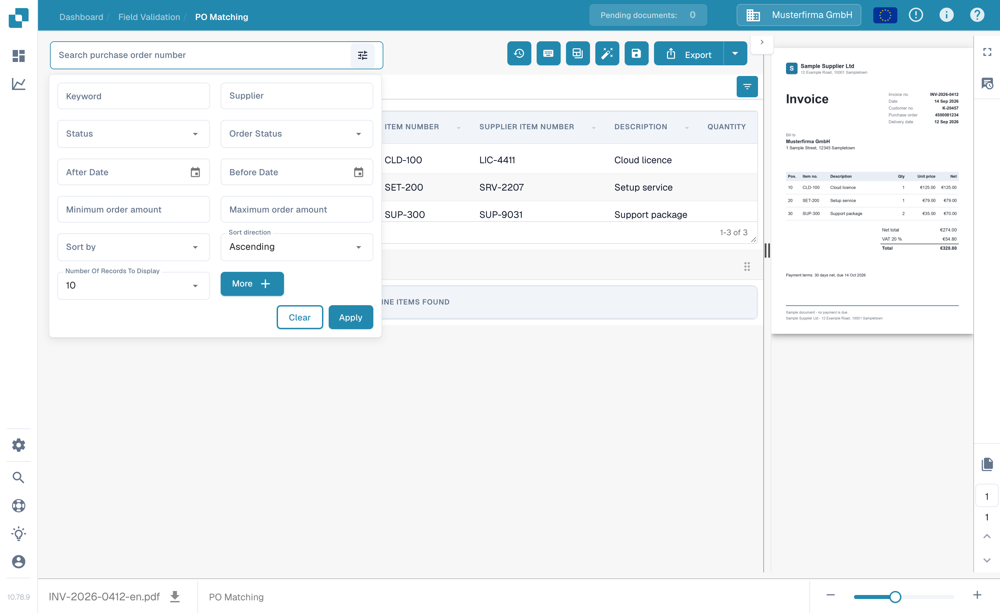
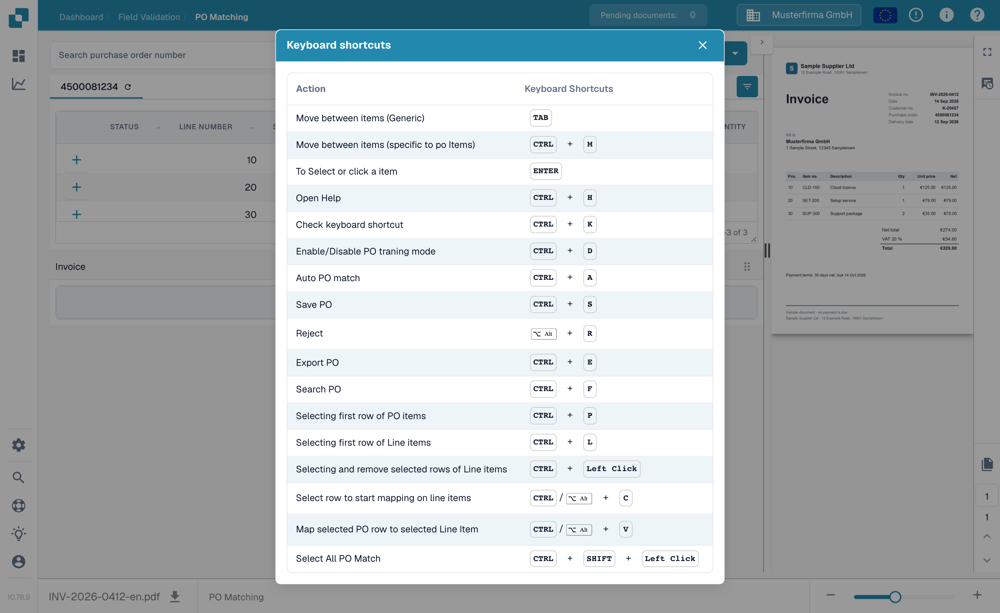

# Purchase Order Matching Tools

The PO Matching screen places the purchase order search and tools above the PO lines. The invoice preview remains on the right. The available actions can vary with your permissions, document data, and your organization's settings.

<figure><figcaption>
Find the search field and action toolbar above the purchase order lines.
</figcaption></figure>

## Find the right purchase order

Enter a purchase order number in **Search purchase order number** and select a result. The filter icon beside the field opens additional search options: keyword, supplier, status, order status, date range, order amount, sort order, and number of records. Choose **Apply** to use the filters or **Clear** to reset them. Filtering the list does not match or export the invoice.

<figure><figcaption>
Open the filter icon beside the PO search field for more search options.
</figcaption></figure>

## Toolbar actions

Read the tooltip for an icon before selecting it. The toolbar can show:

| Action | What it does |
| --- | --- |
| **Matching history** (clock) | Opens previous matching activity for this document. It does not start a new match. |
| **Help** (?) | Opens the PO Matching help page in a new browser tab. |
| **Keyboard shortcuts** (keyboard) | Shows the shortcuts available on this screen. See [Keyboard Shortcuts](keyboard-shortcuts.md). |
| **Training mode** (table) | Turns dragging PO rows into the invoice table on or off. It is useful only when the document has invoice line items; the sample screen below has none. |
| **Tasks / Create task** | Opens document tasks or creates a task when these actions are available for your document and role. See [Tasks](../tasks.md). |
| **Auto Accounting** | Opens accounting for this document when accounting data is present. |
| **Auto PO match** (wand) | Runs automatic matching. If the organization has enabled automatic export and the resulting match meets its conditions, this action can export too. Review the document before using it. See [Automatic Purchase Order Data Matching](automatic-purchase-order-data-matching.md). |
| **Save** (disk) | Saves PO matching changes to the document. |
| **Sync Data** | Available only for the corresponding PO quantity setting; refreshes selected PO data from the connected system. Use the displayed PO number and available sync options. |
| **Export** | Exports the document after matching. If your organization offers multiple export targets, use the arrow beside **Export** to select one. |

The PO tab also has a refresh icon for reloading that purchase order. The column settings icon at the right of the table header controls which PO columns are visible. These change the view of the PO table, not the invoice's extracted values.

## Keyboard shortcuts

Select the keyboard icon to see the current shortcut list. Common examples include **Ctrl+F** to focus PO search, **Ctrl+K** to reopen the shortcut dialog, **Ctrl+S** to save, and **Ctrl+E** to export. The dialog is the source for the complete list on your current screen.

<figure><figcaption>
Open the keyboard icon to see the shortcuts supported by this screen.
</figcaption></figure>


This screenshot uses a synthetic invoice and purchase order in the DocBits Documentation Test A sandbox. Its invoice has no extracted line items, so it cannot demonstrate a successful match. Match, save, sync, and export actions were not run for these screenshots.

